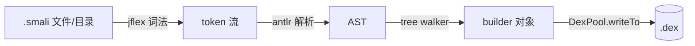

# smali assemble

将 `.smali` 文本文件汇编为 Android Dalvik 可执行文件（`.dex`）。



## 用法

```bash
# 基本汇编（目录递归搜索 .smali）
java -jar smali.jar assemble -o <输出.dex> <输入目录|文件>
# 短别名
java -jar smali.jar a -o out.dex smali_src/
# 指定 API 级别（影响可用操作码）
java -jar smali.jar a -o out.dex -a 28 smali_src/
```

## 选项

| 选项 | 默认 | 作用 |
|------|------|------|
| `-o <file>` | `out.dex` | 输出 dex 路径 |
| `-a <api>` | `15` | API 级别，决定可用操作码 |
| `-j <n>` | CPU 核心数 | 并行编译线程数 |
| `--allow-odex-opcodes` | off | 允许汇编 odex 优化操作码 |

可指定多个文件/目录，目录会递归搜索 `.smali`。

## API 级别与操作码

| API | dex 版本 | 关键新增 |
|-----|---------|---------|
| 15（默认） | 035 | 基础指令集 |
| 23 | 035 | — |
| 26 | 038 | invoke-custom, invoke-polymorphic |
| 28 | 039 | const-method-handle, const-method-type |
| 30+ | 040 | hiddenapi 限制标志 |

汇编报 `invalid instruction` 通常是 API 级别太低——加 `-a` 提高。

## 真实示例

汇编 `examples/HelloWorld/HelloWorld.smali` 为 dex 并用 baksmali 验证：

```bash
# 1) 汇编
java -jar smali.jar assemble -o /tmp/hello.dex examples/HelloWorld/
# （无输出即成功；产物 /tmp/hello.dex，652 字节）

# 2) 用 baksmali 验证产物
java -jar baksmali.jar list classes --format text /tmp/hello.dex
# LHelloWorld;
```

源文件 `examples/HelloWorld/HelloWorld.smali`（节选）：

```smali
.class public LHelloWorld;
.super Ljava/lang/Object;

.method public static main([Ljava/lang/String;)V
    .registers 2

    sget-object v0, Ljava/lang/System;->out:Ljava/io/PrintStream;
    const-string	v1, "Hello World!"
    invoke-virtual {v0, v1}, Ljava/lang/PrintStream;->println(Ljava/lang/String;)V
    return-void
.end method
```

汇编后用 `baksmali disassemble` 取回的 smali 与源码逻辑等价（寄存器命名等细节可能规范化），见 [反汇编↔汇编往返](../guide/roundtrip)。

## 修改-重汇编工作流

```bash
# 1. 反汇编原始 APK
java -jar baksmali.jar d -o smali_out original.apk
# 2. 修改 smali 文件
vim smali_out/com/example/Main.smali
# 3. 重新汇编
java -jar smali.jar a -o modified.dex smali_out/
# 4. 替换回 APK（解压 → 替换 classes.dex → 删旧签名 → 重打包 → 对齐 → 签名）
```

## 常见错误

| 错误 | 原因 | 解决 |
|------|------|------|
| `invalid instruction` | API 级别太低，不支持该指令 | 加 `-a` 提高到对应 API 级别 |
| `odex opcode not allowed` | 使用了 odex 优化操作码 | 加 `--allow-odex-opcodes` 或先 deodex |
| `Duplicate class` | 同一个类出现在多个 .smali 文件中 | 检查输入文件去重 |
| `No .source or .class directive` | smali 文件格式错误 | 检查文件头部 |
