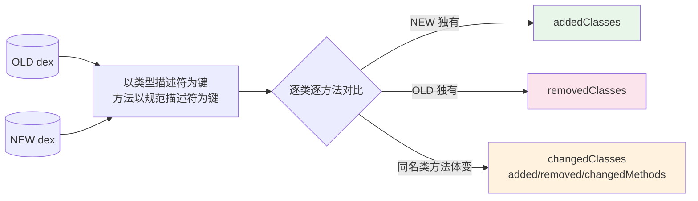

# baksmali diff

`baksmali diff OLD NEW` 在**opcode 层面**比较两个 dex/apk，报告新增/删除/改动的类与方法。



方法被判为「改动」的依据是 **opcode 序列不同**。寄存器分配、调试信息（`.line`/`.local`/参数名）、
指令偏移都被**刻意忽略**——所以「同源重编译产生的噪声」不会被误报为语义改动。

## 用法

```bash
# 默认就是 JSON；两个位置参数：OLD NEW
java -jar baksmali.jar diff old.apk new.apk
# 人读文本
java -jar baksmali.jar diff old.apk new.apk --format text
```

支持多 dex 条目语法：`baksmali diff app.apk/classes2.dex app2.apk/classes2.dex`。

## 退出码

| 退出码 | 含义 |
|--------|------|
| `0` | 两文件在 opcode 层面**语义一致** |
| `1` | 存在差异 |

```bash
baksmali diff orig.dex patched.dex && echo "未改动" || echo "有差异，请复核"
```

## 文本报告格式

```
+ class Lcom/example/New;              # NEW 中新增的类
- class Lcom/example/Removed;          # OLD 中被删除的类
~ class Lcom/example/A;                # 两边都有、但方法有变化的类
    + Lcom/example/A;->added()V        # 新增方法
    - Lcom/example/A;->gone()V         # 删除方法
    ~ Lcom/example/A;->foo()I          # opcode 序列改动的方法
```

## JSON 结构

```json
{
  "addedClasses":   ["Lcom/example/New;"],
  "removedClasses": ["Lcom/example/Removed;"],
  "changedClasses": [
    {
      "type": "Lcom/example/A;",
      "addedMethods":   ["Lcom/example/A;->added()V"],
      "removedMethods": ["Lcom/example/A;->gone()V"],
      "changedMethods": ["Lcom/example/A;->foo()I"]
    }
  ]
}
```

所有列表按字典序排序，输出**确定性**，适合作为回归基线 diff。

## 真实示例

用两个不同 fixture 对比——`accessorTest.dex`（含 `AccessorTypes` 两个类）与 `LocalTest/classes.dex`（含 `LLocalTest;`）：

```bash
java -jar baksmali.jar diff \
  dexlib2/src/test/resources/accessorTest.dex \
  baksmali/src/test/resources/LocalTest/classes.dex
```

实际输出（默认 JSON）：

```json
{
  "addedClasses": ["LLocalTest;"],
  "removedClasses": [
    "Lorg/jf/dexlib2/AccessorTypes$Accessors;",
    "Lorg/jf/dexlib2/AccessorTypes;"
  ],
  "changedClasses": []
}
```

`addedClasses` 是 NEW 独有的类，`removedClasses` 是 OLD 独有的类，`changedClasses` 为空（两边没有同名类，自然没有「同名但方法体变化」）。退出码 `1`。

## 典型场景

| 场景 | 命令 |
|------|------|
| 验证补丁精确性 | `diff app.apk patched.dex`（应只显示目标方法一处 `~`） |
| 版本升级审计 | `diff v1.apk v2.apk \| jq '.addedClasses'` |
| 恶意样本比对 | 判断「重打包」样本相对原版改动了哪些方法体 |
