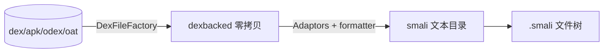

# baksmali disassemble

将 Android dex/apk/odex/oat 二进制反汇编为人类可读的 smali 文本。



## 用法

```bash
java -jar baksmali.jar disassemble -o <输出目录> <输入文件>
# 短别名
java -jar baksmali.jar d -o out app.apk
# 只反汇编特定类
java -jar baksmali.jar d -o out --classes Lcom/example/Main app.apk
```

## 支持的输入格式

| 格式 | 扩展名 | 说明 |
|------|--------|------|
| dex | `.dex` | 标准 Dalvik 可执行文件 |
| odex | `.odex` | 优化过的 dex（需 deodex 才能重汇编） |
| oat | `.oat` | ART 运行时格式（含 vdex 支持） |
| apk/zip | `.apk`, `.zip` | 自动提取 classes.dex |

## 常用选项

| 选项 | 作用 |
|------|------|
| `-o <目录>` | 输出目录（默认 `out`） |
| `-a <api>` | API 级别（默认 15） |
| `-j <线程>` | 并行线程数 |
| `--debug-info=false` | 省略调试信息（`.local`/`.param`/`.line`） |
| `--code-offsets` | 每条指令前注释代码偏移 |
| `--use-locals` | 用 `.locals` 代替 `.registers` |
| `--sequential-labels` | 标签用顺序编号而非字节码地址 |
| `--accessor-comments=false` | 禁用合成访问器辅助注释 |
| `--normalize-virtual-methods` | 虚方法引用归一化到声明基类 |
| `--classes <列表>` | 只反汇编指定类（逗号分隔） |
| `-r <类型>` | 注释寄存器类型（ALL/ALLPRE/ALLPOST/ARGS/DEST/MERGE/FULLMERGE） |

## 真实示例

用 `LocalTest/classes.dex` fixture：

```bash
java -jar baksmali.jar disassemble -o /tmp/local_smali \
  baksmali/src/test/resources/LocalTest/classes.dex
```

生成的文件树：

```
/tmp/local_smali/
└── LocalTest.smali
```

`LocalTest.smali` 内容（节选）：

```smali
.class public LLocalTest;
.super Ljava/lang/Object;

# direct methods
.method public static method1()V
    .registers 10
    .local v0, "blah! This local name has some spaces, a colon, even a \nnewline!":I, "some sig info:\nblah."
    .local v1, "blah!...":V, "some sig info:\nblah."
    ...
    .local v8
    .local v9
    return-void
.end method

.method public static method2(IJLjava/lang/String;)V
    .registers 10
    .param p0, "blah!..."    # I
    .param p1    # J
        .annotation runtime LAnnotationWithValues;
        .end annotation
    .end param
    return-void
```

可见 `.class`/`.super` 声明类型层次，`.method`/`.registers`/`.local`/`.param` 描述方法签名与调试信息，
`.annotation` 还原运行时注解。

## 注意事项

- 反汇编 odex/oat 时若未 deodex，输出将含优化指令，**无法重新汇编**——此时用 `deodex`。
- 多 dex APK 默认只处理 `classes.dex`，需指定条目见 [multidex](../guide/roundtrip#多-dex-apk)。
- smali 文本可用 `smali assemble` **无损**重新汇编回等价 dex。
