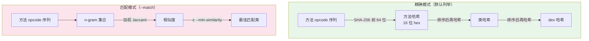

# baksmali fingerprint

基于**方法体 opcode 序列**计算指纹，对重命名不敏感——混淆器改名、换寄存器号，只要字节码逻辑不变指纹就相同。用于识别「被改名的已知库」「被重打包/抄袭的代码」。



两种模式互补：哈希用于**精确去重**（完全相同），n-gram 用于**模糊识别**（轻微修改也能认出）。

## 1. 列举指纹（默认）

对每个 方法 / 类 / 整个 dex 输出一个短哈希。

```bash
java -jar baksmali.jar fingerprint app.apk                      # 每个类（默认）
java -jar baksmali.jar fingerprint app.apk --level method       # 细到方法
java -jar baksmali.jar fingerprint app.apk --level dex          # 整个 dex 一个哈希
java -jar baksmali.jar fingerprint app.apk --class 'Lokhttp3/.*'  # 只看某包
# 默认就是 JSON；要人读文本加 --format text
```

- **方法哈希** = 该方法 opcode 序列的哈希。
- **类哈希** = 其所有方法哈希**排序后**再哈希（与方法声明顺序、类名、成员名都无关）。
- **dex 哈希** = 其所有类哈希排序后再哈希。

两个仅改了名字的类，类哈希**完全相同**。

## 2. 匹配参考库（--match）

把输入的每个类，用 **opcode n-gram 的加权 Jaccard 相似度**与参考 dex 里的类逐一比较，报告相似度 ≥ 阈值的最佳匹配。

```bash
# 在 app 里找 okhttp（指向已知版本的 okhttp classes.dex）
java -jar baksmali.jar fingerprint app.apk --match okhttp.dex --min-similarity 0.9
java -jar baksmali.jar fingerprint app.apk --match lib.dex --ngram 4      # 用 4-gram，更严格
# 默认 JSON：[{class, match, similarity}]
```

| 选项 | 默认 | 说明 |
|------|------|------|
| `--ngram N` | `3` | n-gram 窗口大小，越大越严格 |
| `--min-similarity F` | `0.85` | 报告阈值，`1.0` = 完全一致 |

加权 Jaccard = `Σ min(计数) / Σ max(计数)`，两侧空袋定义为 `1.0`。

## 真实示例

用 `accessorTest.dex` fixture：

```bash
java -jar baksmali.jar fingerprint dexlib2/src/test/resources/accessorTest.dex
```

实际输出（默认 JSON）：

```json
[
  {"class":"Lorg/jf/dexlib2/AccessorTypes$Accessors;","fingerprint":"63594b5c1fa69ee4"},
  {"class":"Lorg/jf/dexlib2/AccessorTypes;","fingerprint":"206203f971d55342"}
]
```

人读文本对照：

```
63594b5c1fa69ee4  Lorg/jf/dexlib2/AccessorTypes$Accessors;
206203f971d55342  Lorg/jf/dexlib2/AccessorTypes;
```

`63594b5c1fa69ee4` 这种 16 位十六进制短哈希就是「类内所有方法 opcode 序列排序后再哈希」的结果。

## 典型场景

**查抄袭/重打包**——同一份代码被改名后重新发布，类哈希取交集即为「结构相同（可能仅改名）」的类：

```bash
java -jar baksmali.jar fingerprint appA.apk | jq -r '.[].fingerprint' | sort > a.txt
java -jar baksmali.jar fingerprint appB.apk | jq -r '.[].fingerprint' | sort > b.txt
comm -12 a.txt b.txt   # 共有指纹 = 疑似复用代码
```

**方法去重**——统计一个 dex 里有多少组「字节码完全相同」的方法：

```bash
java -jar baksmali.jar fingerprint app.apk --level method \
  | jq -r '.[].fingerprint' | sort | uniq -d
```
