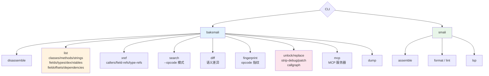

# CLI 概览

两个 jcommander CLI：`baksmali`（反汇编/查询/变换）与 `smali`（汇编/工具）。每个主类下挂子命令。

## 命令全景



## 输出格式约定

| 命令类 | 默认输出 | 切换人读文本 |
|--------|---------|-------------|
| 查询（list/xref/search/diff/fingerprint） | **JSON** | `--format text` |
| 写回变换（unlock/replace/strip-debug/patch） | **JSON 报告** | `--format text` |
| 转换（disassemble/assemble/dump） | smali 文本 / dex 二进制 | 不支持 `--format` |
| `list dex`/`vtables`/`fieldoffsets`/`dependencies` | 纯文本 | 不支持 `--format` |
| `smali lint` | 文本 | `--format json`（opt-in） |

::: tip 为什么 JSON 默认
面向 AI Agent / 脚本消费——结构化输出免去正则解析，直接 `jq` 取字段。人读场景显式 `--format text`。
:::

## 输入文件约定

所有命令接受 `dex`/`apk`/`oat`/`odex`/`zip`。多 dex 容器用路径后缀指定条目：

```bash
java -jar baksmali.jar l c "app.apk/classes2.dex"
java -jar baksmali.jar l c "framework.oat/framework.jar:classes2.dex"
```

不指定条目时默认处理第一个 dex（通常是 `classes.dex`）。

## 真实示例

各命令页均含用仓库自带 fixture（`accessorTest.dex` / `LocalTest/classes.dex` / `examples/HelloWorld`）
实跑的真实命令→真实输出对照。fixture 路径（仓库根）：

```
dexlib2/src/test/resources/accessorTest.dex
baksmali/src/test/resources/LocalTest/classes.dex
examples/HelloWorld/
```
