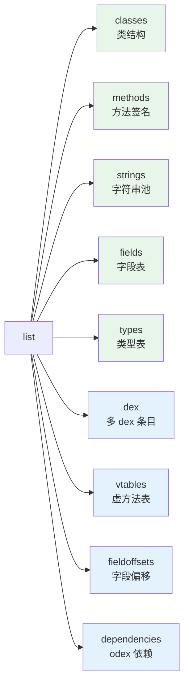

# baksmali list

快速浏览 dex/apk 文件中的各类对象，无需完整反汇编。`classes`/`methods`/`strings`/`fields`/`types`
**默认输出 JSON**，`--format text` 切回人读文本。

## 子命令



绿色子命令支持 `--format json|text`（默认 JSON）；蓝色子命令为纯文本输出（无 `--format`）。

## list classes

```bash
java -jar baksmali.jar list classes app.apk          # 默认 JSON：含结构
java -jar baksmali.jar l c app.apk --format text     # 仅类描述符
```

真实示例（`LocalTest/classes.dex`）：

```json
[{"type":"LLocalTest;","superclass":"Ljava/lang/Object;","accessFlags":1,"interfaces":[],"fields":[],"methods":[{"name":"method1","parameters":[],"returnType":"V","accessFlags":9},{"name":"method2","parameters":["I","J","Ljava/lang/String;"],"returnType":"V","accessFlags":9}]}]
```

文本对照：

```
LLocalTest;
```

## list methods

```bash
java -jar baksmali.jar list methods app.apk
java -jar baksmali.jar l m app.apk --format text
```

JSON schema：`[{"class":"Lcom/Example;","name":"foo","parameters":["I"],"returnType":"V"}]`

真实示例：

```json
[
  {"class":"LLocalTest;","name":"method1","parameters":[],"returnType":"V"},
  {"class":"LLocalTest;","name":"method2","parameters":["I","J","Ljava/lang/String;"],"returnType":"V"}
]
```

聚合选项（无需 grep/wc）：

```bash
java -jar baksmali.jar l m --count app.apk              # {"count":N}
java -jar baksmali.jar l m --group-by class app.apk     # [{group,count}]
```

`accessorTest.dex` 实跑：

```json
{"count":432}
[{"group":"Ljava/lang/Object;","count":1},{"group":"Lorg/jf/dexlib2/AccessorTypes$Accessors;","count":232},{"group":"Lorg/jf/dexlib2/AccessorTypes;","count":199}]
```

## list strings

```bash
java -jar baksmali.jar list strings app.apk
java -jar baksmali.jar l s app.apk --format text
```

真实示例（`LocalTest/classes.dex`，节选）：

```json
[
  {"string":"I"},
  {"string":"LLocalTest;"},
  {"string":"Ljava/lang/String;"},
  {"string":"blah! This local name has some spaces, a colon, even a \nnewline!"},
  {"string":"method1"}
]
```

文本对照：

```
"I"
"LLocalTest;"
"blah! This local name has some spaces, a colon, even a \nnewline!"
```

搜索字符串：JSON + `jq` 或文本 + `grep`：

```bash
java -jar baksmali.jar l s app.apk | jq -r '.[].string | select(test("https";"i"))'
java -jar baksmali.jar l s app.apk --format text | grep -iE "key|secret|token"
```

## list fields / list types

```bash
java -jar baksmali.jar list fields app.apk     # 默认 JSON: {class,name,type}
java -jar baksmali.jar list types app.apk      # 默认 JSON: {type}
```

`accessorTest.dex` 字段真实输出（节选）：

```json
[
  {"class":"Lorg/jf/dexlib2/AccessorTypes$Accessors;","name":"this$0","type":"Lorg/jf/dexlib2/AccessorTypes;"},
  {"class":"Lorg/jf/dexlib2/AccessorTypes;","name":"boolean_val","type":"Z"},
  {"class":"Lorg/jf/dexlib2/AccessorTypes;","name":"byte_val","type":"B"}
]
```

`this$0` 是非静态内部类持有的外部类实例引用——识别 Java 内部类的典型特征字段。

## list dex（多 dex 条目，纯文本）

```bash
java -jar baksmali.jar list dex app.apk
```

真实示例（两个 fixture 打成的多 dex APK）：

```
classes.dex
classes2.dex
```

## list vtables / fieldoffsets / dependencies

这三个子命令为纯文本输出，通常需要 `--boot-class-path` 提供类路径以构建类型层次：

```bash
java -jar baksmali.jar l v -b /system/framework/framework.jar app.apk
java -jar baksmali.jar l fo -b /system/framework/framework.jar app.apk
java -jar baksmali.jar l deps app.odex
```

详见 [Skills: dex-list-structure](../skills/#读取-结构)。
