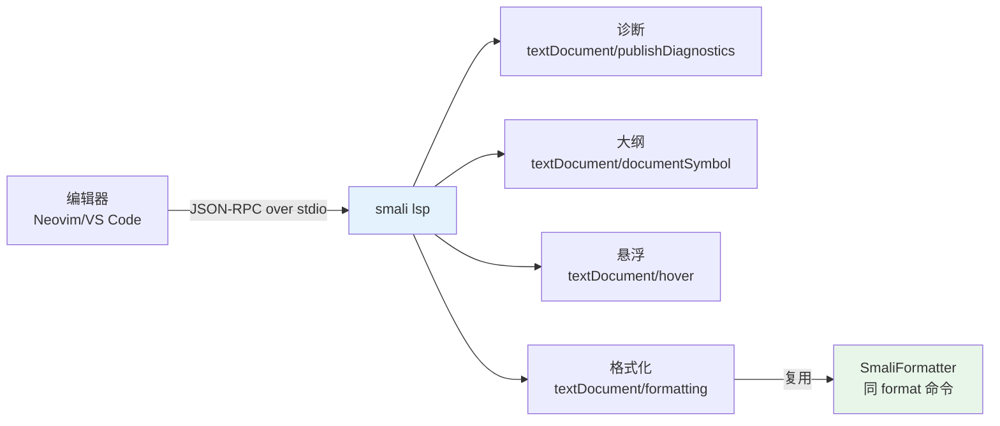

# smali lsp

smali 语言服务器（LSP over stdio），为编辑器提供 诊断 / 大纲 / 悬浮 / 格式化。Neovim、VS Code 即开即用。



## 启动

```bash
java -jar smali.jar lsp
# LSP over stdio，不输出到终端；编辑器负责启动与通信
```

## 通告的能力

| LSP 方法 | 能力 |
|----------|------|
| `textDocument/publishDiagnostics` | 汇编错误定位到行/列 |
| `textDocument/documentSymbol` | 类/方法/字段大纲 |
| `textDocument/hover` | 指令/引用悬浮信息 |
| `textDocument/formatting` | 全文格式化（复用 `SmaliFormatter`，返回单个 `TextEdit`） |

## 编辑器接入

### Neovim（native LSP）

```lua
require('lspconfig').smali.setup {
  cmd = { 'java', '-jar', '/path/to/smali.jar', 'lsp'' },
  filetypes = { 'smali' },
  root_dir = function(fname)
    return require('lspconfig.util').root_pattern('.git', 'smali.cfg')(fname) or vim.fn.getcwd()
  end,
}
```

### VS Code

用任意「通过命令启动的语言服务器」扩展（如 [vscode-anyexec](https://marketplace.visualstudio.com/...)），配置：

```json
{
  "smali.languageServer": {
    "command": "java",
    "args": ["-jar", "/path/to/smali.jar", "lsp"]
  }
}
```

## 格式化

`textDocument/formatting` 复用与 `smali format` 命令相同的 `SmaliFormatter`，返回覆盖全文的单个 `TextEdit`：

```
→ textDocument/formatting  ← [ { range:{start:{0,0},end:{N,0}}, newText:"…规范化后的整份文本…" } ]
```

已格式化的文档返回空编辑数组。在编辑器里「Format Document」即走这条路径。
