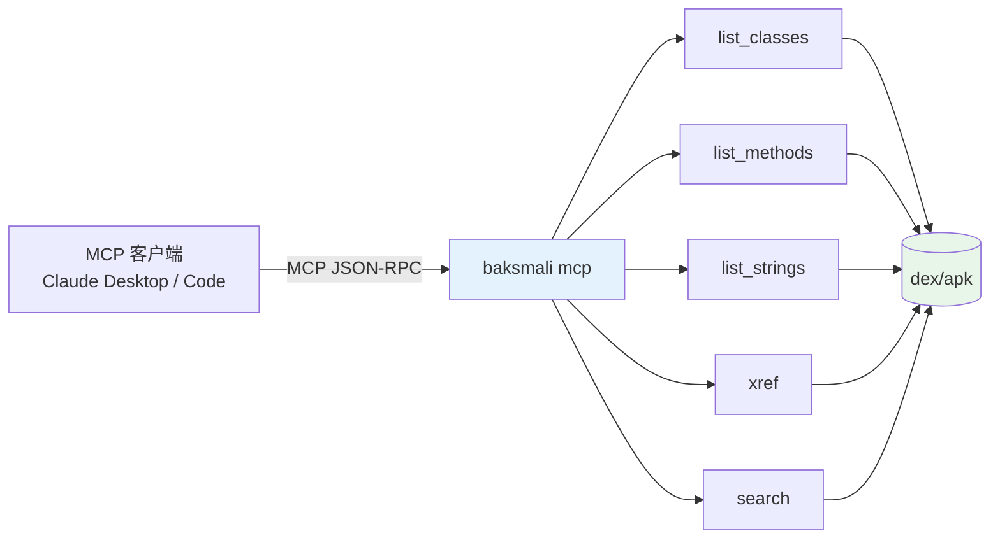

# baksmali mcp

MCP（Model Context Protocol）服务器，把只读 dex 查询暴露为 Agent 工具，集成进任意 MCP 客户端（Claude Desktop、Claude Code 等）。



## 启动

```bash
java -jar baksmali.jar mcp
# MCP over stdio；MCP 客户端负责启动与通信
```

## 暴露的工具

服务器把 baksmali 的只读查询命令封装为 MCP 工具，Agent 可直接调用（无需自己拼 shell 命令）：

| 工具 | 对应 CLI | 作用 |
|------|---------|------|
| `list_classes` | `list classes` | 列举类结构 |
| `list_methods` | `list methods` | 列举方法签名 |
| `list_strings` | `list strings` | 列举字符串池 |
| `xref` | `xref callers/field-refs/type-refs` | 反向交叉引用 |
| `search` | `search --opcode` | 指令模式搜索 |

所有工具返回结构化 JSON（与 CLI 默认输出一致），便于 Agent 直接消费。

## 与 Claude Desktop 集成

在 `claude_desktop_config.json` 中注册：

```json
{
  "mcpServers": {
    "smali-skills": {
      "command": "java",
      "args": ["-jar", "/path/to/baksmali.jar", "mcp"]
    }
  }
}
```

重启 Claude Desktop 后，Agent 即可调用上述工具查询 dex。

## 与 Claude Code 集成

在 `.mcp.json` 或项目配置中：

```json
{
  "mcpServers": {
    "smali-skills": {
      "command": "java",
      "args": ["-jar", "/path/to/baksmali.jar", "mcp"]
    }
  }
}
```

## 设计原则

- **只读**：mcp 服务器不提供任何写回变换（unlock/replace/patch），避免 Agent 误改 dex。
- **结构化**：工具返回 JSON，非文本，Agent 无需正则解析。
- **复用 CLI**：底层与 `list`/`xref`/`search` 命令共享同一查询逻辑。
