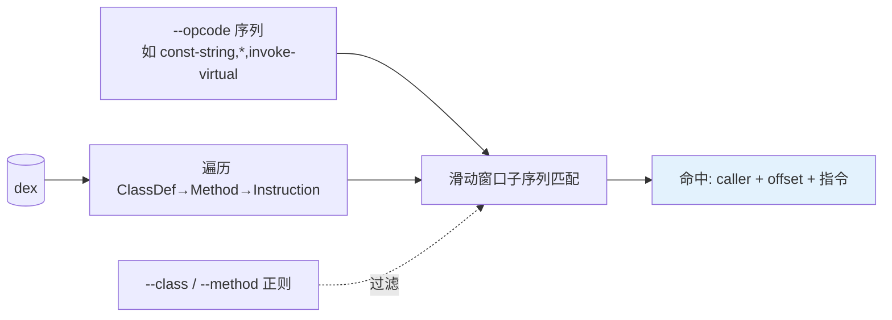

# baksmali search

在方法指令流中搜索连续的 opcode 模式（如 `const-string,invoke-virtual`），支持 `*` 通配符和类/方法正则过滤。



## 用法

```bash
# 默认就是 JSON；下面不再重复 --format json
java -jar baksmali.jar search app.apk --opcode const-string,invoke-virtual
# 人读文本
java -jar baksmali.jar search app.apk --opcode const-string,invoke-virtual --format text
# 单 opcode
java -jar baksmali.jar search app.apk --opcode invoke-virtual
# 通配符 *：匹配任意单条 opcode
java -jar baksmali.jar search app.apk --opcode "const-string,*,invoke-virtual"
# 类/方法正则过滤
java -jar baksmali.jar search app.apk --class "Lcom/example/.*" --method "onCreate"
# 不指定 --opcode：按 --class/--method 正则列举匹配的方法
java -jar baksmali.jar search app.apk --class "Lcom/.*" --method "onCreate"
```

## 输出格式

JSON（默认）：

```json
[{"caller":"Lcom/Example;->greet()V","offset":"0x2","instructions":["const-string \"hello\"","invoke-virtual ..."]}]
```

文本：每个匹配输出 `类->方法 @ offset`，后跟匹配的指令：

```
Lcom/Example;->greet()V @ offset 0x2
  const-string "hello"
  invoke-virtual ...
```

`offset` 是匹配序列第一条指令在方法体内的字节偏移（hex）。

## 匹配规则

- **连续匹配**：模式中每个 token 必须与方法中连续的指令一一对应。
- **`*` 通配**：匹配任意一条 opcode。如 `const-string,*,return-void` 中 `*` 匹配两者之间的那条指令。
- **重叠匹配**：从每个起始位置都尝试，会报告重叠的匹配。
- **大小写不敏感**：opcode 名。
- **类/方法正则**：用 `find()`（部分匹配）；`--class` 作用于类型描述符，`--method` 作用于方法名。

## 真实示例

用 `accessorTest.dex` fixture（含大量 `invoke-static` 合成访问器调用）：

```bash
java -jar baksmali.jar search \
  dexlib2/src/test/resources/accessorTest.dex \
  --opcode invoke-static
```

实际输出（默认 JSON，节选）：

```json
[
  {"caller":"Lorg/jf/dexlib2/AccessorTypes$Accessors;->boolean_and(Z)V","offset":"0x2","instructions":["invoke-static Lorg/jf/dexlib2/AccessorTypes;->access$072(Lorg/jf/dexlib2/AccessorTypes;I)Z"]},
  {"caller":"Lorg/jf/dexlib2/AccessorTypes$Accessors;->boolean_or(Z)V","offset":"0x2","instructions":["invoke-static Lorg/jf/dexlib2/AccessorTypes;->access$076(Lorg/jf/dexlib2/AccessorTypes;I)Z"]}
]
```

人读文本对照：

```
Lorg/jf/dexlib2/AccessorTypes$Accessors;->boolean_and(Z)V @ offset 0x2
  invoke-static Lorg/jf/dexlib2/AccessorTypes;->access$072(Lorg/jf/dexlib2/AccessorTypes;I)Z
Lorg/jf/dexlib2/AccessorTypes$Accessors;->boolean_or(Z)V @ offset 0x2
  invoke-static Lorg/jf/dexlib2/AccessorTypes;->access$076(Lorg/jf/dexlib2/AccessorTypes;I)Z
```

每个 `Accessors` 内部类方法都在偏移 `0x2` 处通过 `invoke-static` 调用一个 `access$NNN` 桥接方法。

## 典型场景

| 场景 | 命令 |
|------|------|
| 找日志调用点 | `--opcode "const-string,invoke-virtual"` + grep 日志 tag |
| 找字符串拼接 | `--opcode "new-instance,invoke-direct,const-string,invoke-virtual"` (StringBuilder) |
| 找反射调用 | `--opcode "invoke-virtual"` + `--method "invoke"` + `--class "Ljava/lang/reflect/.*"` |
| 找某类的所有方法 | `--class "Lcom/example/.*"`（无 --opcode） |
| 找入口方法 | `--method "main"` |

## 与 xref 的区别

- `search`：按 **opcode 模式** 正向搜索指令序列（找「什么样的指令」）。
- `xref`：按 **引用目标** 反向查询（找「谁调用了这个方法」）。见 [xref](./xref)。
