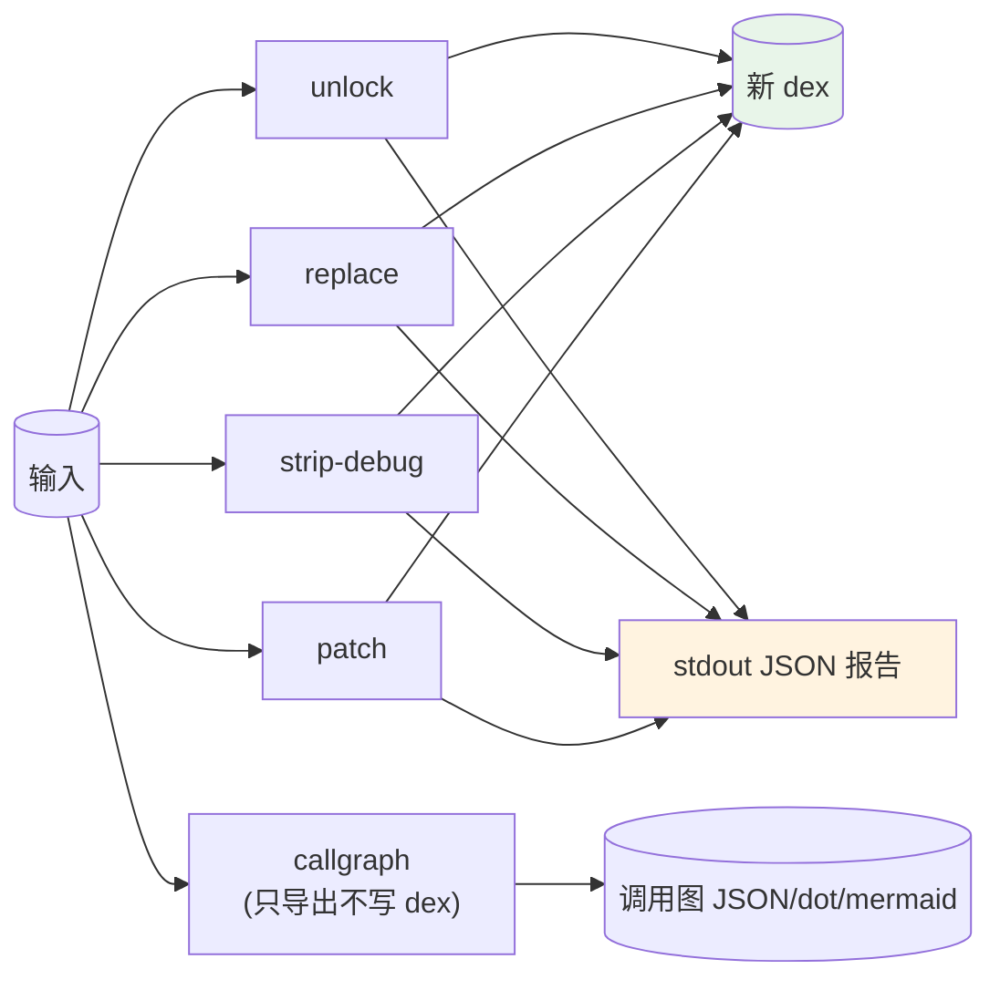

# baksmali 变换命令

读入 dex → 应用变换 → 写出新 dex 的 `baksmali` 子命令组（区别于只读的 list/xref/search）。完整工作流与组合示例见 [写回变换](../guide/transform)。



## 共同行为

- 读入一个 dex/apk → 应用变换 → 用 `-o/--output`（默认 `out.dex`）写出一个新 dex。**原文件不被修改。**
- 成功时默认输出一行 **JSON 报告**（`command`/`input`/`output` + 各命令特有统计字段）；`--format text` 切回人读文本。
- 错误（无匹配、类型不兼容、缺必需参数）输出到 stderr 并以非零码退出，不影响 stdout JSON。

## unlock — 批量修改访问标志

```bash
baksmali unlock app.apk -o unlocked.dex            # publicize + definalize（默认）
baksmali unlock app.apk --public   -o public.dex   # 仅 publicize
baksmali unlock app.apk --no-final -o open.dex     # 仅 definalize
```

真实 JSON 报告：

```json
{"command":"unlock","input":"app.apk","output":"unlocked.dex","publicized":true,"definalized":true}
```

## replace — 批量替换字符串常量

```bash
# 字面替换（--from 与 --to 按出现顺序配对）
baksmali replace app.apk --from http://old.example --to http://new.example -o patched.dex
# 多条规则，按顺序依次施加
baksmali replace app.apk --from DEBUG --to RELEASE --from v1 --to v2 -o patched.dex
# 正则替换，--to 可用 $1 引用捕获组
baksmali replace app.apk --regex "key_[0-9]+" --to REDACTED -o patched.dex
```

JSON 报告含 `rules`（数量）与 `ruleDetails`（数组，每条含 `type`/`from`/`to`）。HTML 转义已禁用，URL/正则元字符原样保留。

## strip-debug — 清除调试信息

```bash
baksmali strip-debug app.apk -o stripped.dex
```

```json
{"command":"strip-debug","input":"app.apk","output":"stripped.dex","strippedDebugInfo":true}
```

## patch — 强制方法返回定值

```bash
baksmali patch app.apk --method 'isPremium' --return true -o patched.dex
baksmali patch app.apk --class 'Lcom/drm/.*' --method 'check' --return void -o patched.dex
```

真实 JSON 报告：

```json
{"command":"patch","input":"app.apk","output":"patched.dex","matched":1,"return":"void","classFilter":"Lorg/jf/.*","methodFilter":"boolean_and"}
```

`--return` 取值：`void`（V）、`true`/`false`/`0`/`1`（布尔/数值）、`null`（对象/数组）。必须至少给出 `--class` 或 `--method` 之一；类型不兼容会报错中止。

## callgraph — 导出调用图

```bash
baksmali callgraph app.apk                              # JSON（默认）
baksmali callgraph app.apk --graph-format dot > cg.dot  # Graphviz
baksmali callgraph app.apk --graph-format mermaid       # Mermaid 流程图
baksmali callgraph app.apk --class 'Lcom/example/.*'    # 只看某子系统
```

JSON 结构：`{"nodes":[...],"edges":[{"from":"...","to":"..."}]}`，节点用规范 smali 描述符 `Lpkg/Cls;->name(参数)返回类型`。
