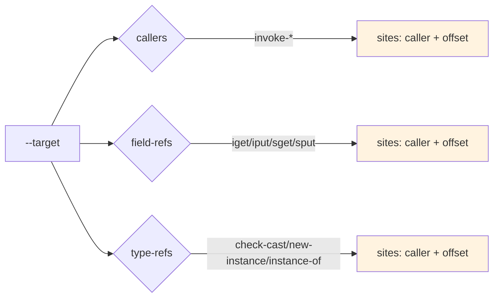

# baksmali xref

反向交叉引用查询：给定一个方法/字段/类型，找出 dex 中所有引用它的位置。`list`（正向列举）的补充。



## 子命令

| 子命令 | 别名 | 匹配的引用类型 |
|--------|------|----------------|
| `callers` | `caller`, `c` | 方法引用（invoke-*） |
| `field-refs` | `field-ref`, `f` | 字段引用（iget/iput/sget/sput） |
| `type-refs` | `type-ref`, `t` | 类型引用（check-cast/new-instance/instance-of 等） |

## 用法

```bash
# 默认就是 JSON；下面不再重复 --format json
java -jar baksmali.jar xref callers app.apk --target "Lcom/Example;->foo()V"
# 人读文本
java -jar baksmali.jar xref callers app.apk --target "Lcom/Example;->foo()V" --format text
# 子串匹配（不记得完整签名时）—— foo()V 会匹配任何含该子串的方法
java -jar baksmali.jar xref callers app.apk --target "foo()V"
# 不指定 --target：列出该类型的所有目标及其引用点
java -jar baksmali.jar xref callers app.apk
```

## 输出格式

JSON（默认）：

```json
[{"target":"Lcom/Example;->foo()V","sites":[{"caller":"Lcom/App;->onCreate()V","offset":"0x4"}]}]
```

文本：先输出目标，再缩进列出每个引用点：

```
Lcom/Example;->foo()V
  Lcom/App;->onCreate()V @ offset 0x4
```

`offset` 是引用指令在方法体内的字节偏移（hex），可定位到反汇编输出的具体行。

## 匹配规则

- **精确匹配优先**：`--target` 值等于格式化后的引用描述符时直接命中。
- **子串回退**：无精确匹配时，对每个已知目标做 `contains` 子串匹配。
- **类型过滤**：每个子命令只报告对应引用类型的目标。

## 真实示例

用 `accessorTest.dex` fixture——`access$072` 是内部类调用的桥接方法：

```bash
java -jar baksmali.jar xref callers \
  dexlib2/src/test/resources/accessorTest.dex \
  --target "Lorg/jf/dexlib2/AccessorTypes;->access\$072(Lorg/jf/dexlib2/AccessorTypes;I)Z"
```

实际输出（默认 JSON）：

```json
[{"target":"Lorg/jf/dexlib2/AccessorTypes;->access$072(Lorg/jf/dexlib2/AccessorTypes;I)Z","sites":[{"caller":"Lorg/jf/dexlib2/AccessorTypes$Accessors;->boolean_and(Z)V","offset":"0x2"}]}]
```

人读文本对照：

```
Lorg/jf/dexlib2/AccessorTypes;->access$072(Lorg/jf/dexlib2/AccessorTypes;I)Z
  Lorg/jf/dexlib2/AccessorTypes$Accessors;->boolean_and(Z)V @ offset 0x2
```

`boolean_and(Z)V` 在偏移 `0x2` 处调用了 `access$072`——这正是内部类访问外部类私有成员时编译器生成的合成调用。

## 典型场景

| 场景 | 命令 |
|------|------|
| 找某 Activity 的所有启动点 | `xref callers --target "->startActivity(...)"` |
| 找某字段的写入点 | `xref field-refs --target "Lcom/Config;->token:Ljava/lang/String;"` |
| 找某类的所有实例化 | `xref type-refs --target "Lcom/Sensitive;"` |
| 找构造函数的所有调用者 | `xref callers --target "-><init>()V"` |
| 找某 SDK 方法的集成点 | `xref callers --target "Lcom/sdk/;->track("` |
