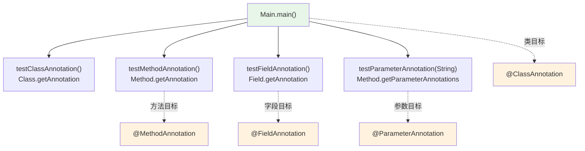

# 🏷️ AnnotationTypes — 注解的四种目标

本示例展示在 smali 中注解（annotation）可挂载到的四种目标：**类**、**方法**、**字段**、**参数**。每种目标对应一个空的标记注解接口，`Main` 类在四处分别挂载它们，再通过反射逐个读取并打印，验证 `.annotation` 指令可绑定到任一目标元素。

## 🎯 示例定位

| 文件 | 角色 |
| --- | --- |
| `ClassAnnotation.smali` | 类目标注解接口（空标记注解） |
| `MethodAnnotation.smali` | 方法目标注解接口 |
| `FieldAnnotation.smali` | 字段目标注解接口 |
| `ParameterAnnotation.smali` | 参数目标注解接口 |
| `Main.smali` | 入口类，在四处挂载注解并通过反射打印 |

> 四个注解接口结构完全一致：`.class public abstract interface annotation` + `.implements Ljava/lang/annotation/Annotation;`，差异仅在于挂载位置。

## 📋 语法要点

| 目标 | 挂载位置 | smali 写法 | 反射读取 API |
| --- | --- | --- | --- |
| 类 | 类声明后、方法外 | `.annotation runtime LClassAnnotation;` `.end annotation` | `Class.getAnnotation(Class)` |
| 方法 | 方法体内、指令前 | `.annotation runtime LMethodAnnotation;` `.end annotation` | `Method.getAnnotation(Class)` |
| 字段 | `.field` 块内 | `.field ... .annotation runtime LFieldAnnotation; .end annotation .end field` | `Field.getAnnotation(Class)` |
| 参数 | `.param` 块内 | `.param p0 .annotation runtime LParameterAnnotation; .end annotation .end param` | `Method.getParameterAnnotations()` |

> 可见性三档：`runtime`（对应 `RetentionPolicy.RUNTIME`，反射可读）、`build`（仅构建期，反射不可见）、`system`（`dalvik/annotation/*` 系统注解，VM 内部用）。本示例四个挂载点全用 `runtime`，反射均能取回。

## 🔧 smali 源码摘录

注解接口定义（四个接口结构相同，以 `ClassAnnotation` 为例）：

```smali
.class public abstract interface annotation LClassAnnotation;
.super Ljava/lang/Object;
.implements Ljava/lang/annotation/Annotation;
```

四种挂载位置（均使用 `runtime` 保留策略）：

```smali
# 类目标——挂在类声明后、方法外
.annotation runtime LClassAnnotation;
.end annotation

# 方法目标——挂在方法体内、指令之前
.method public static testMethodAnnotation()V
    .registers 4
    .annotation runtime LMethodAnnotation;
    .end annotation
    sget-object v0, Ljava/lang/System;->out:Ljava/io/PrintStream;
    ...
.end method

# 字段目标——挂在 .field 块内
.field public static fieldAnnotationTest:Ljava/lang/Object;
    .annotation runtime LFieldAnnotation;
    .end annotation
.end field

# 参数目标——挂在 .param 块内，绑定到具体参数寄存器
.method public static testParameterAnnotation(Ljava/lang/String;)V
    .registers 6
    .param p0    # Ljava/lang/String;
        .annotation runtime LParameterAnnotation;
        .end annotation
    .end param
    ...
.end method
```

> 参数注解反射取二维数组首元素首元素（`Main.smali:129-133`）：`getParameterAnnotations()` 返回 `[[Annotation`，外层按参数索引、内层为该参数上的多个注解。

## ☕ Java 等价代码

```java
import java.lang.annotation.*;

@Retention(RetentionPolicy.RUNTIME) @interface ClassAnnotation {}
@Retention(RetentionPolicy.RUNTIME) @interface MethodAnnotation {}
@Retention(RetentionPolicy.RUNTIME) @interface FieldAnnotation {}
@Retention(RetentionPolicy.RUNTIME) @interface ParameterAnnotation {}

@ClassAnnotation
public class Main {
    @MethodAnnotation public static void testMethodAnnotation() {}
    @FieldAnnotation public static Object fieldAnnotationTest;
    public static void testParameterAnnotation(@ParameterAnnotation String p0) {}

    public static void main(String[] args) throws Exception {
        System.out.println(Main.class.getAnnotation(ClassAnnotation.class));
        System.out.println(Main.class.getMethod("testMethodAnnotation")
                .getAnnotation(MethodAnnotation.class));
        System.out.println(Main.class.getField("fieldAnnotationTest")
                .getAnnotation(FieldAnnotation.class));
        System.out.println(Main.class.getMethod("testParameterAnnotation", String.class)
                .getParameterAnnotations()[0][0]);
    }
}
```

## 🔗 挂载结构与反射调用流



## 🛠️ 汇编与反汇编命令

```bash
# 1) 汇编整个目录（4 个注解接口 + Main）
java -jar smali.jar assemble -o /tmp/AnnotationTypes.dex examples/AnnotationTypes/

# 2) 反汇编验证注解在各目标上完整保留
java -jar baksmali.jar disassemble -o /tmp/out /tmp/AnnotationTypes.dex
grep -n "LClassAnnotation\|LMethodAnnotation\|LFieldAnnotation\|LParameterAnnotation" /tmp/out/Main.smali

# 3) 运行（需 dalvikvm / Android 设备或等价 dex 运行时）
dalvikvm -cp /tmp/AnnotationTypes.dex Main
```

预期输出（与 `Main.smali:5-9` 注释一致）：

```
@ClassAnnotation()
@MethodAnnotation()
@FieldAnnotation()
@ParameterAnnotation()
```

## 📖 延伸阅读

- [AnnotationValues — 注解元素值](./AnnotationValues.md)：为注解元素赋值与 `AnnotationDefault` 默认值
- [HelloWorld — 最小可运行类](./HelloWorld.md)：基本的类/方法/调用结构
- [assemble CLI](../cli/assemble.md) / [disassemble CLI](../cli/disassemble.md)：汇编与反汇编命令完整选项
- [示例索引](./)：所有端到端可运行示例
