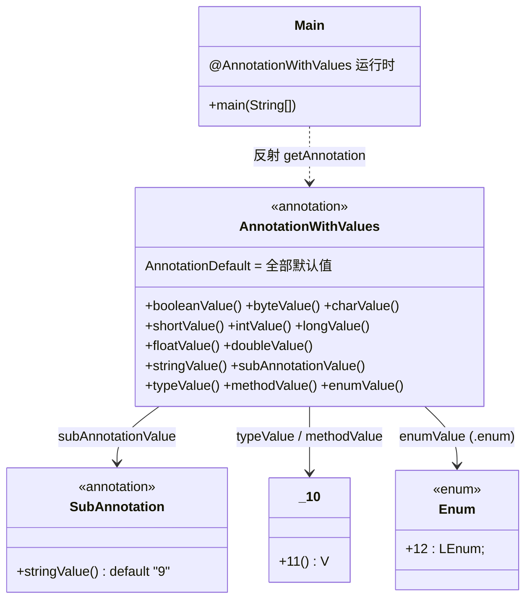

# 📝 AnnotationValues — 注解元素值

注解（annotation）在 dex 中以「键 = 值」形式存放元素值，值类型涵盖全部八种基本类型、字符串、`Class`、`Method`、`Enum`、数组以及嵌套子注解。本示例用一张注解接口 `AnnotationWithValues` 把所有值类型一次列全，并通过 `AnnotationDefault` 给出默认值，再让 `Main` 标注运行时注解、用反射 `getAnnotation` 打印——验证 smali ⇄ dex 在注解值上 100% 往返。

## 🎯 示例定位

| 文件 | 角色 |
| --- | --- |
| `AnnotationWithValues.smali` | 注解接口定义，附 `AnnotationDefault` 全量默认值 |
| `SubAnnotation.smali` | 嵌套子注解接口（仅 `stringValue()`） |
| `Enum.smali` | 枚举类型，供 `enumValue` 引用 |
| `10.smali` | 普通类，作为 `typeValue` 与 `methodValue` 的引用目标 |
| `Main.smali` | 入口类，标注运行时注解并通过反射打印 |

> 类名 `10`、方法名 `11`、枚举常量 `12` 均非合法 Java 标识符，但 smali/dex 允许这类名称，故反射输出形如 `class 10`、`10.11()`——这正是 smali 文本表达力强于 Java 源码的体现。

## 📋 语法要点

| 元素值类型 | smali 写法 | 后缀/标记 | 说明 |
| --- | --- | --- | --- |
| 布尔 `Z` | `booleanValue = false` | — | 仅 `true`/`false` |
| 字节 `B` | `byteValue = 1t` | `t` | 整数字面量加 `t` |
| 字符 `C` | `charValue = '2'` | 单引号 | 字符字面量 |
| 短整型 `S` | `shortValue = 3s` | `s` | 整数加 `s` |
| 整型 `I` | `intValue = 4` | — | 裸数字 |
| 长整型 `J` | `longValue = 5l` | `l` | 整数加 `l` |
| 单精度 `F` | `floatValue = 6.0f` | `f` | 浮点加 `f` |
| 双精度 `D` | `doubleValue = 7.0` | — | 浮点字面量 |
| 字符串 | `stringValue = "8"` | 双引号 | UTF-8 字符串 |
| 类型 `Class` | `typeValue = L10;` | — | 类型描述符 |
| 方法 `Method` | `methodValue = L10;->11()V` | `->` | 类描述符分隔方法 |
| 枚举 `Enum` | `.enum LEnum;->12:LEnum;` | `.enum` 前缀 | 标记为枚举常量引用 |
| 嵌套子注解 | `.subannotation LSubAnnotation; ... .end subannotation` | `.subannotation` | 子注解块 |
| 默认值 | `.annotation system Ldalvik/annotation/AnnotationDefault;` | `system` | 注解接口内声明 |
| 运行时注解 | `.annotation runtime LAnnotationWithValues;` | `runtime` | 保留至运行时可反射 |

> 数组值写法为 `.array [ ... ]`，本示例未使用但语法同源。`runtime` 对应 `RetentionPolicy.RUNTIME`，`build`/`system` 则分别对应编译期与 dex 内部元数据。

## 🔧 smali 源码摘录

`AnnotationDefault` 中八种基本类型与引用类型的完整默认值（`examples/AnnotationValues/AnnotationWithValues.smali:48-66`）：

```smali
.annotation system Ldalvik/annotation/AnnotationDefault;
    value = .subannotation LAnnotationWithValues;
                booleanValue = false          # Z
                byteValue = 1t                # B
                charValue = '2'               # C
                shortValue = 3s               # S
                intValue = 4                  # I
                longValue = 5l                # J
                floatValue = 6.0f             # F
                doubleValue = 7.0             # D
                stringValue = "8"             # Ljava/lang/String;
                subAnnotationValue = .subannotation LSubAnnotation;
                                            stringValue = "9"
                                     .end subannotation
                typeValue = L10;              # Ljava/lang/Class;
                methodValue = L10;->11()V     # Ljava/lang/reflect/Method;
                enumValue = .enum LEnum;->12:LEnum;
            .end subannotation
.end annotation
```

入口类标注空运行时注解并反射读取（`examples/AnnotationValues/Main.smali:8-25`）。`Main` 未显式赋值，故反射拿到的全部是 `AnnotationDefault` 中的默认值：

```smali
.method public static main([Ljava/lang/String;)V
    .registers 3
    sget-object v0, Ljava/lang/System;->out:Ljava/io/PrintStream;
    const-class v1, LMain;
    const-class v2, LAnnotationWithValues;
    invoke-virtual {v1, v2}, Ljava/lang/Class;->getAnnotation(Ljava/lang/Class;)Ljava/lang/annotation/Annotation;
    move-result-object v1
    invoke-virtual {v0, v1}, Ljava/io/PrintStream;->println(Ljava/lang/Object;)V
    return-void
.end method

.annotation runtime LAnnotationWithValues;
.end annotation
```

枚举常量 `12` 在 `<clinit>` 中构造（`examples/AnnotationValues/Enum.smali:13-16`），供 `.enum` 引用：

```smali
new-instance v0, LEnum;
const-string v1, "12"
invoke-direct {v0, v1, v2}, LEnum;-><init>(Ljava/lang/String;I)V
sput-object v0, LEnum;->12:LEnum;
```

## ☕ Java 等价代码

```java
public @interface SubAnnotation { String stringValue(); }

public @interface AnnotationWithValues {
    boolean booleanValue() default false;
    byte    byteValue()    default 1;
    char    charValue()    default '2';
    short   shortValue()   default 3;
    int     intValue()     default 4;
    long    longValue()    default 5L;
    float   floatValue()   default 6.0f;
    double  doubleValue()  default 7.0;
    String  stringValue()  default "8";
    SubAnnotation subAnnotationValue() default @SubAnnotation(stringValue = "9");
    Class<?>  typeValue()  default _10.class;                 // 类名 10
    Method    methodValue() default _10.class.getMethods()[0];
    Enum12    enumValue()  default Enum12._12;
}

@AnnotationWithValues   // 全部走默认值
public class Main {
    public static void main(String[] args) {
        System.out.println(Main.class.getAnnotation(AnnotationWithValues.class));
    }
}
```

> 类名 `10`、方法 `11`、枚举常量 `12` 在 Java 源码层无法直接书写（非合法标识符），故等价代码以 `_10`/`Enum12._12` 占位。`Main.smali:5` 的注释给出了预期的反射输出。

## 🧩 注解结构关系



## 🛠 汇编命令

```bash
# 进入示例目录
cd examples/AnnotationValues

# 汇编全部 .smali 为单个 dex（jar 形态）
java -jar smali/build/libs/smali.jar assemble -o AnnotationValues.dex .

# 反汇编回 smali，验证 AnnotationDefault 与子注解值是否完整往返
java -jar baksmali/build/libs/baksmali.jar disassemble AnnotationValues.dex -o out/

# 查看反汇编产物中注解默认值块
grep -A2 'AnnotationDefault' out/AnnotationWithValues.smali
```

反汇编产物中 `AnnotationDefault` 块应与源码逐字一致（键名、值字面量、`.subannotation`/`.enum` 前缀全部保留），印证 smali 文本是 dex 的无损表示。预期反射输出（`Main.smali:5` 注释）：

```
@AnnotationWithValues(booleanValue=false, byteValue=1, charValue=2, doubleValue=7.0,
  enumValue=12, floatValue=6.0, intValue=4, longValue=5,
  methodValue=public static void 10.11(), shortValue=3, stringValue=8,
  subAnnotationValue=@SubAnnotation(stringValue=9), typeValue=class 10)
```

## 📚 延伸阅读

- [AnnotationTypes — 注解的四种目标](./AnnotationTypes.md)：注解挂载到类/方法/字段/参数的写法
- [RecursiveAnnotation — 递归注解](./RecursiveAnnotation.md)：注解引用自身的循环结构
- [Enums — 枚举类的手写实现](./Enums.md)：`<clinit>` 构造常量与 `values()`/`valueOf` 合成方法
- [BracketedMemberNames — 括号成员名](./BracketedMemberNames.md)：非标识符成员名的另一种写法
- [示例索引](./)：所有端到端可运行示例
