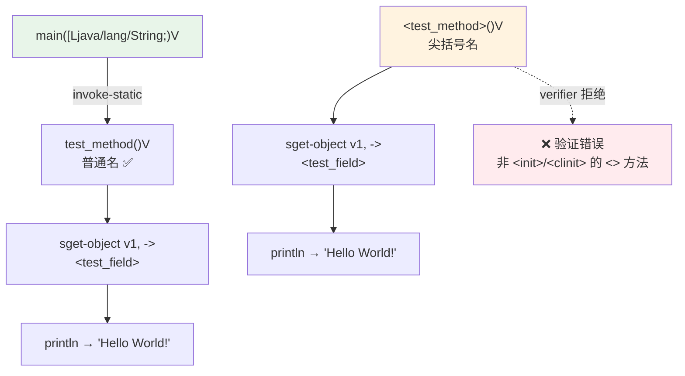
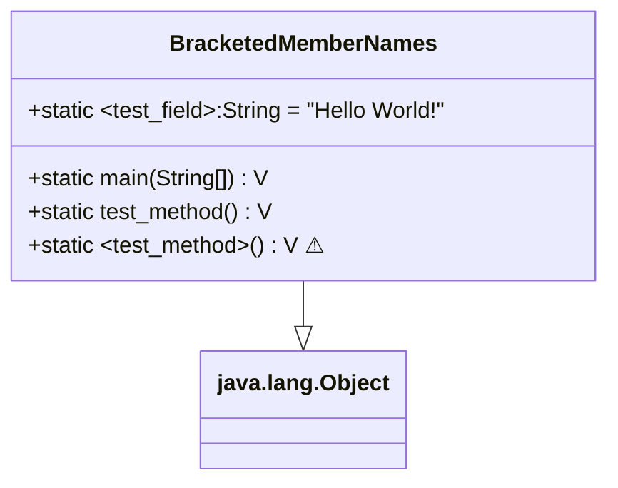

# 🧷 BracketedMemberNames — 尖括号成员名

`examples/BracketedMemberNames/BracketedMemberNames.smali` 展示一个反直觉特性：在 JVM 层 `<>` 是构造器/初始化方法（`<init>`、`<clinit>`）的保留记法，但 dex 字节码层面成员名只是一串字符串，并无此限制。smali 作为贴近字节码的汇编，词法器把 `<SimpleName>` 整体识别为 `MEMBER_NAME` 记号，因而允许你声明并引用 `<test_field>`、`<test_method>` 这类 Java 源码无法书写的成员名。

## 🎯 示例定位

普通 Java 源码无法声明名为 `<test_field>` 的字段或 `<test_method>` 的方法——`<>` 在 Java 标识符里非法，编译器直接拒绝。但 dex 文件的 `field_ids` / `method_ids` 表里名字只是一个 UTF-8 串；smali 贴近这一层，提供 `<SimpleName>` 记法来直接表达它。本例同时演示“语法合法 ≠ 运行时合法”：smali 能汇编，dex verifier 却会拒绝非 `<init>`/`<clinit>` 的尖括号方法调用。

## 📋 语法要点

| 要点 | 体现 | 说明 |
|------|------|------|
| 尖括号字段声明 | `.field public static <test_field>:Ljava/lang/String;` | 声明处直接写 `<name>` |
| 尖括号方法声明 | `.method public static <test_method>()V` | 方法名同样可含 `<>` |
| 字段引用 | `sget-object v1, LBracketedMemberNames;-><test_field>:Ljava/lang/String;` | 引用处同样直接写 `<name>`，无额外转义 |
| 普通方法调用 | `invoke-static {}, LBracketedMemberNames;->test_method()V` | 普通名照常调用 |
| 尖括号方法调用 | `invoke-static {}, LBracketedMemberNames;-><test_method>()V` | 词法上合法 |
| 静态初始值 | `= "Hello World!"` | 字段可附编译期常量 |
| 验证陷阱 | 直接调用 `<test_method>` 触发 verifier 报错 | 名字合法不代表运行时合法 |

> 关键澄清：声明与引用**写法一致**——都直接写 `<test_field>`，没有方括号 `[...]` 转义。这是 smali 词法规则，见下方源码引用。真正的“转义”机制是反引号 `` `name` ``（`SimpleNameQuoted`），用于含空格等更特殊字符的名字，但仅限类型描述符路径上下文。

## 📜 源码摘录

声明带尖括号名的字段（`examples/BracketedMemberNames/BracketedMemberNames.smali:5`）：

```smali
.class public LBracketedMemberNames;
.super Ljava/lang/Object;

# 字段名含 <>，声明处直接书写
.field public static <test_field>:Ljava/lang/String; = "Hello World!"
```

引用处同样直接写尖括号名（`BracketedMemberNames.smali:18-20`）：

```smali
.method public static test_method()V
    .registers 2
    sget-object v0, Ljava/lang/System;->out:Ljava/io/PrintStream;
    # 引用 <test_field> 时直接写，无需方括号
    sget-object v1, LBracketedMemberNames;-><test_field>:Ljava/lang/String;
    invoke-virtual {v0, v1}, Ljava/io/PrintStream;->println(Ljava/lang/String;)V
    return-void
.end method
```

第三个方法 `<test_method>` 演示对尖括号名方法的调用，注释指出会引发验证错误（`BracketedMemberNames.smali:27-39`）：

```smali
.method public static <test_method>()V
    .registers 2
    sget-object v0, Ljava/lang/System;->out:Ljava/io/PrintStream;
    sget-object v1, LBracketedMemberNames;-><test_field>:Ljava/lang/String;
    invoke-virtual {v0, v1}, Ljava/io/PrintStream;->println(Ljava/lang/String;)V
    # 名字虽能被 smali 解析，但运行时 verifier 会拒绝
    invoke-static {}, LBracketedMemberNames;-><test_method>()V
    return-void
.end method
```

## 🔬 词法器如何识别

smali 用 JFlex 词法器把 `<SimpleName>` 整体切成一个 `MEMBER_NAME` 记号，与普通 `SIMPLE_NAME` 区分但等价使用：

- `smali/src/main/jflex/smaliLexer.jflex:779` —— `"<" {SimpleNameRaw} ">" { return newToken(MEMBER_NAME); }`
- `smali/src/main/antlr/smaliParser.g:608-610` —— `member_name: SIMPLE_NAME | MEMBER_NAME -> SIMPLE_NAME[...]`

即 `MEMBER_NAME` 在 AST 层被归一为 `SIMPLE_NAME`，声明与引用走同一条 `member_name` 产生式（`smaliParser.g:498` 字段、`:508` 方法、`:747`/`:751` 引用），所以两边写法必然一致。

## 🧩 结构与调用流



类结构上 `LBracketedMemberNames;` 持有一个尖括号名静态字段与三个静态方法（其一同为尖括号名）：



## ☕ Java 等价

Java 源码无法直接写出 `<test_field>` 这样的标识符；下面是“语义等价”的合法 Java 形态（普通名），用于对照理解字节码行为：

```java
public class BracketedMemberNames {
    public static String test_field = "Hello World!";

    public static void main(String[] args) {
        test_method();
    }

    public static void test_method() {
        System.out.println(test_field);
    }

    // <test_method>() 在 Java 中不可表达；
    // 即便手工构造 dex，运行时 verifier 也会拒绝此类
    // 非 <init>/<clinit> 的尖括号方法调用。
}
```

## 🛠 汇编与反汇编

```bash
# 汇编：源文件引用处直接写 <test_field>，smali 能正确解析
java -jar smali/build/libs/smali.jar assemble \
    examples/BracketedMemberNames/BracketedMemberNames.smali -o classes.dex
# exit=0，无报错

# 反汇编对照，确认尖括号在 round-trip 中保持稳定
java -jar baksmali/build/libs/baksmali.jar disassemble classes.dex -o out/
# out/BracketedMemberNames.smali 中 <test_field> / <test_method> 完整保留
```

实测 round-trip 输出（节选）：

```smali
.field public static <test_field>:Ljava/lang/String; = "Hello World!"
...
sget-object v1, LBracketedMemberNames;-><test_field>:Ljava/lang/String;
invoke-static {}, LBracketedMemberNames;-><test_method>()V
```

在设备上运行时，`main` 只调用普通名 `test_method`，可正常打印；若执行流走到 `<test_method>` 的自调用，dalvik verifier 会拒绝。

## 🧭 设计意图

此例同时教导两件事：其一，smali 词法器把成员名视作普通字符串，`<SimpleName>` 记法让 `<init>`/`<clinit>` 之外的特殊名也可被表达与引用，且声明与引用写法一致；其二，**能汇编 ≠ 能运行**——dex verifier 对方法名有额外约束，`<>` 仅允许用于 `<init>` / `<clinit>`。手写字节码或做混淆/反混淆时，区分“语法合法”与“语义合法”至关重要。

## 📚 延伸阅读

- [smali 语法参考](../internals/smali-syntax.md)
- [汇编管线](../reference/smali/assembly-pipeline.md)
- [dex-assemble skill](../skills/dex-assemble.md)
- [HelloWorld 示例](./HelloWorld.md)
- [示例总览](./)
