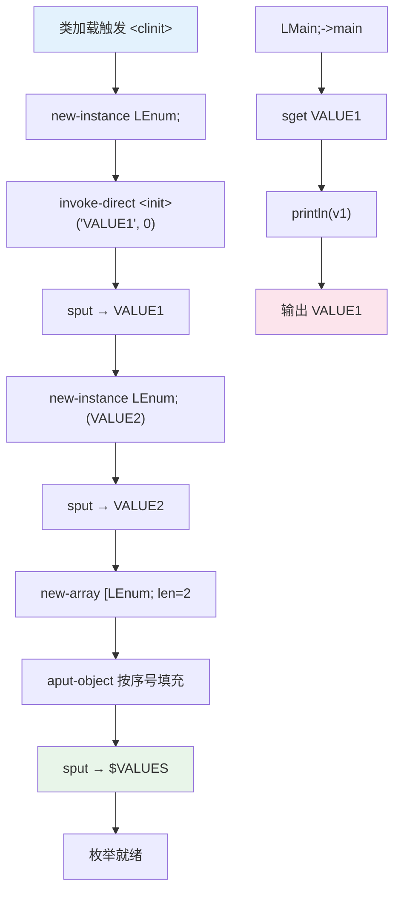

# 🎴 Enums — 枚举类的手写 smali 实现

Java 的 `enum` 关键字只是一颗语法糖——编译器替你生成一整套样板：每个常量是类的 `public static final enum` 实例字段、一个 `private` 构造器、一个合成 `$VALUES` 数组，外加 `values()` / `valueOf(String)` 两个静态方法。smali 层没有这颗糖，你必须手写全部。`examples/Enums/` 展示一个含 `VALUE1`/`VALUE2` 两常量的最小枚举类，入口 `LMain;` 读取并打印 `VALUE1`，预期输出：

```
VALUE1
```

## 🎯 示例定位

| 维度 | 说明 |
|------|------|
| 类声明 | `Enum.smali:1` — `.class public final enum LEnum;` |
| 父类 | `Enum.smali:2` — `.super Ljava/lang/Enum;`，所有枚举隐式继承 |
| 枚举常量 | `VALUE1` / `VALUE2` —— `public static final enum` 字段 |
| 合成字段 | `$VALUES:[LEnum;` —— `synthetic`，存常量数组 |
| 静态构造 | `<clinit>` 实例化各常量并填入 `$VALUES` |
| 静态 API | `values()` 克隆 `$VALUES`；`valueof()` 委托父类反射 |
| 入口 | `Main.smali` `sget` 取常量后 `println` |

## 📋 语法要点

| 要点 | smali 写法 | 备注 |
|------|------|------|
| 枚举类声明 | `.class public final enum LEnum;` | `final enum` 双关键字，不可继承 |
| 枚举父类 | `.super Ljava/lang/Enum;` | 必须显式写，smali 不自动补 |
| 常量字段 | `.field public static final enum VALUE1:LEnum;` | `enum` 修饰字段，区别于普通 static final |
| 合成数组 | `.field private static final synthetic $VALUES:[LEnum;` | `synthetic` 标记编译器生成 |
| 静态构造 | `.method static constructor <clinit>()V` | 类加载时执行，初始化全部常量 |
| 实例化常量 | `new-instance` + `invoke-direct <init>(String;I)V` | 名字 + 序号两参数 |
| 装入数组 | `new-array` + `aput-object` | 按序号 0..n-1 填充 `$VALUES` |
| 取值方法 | `valueof(Ljava/lang/String;)LEnum;` | 委托 `Enum.valueOf(Class;String)` |
| 列举方法 | `values()[LEnum;` | 克隆 `$VALUES` 后 `check-cast` |
| 强制转型 | `check-cast v1, LEnum;` | 父类返回 `Enum`，需转回子类型 |
| 私有构造 | `.method private constructor <init>(...)V` | `private`，仅 `<clinit>` 内部调用 |

> `<init>` 的 `(Ljava/lang/String;I)V` 签名对齐 `java/lang/Enum` 构造器：第一参为常量名，第二参为 `ordinal`（序号，从 0 起）。## 🧩 枚举类源码摘录

声明与字段（`examples/Enums/Enum.smali:1-10`）：

```smali
.class public final enum LEnum;
.super Ljava/lang/Enum;

.field private static final synthetic $VALUES:[LEnum;
.field public static final enum VALUE1:LEnum;
.field public static final enum VALUE2:LEnum;
```

`<clinit>` 中实例化常量并装入数组（`Enum.smali:12-49`）：

```smali
.method static constructor <clinit>()V
    .registers 4
    new-instance v0, LEnum;
    const-string v1, "VALUE1"
    const/4 v2, 0
    invoke-direct {v0, v1, v2}, LEnum;-><init>(Ljava/lang/String;I)V
    sput-object v0, LEnum;->VALUE1:LEnum;
    # VALUE2 同理，序号 1 ...
    const/4 v0, 2
    new-array v0, v0, [LEnum;
    sget-object v1, LEnum;->VALUE1:LEnum;
    aput-object v1, v0, v2
    sget-object v1, LEnum;->VALUE2:LEnum;
    aput-object v1, v0, v3
    sput-object v0, LEnum;->$VALUES:[LEnum;
    return-void
.end method
```

两个合成静态方法（`Enum.smali:57-73`）——`valueof` 委托父类反射、`values` 克隆 `$VALUES`：```smali
.method public static valueof(Ljava/lang/String;)LEnum;
    .registers 2
    const-class v0, LEnum;
    invoke-static {v0, p0}, Ljava/lang/Enum;->valueOf(Ljava/lang/Class;Ljava/lang/String;)Ljava/lang/Enum;
    move-result-object v1
    check-cast v1, LEnum;
    return-object v1
.end method

.method public static values()[LEnum;
    .registers 1
    sget-object v0, LEnum;->$VALUES:[LEnum;
    invoke-virtual {v0}, [LEnum;->clone()Ljava/lang/Object;
    move-result-object v0
    check-cast v0, [LEnum;
    return-object v0
.end method
```

入口类直接 `sget-object` 取常量字段后 `println`（`examples/Enums/Main.smali:9-12`），`v1` 即 `VALUE1` 实例。

## ☕ Java 等价

```java
public enum Enum {
    VALUE1,
    VALUE2;
    // javac 自动生成 $VALUES、values()、valueOf(String)
    // 及 private Enum(String name, int ordinal) { super(name, ordinal); }
}
public class Main {
    public static void main(String[] args) { System.out.println(Enum.VALUE1); }
}
```

> `javac` 编译上述 `enum` 反汇编得到的 `<clinit>`、`values()`、`valueOf(String)` 与本示例几乎逐行对应，差异仅在寄存器分配。方法名 `valueof`（小写 f）是 dex 层合成名，Java 层写作 `valueOf`，大小写差异由 dex 折叠规则吸收。

## 🔄 枚举初始化与访问流



## ⚙️ 汇编与运行

```bash
# 汇编枚举类与入口类（合并到一个 classes.dex）
java -jar smali/build/libs/smali.jar assemble \
    examples/Enums/Enum.smali examples/Enums/Main.smali -o classes.dex
# 反汇编核验 <clinit> 与合成方法
java -jar baksmali/build/libs/baksmali.jar disassemble classes.dex -o out/
# 列出枚举类方法，确认 values/valueof/<clinit> 均在
java -jar baksmali/build/libs/baksmali.jar list methods classes.dex \
    --class 'LEnum;' --format json
# 打包到设备运行
zip Enums.zip classes.dex
adb push Enums.zip /data/local
adb shell dalvikvm -cp /data/local/Enums.zip Main
```

`list methods --class 'LEnum;'` 典型输出（精简）：

```
LEnum;  <clinit>()V                            static
LEnum;  <init>(Ljava/lang/String;I)V           private
LEnum;  valueof(Ljava/lang/String;)LEnum;      static
LEnum;  values()[LEnum;                        static
```

## 🔍 关键点提示

- **没有语法糖**：smali 中 `enum` 仅是修饰关键字，常量实例化、`$VALUES`、`values()/valueof()` 全需手写，遗漏任一处都会导致枚举行为异常。
- **`<clinit>` 执行顺序**：类加载时按源码顺序实例化常量，序号 `0..n-1` 与声明顺序一致，`Enum.valueOf` 依赖该序号查表。
- **`values()` 返回克隆**：通过 `[LEnum;->clone()` 复制 `$VALUES` 防止外部篡改，`check-cast` 将 `Object` 转回 `[LEnum;`。
- **`valueof` 委托父类**：`const-class` 取 Class 对象交给 `java.lang.Enum.valueOf` 反射查找，再 `check-cast` 为具体枚举类型。
- **`<init>` 私有**：枚举构造器声明 `private`，仅 `<clinit>` 内部 `invoke-direct` 调用，防止外部 `new-instance`。

## 📚 延伸阅读

- [smali 语法参考](../internals/smali-syntax.md)
- 字段与方法声明
- invoke 指令族详解
- [dex-assemble skill](../skills/dex-assemble.md)
- [HelloWorld 示例](./HelloWorld.md)
- [Interface 示例](./Interface.md)
- [AnnotationValues 示例](./AnnotationValues.md)
- [示例总览](./)
