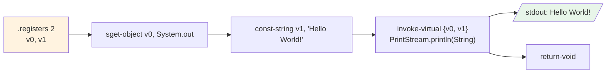

# 👋 HelloWorld — 最小可运行类

`examples/HelloWorld/HelloWorld.smali` 是整个仓库里**最小可独立运行**的 smali 程序：一个类、一个静态 `main`、两条寄存器、一次 `println`，打印出 `Hello World!`。它没有任何字段、继承层级或控制流，是初学者验证「smali 源 → dex → 设备运行」整条链路是否打通的首选样本。

## 🎯 示例定位

| 文件 | 行数 | 角色 |
| --- | --- | --- |
| `examples/HelloWorld/HelloWorld.smali` | 27 行 | 单文件程序：声明 `LHelloWorld;`，含静态 `main`，标准输出打印字符串 |

> 源文件头部的注释块（`HelloWorld.smali:3-13`）本身就是一份可照抄的运行手册——汇编、打包、`adb push`、`dalvikvm` 启动四步全在里面。

## 📋 关键语法点

| 语法点 | smali 写法 | 对应 Java 概念 |
| --- | --- | --- |
| 类声明 | `.class public LHelloWorld;` | `public class HelloWorld` |
| 父类 | `.super Ljava/lang/Object;` | `extends Object`（Java 默认省略） |
| 方法签名 | `.method public static main([Ljava/lang/String;)V` | `public static void main(String[] args)` |
| 寄存器预算 | `.registers 2` | 告知 dexlib2 本方法占 2 个寄存器 |
| 静态字段读取 | `sget-object v0, Ljava/lang/System;->out:Ljava/io/PrintStream;` | `System.out` |
| 字符串常量 | `const-string v1, "Hello World!"` | `"Hello World!"` 装入寄存器 |
| 虚方法调用 | `invoke-virtual {v0, v1}, Ljava/io/PrintStream;->println(Ljava/lang/String;)V` | `out.println(s)` |
| 方法返回 | `return-void` | 隐式 `return` |
| 方法结束 | `.end method` | 方法右括号 |

> 类型签名 `(Ljava/lang/String;)V` 读作「参数是一个 `String[]`、返回 `void`」。`L...;` 前缀的 `L` 与结尾分号共同界定一个类类型，`[` 表示数组——这是 JVM/dalvik 的类型描述符语法，贯穿整本 smali 手册。

## 🔧 smali 源码摘录

完整方法体（`examples/HelloWorld/HelloWorld.smali:17-27`）：

```smali
.method public static main([Ljava/lang/String;)V
    .registers 2

    sget-object v0, Ljava/lang/System;->out:Ljava/io/PrintStream;

    const-string	v1, "Hello World!"

    invoke-virtual {v0, v1}, Ljava/io/PrintStream;->println(Ljava/lang/String;)V

    return-void
.end method
```

逐行对照：

- `.registers 2` 声明 2 个寄存器 `v0`/`v1`。`main` 是静态方法，无 `this`，参数 `args` 占 `v0`？——注意：`.registers` 总数包含参数，但此处 `args` 被编译器优化为「未被使用」（`println` 只用 `System.out` 和字符串），故 `v0`/`v1` 全部由方法体自由支配。若 `main` 真用到 `args`，需从 `p0`（即 `v0`）取。
- `sget-object` 读静态对象字段 `System.out` 到 `v0`。
- `const-string` 把字面量装入 `v1`。
- `invoke-virtual` 拿 `v0`（接收者）+ `v1`（实参）调用 `println(String)`。
- `return-void` 收尾。

## ☕ Java 等价代码

```java
public class HelloWorld {
    public static void main(String[] args) {
        System.out.println("Hello World!");
    }
}
```

## 🧩 方法体数据流



寄存器分配一眼可读：`v0` 承载 `PrintStream` 实例，`v1` 承载字符串实参，`invoke-virtual` 的寄存器集 `{v0, v1}` 严格按「接收者在前、参数在后」排列。

## 🛠️ 汇编与运行

源文件注释里给出的设备端四步（`HelloWorld.smali:5-9`）：

```bash
# 1) 汇编 smali -> dex（无输出即成功，产物约 652 字节）
java -jar smali.jar assemble -o classes.dex examples/HelloWorld/HelloWorld.smali

# 2) 打包成 dalvikvm 可加载的 zip
zip HelloWorld.zip classes.dex

# 3) 推到设备/模拟器
adb push HelloWorld.zip /data/local

# 4) 用 dalvikvm 直接指定主类运行
adb shell dalvikvm -cp /data/local/HelloWorld.zip HelloWorld
# Hello World!
```

> 若 `smali.jar` 报内存不足，源文件 `HelloWorld.smali:11-12` 提示改用 `java -Xmx512m -jar smali.jar ...`。

## 🔄 assemble + disassemble 往返验证

不连设备也能验证产物正确性：汇编后再反汇编，对照语义是否等价。

```bash
# 汇编
java -jar smali.jar assemble -o /tmp/hello.dex examples/HelloWorld/

# 反汇编回 smali 文本
java -jar baksmali.jar disassemble -o /tmp/hello_smali /tmp/hello.dex

# 列出产物中的类
java -jar baksmali.jar list classes --format text /tmp/hello.dex
# LHelloWorld;
```

反汇编得到的 `/tmp/hello_smali/HelloWorld.smali` 与源文件逻辑等价——寄存器命名、空行等表面细节会被规范化，但指令序列一致。这就是 smali↔dex 的**无损往返**特性，也是逆向修改-重打包工作流的可信基础。

## 🧪 加点料：扩展为读取参数

把 `Hello World!` 换成命令行第一个参数，只需把 `const-string` 换成取 `args[0]`：

```smali
.method public static main([Ljava/lang/String;)V
    .registers 3

    sget-object v0, Ljava/lang/System;->out:Ljava/io/PrintStream;
    const/4 v1, 0x0
    aget-object v1, p0, v1          # args[0] —— p0 即 args
    invoke-virtual {v0, v1}, Ljava/io/PrintStream;->println(Ljava/lang/String;)V
    return-void
.end method
```

注意 `.registers` 提到 3（`p0`/`v0`/`v1`），且静态方法的参数寄存器从 `p0` 起算。这正好引出后续示例里参数传递与寄存器布局的细节。

## 📚 延伸阅读

- [smali 语法参考](../internals/smali-syntax.md) — 类型描述符、方法签名、指令格式全景
- [assemble 命令](../cli/assemble.md) — 汇编选项、API 级别与操作码版本映射
- [disassemble 命令](../cli/disassemble.md) — 反汇编输出选项与调试信息还原
- [汇编管线](../reference/smali/assembly-pipeline.md) — lexer → parser → tree walker → dexlib2 writer
- [反汇编↔汇编往返](../guide/roundtrip.md) — 无损往返的原理与多 dex 处理
- [dex-assemble skill](../skills/dex-assemble.md) — 把汇编流程封装成可复用技能
- [示例总览](./) — 从 HelloWorld 走向字段、注解、枚举等更复杂结构
