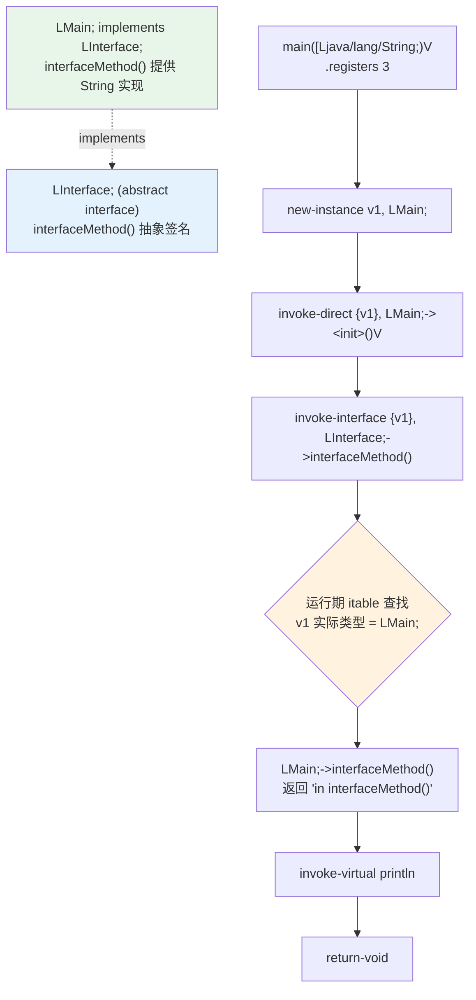

# 🔌 Interface — 接口定义与 implements 实现

`examples/Interface/` 展示 smali 如何声明一个接口、让普通类 `implements` 该接口，并通过 `invoke-interface` 完成虚方法调度。运行入口 `LMain;` 创建自身实例，以接口引用调用 `interfaceMethod()`，预期输出：

```
in interfaceMethod()
```

## 📐 示例定位

| 维度 | 说明 |
|------|------|
| 接口声明 | `Interface.smali` — `.class public abstract interface` |
| 实现关系 | `Main.smali` — `.implements LInterface;` |
| 调用方式 | `invoke-interface {v1}, LInterface;->interfaceMethod()` |
| 抽象方法 | 接口内方法无方法体，仅签名 `.method public abstract` |
| 多态调度 | 编译期类型为接口，运行期定位到 `LMain;` 的实现 |

源码定位：`examples/Interface/Interface.smali:1`、`examples/Interface/Main.smali:1`。

## 📋 语法要点

| 要点 | 写法 | 备注 |
|------|------|------|
| 接口声明 | `.class public abstract interface LInterface;` | `abstract interface` 双关键字 |
| 接口父类 | `.super Ljava/lang/Object;` | 接口默认隐式继承 Object |
| 抽象方法 | `.method public abstract interfaceMethod()Ljava/lang/String;` | 无 `.registers` / 无方法体 |
| 实现接口 | `.implements LInterface;` | 写在 `.super` 之后 |
| 实现方法 | 方法签名与接口一致，提供方法体 | 访问标志去掉 `abstract` |
| 接口调用 | `invoke-interface {v1}, LInterface;->interfaceMethod()Ljava/lang/String;` | 走 itable 调度 |
| 取返回值 | `move-result-object v1` | 接口方法返回引用 |
| 实例创建 | `new-instance` + `invoke-direct <init>` | 实现类需实例化 |

## 🧩 接口声明源码

`examples/Interface/Interface.smali`：

```smali
.class public abstract interface LInterface;
.super Ljava/lang/Object;

.method public abstract interfaceMethod()Ljava/lang/String;
.end method
```

接口方法**无方法体**：从 `.method` 到 `.end method` 之间只有签名，无任何指令，也无 `.registers`。

## 🛠 实现类与调用源码

`examples/Interface/Main.smali`：

```smali
.class public LMain;
.super Ljava/lang/Object;
.implements LInterface;

.method public static main([Ljava/lang/String;)V
    .registers 3

    sget-object v0, Ljava/lang/System;->out:Ljava/io/PrintStream;

    new-instance v1, LMain;
    invoke-direct {v1}, LMain;-><init>()V
    invoke-interface {v1}, LInterface;->interfaceMethod()Ljava/lang/String;
    move-result-object v1

    invoke-virtual {v0, v1}, Ljava/io/PrintStream;->println(Ljava/lang/Object;)V

    return-void
.end method

.method public interfaceMethod()Ljava/lang/String;
    .registers 1

    const-string v0, "in interfaceMethod()"
    return-object v0
.end method
```

## ☕ Java 等价

```java
public interface Interface {
    String interfaceMethod();
}

public class Main implements Interface {
    public static void main(String[] args) {
        Main obj = new Main();
        // 编译期类型为接口，运行期调度到 Main.interfaceMethod()
        System.out.println(obj.interfaceMethod());
    }

    @Override
    public String interfaceMethod() {
        return "in interfaceMethod()";
    }
}
```

## 🔄 结构与调用流



## ⚙️ 汇编与反汇编

```bash
# 1) 汇编接口与实现类（合并到一个 classes.dex）
java -jar smali/build/libs/smali.jar assemble \
    -o classes.dex examples/Interface/
# （无输出即成功；产物 classes.dex）

# 2) 反汇编核验接口声明与 implements 关系
java -jar baksmali/build/libs/baksmali.jar disassemble classes.dex -o out/

# 3) 列出类，确认 Interface 与 Main 均已写入
java -jar baksmali/build/libs/baksmali.jar list classes --format text classes.dex
# LInterface;
# LMain;
```

反汇编后 `out/Interface.smali` 应还原出 `.class public abstract interface LInterface;`，`out/Main.smali` 应含 `.implements LInterface;`——这正是 smali ⇄ dex 的无损往返。

## 🔍 关键点提示

- `invoke-interface` 与 `invoke-virtual` 的区别：前者按接口类型在 itable 中查找实现，后者按声明的类直接走 vtable。本例中 `v1` 实际类型为 `LMain;`，调度命中其 `interfaceMethod()`。
- `println` 形参描述符为 `Ljava/lang/Object;`（接受任意引用），smali 依此填写；实际打印的是 String 文本。
- 接口默认 `abstract`，方法亦默认 `public abstract`；实现类须显式声明 `.implements`，方法签名逐字匹配。

## 📚 延伸阅读

- [smali 语法参考](../internals/smali-syntax.md)
- [指令接口与格式](../reference/dexlib2/iface-instruction.md)
- [dex-assemble skill](../skills/dex-assemble.md)
- [dex-instructions skill](../skills/dex-instructions.md)
- [HelloWorld 示例](./HelloWorld.md)
- [示例总览](./)
