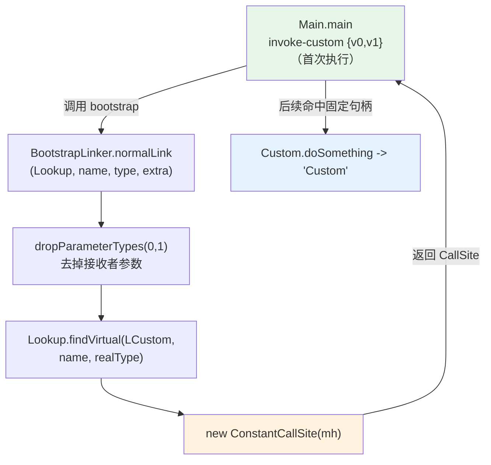

# 🔗 InvokeCustom — invoke-custom 指令与 bootstrap linker

`examples/InvokeCustom/` 是 smali 对 Java `invokedynamic` 的等价实现：调用点（call site）不直接指向目标方法，而是交给 bootstrap method 在首次执行时动态解析，返回的 `CallSite` 决定真正调用的方法。它由三个类协作完成，恰好覆盖「调用方 / 链接器 / 目标」三方角色，是理解 dex 动态分派机制的标准样本。

## 🎯 示例定位

| 文件 | 角色 | 关键点 |
| --- | --- | --- |
| `examples/InvokeCustom/Main.smali` | 入口类，含两条 `invoke-custom` | 演示同一签名、不同链接器带来的不同结果 |
| `examples/InvokeCustom/BootstrapLinker.smali` | 链接器，提供 `normalLink` / `backwardsLink` | 用 `Lookup.findVirtual` 定位真实方法 |
| `examples/InvokeCustom/Custom.smali` | 目标类，含 `doSomething` 与 `gnihtemoSod` | `backwardsLink` 把方法名反转后命中后者 |

> `backwardsLink` 会把方法名 `"doSomething"` 反转为 `"gnihtemoSod"` 再 `findVirtual`，因此第二条调用最终命中 `Custom.gnihtemoSod` 并返回 `"motsuC"`。这正体现了 invoke-custom「延迟到运行时再决定目标」的特性。

## 📋 关键语法点

| 要素 | 语法 | 说明 |
| --- | --- | --- |
| 调用指令 | `invoke-custom {寄存器}, name(args)@boot` | 形似 `invoke-virtual`，但目标由链接器解析 |
| 调用点名 | `normallyLinkedCallSite(...)` | call site name，链接器据此查找 |
| 调用点签名 | `(LCustom;Ljava/lang/String;)Ljava/lang/String;` | 含接收者在内的方法签名 |
| 附加常量 | `"just testing"` | 传给 bootstrap 的额外参数 |
| bootstrap 引用 | `@LBootstrapLinker;->normalLink(...)` | `@` 引导 bootstrap method 句柄 |
| bootstrap 签名 | `(Lookup;String;MethodType;...)CallSite;` | 标准前三参 + 自定义附加参 |
| 链接器返回 | `ConstantCallSite` | 包装一个固定的 `MethodHandle` |
| 方法查找 | `Lookup.findVirtual(Class, name, type)` | 反射式定位真实方法 |
| 类型改造 | `MethodType.dropParameterTypes(0,1)` | 去掉接收者，得到真实方法签名 |

> bootstrap method 的前三个参数固定为 `MethodHandles.Lookup`、`String`（调用点名）、`MethodType`（调用点签名）；其后可追加任意附加常量。注意 `normalLink` 的第四参声明为 `Object`，`backwardsLink` 为 `String`——签名不同，故是两个独立的 bootstrap method。
>
> ⚠️ `invoke-custom` 属于 dex 038（API 26）新增指令。汇编时需 `-a 26` 或更高，否则报 `invalid instruction`。

## 🔧 smali 源码摘录

`Main.smali` 中两条 `invoke-custom` 调用（`examples/InvokeCustom/Main.smali:13,20`）——每条均写在单行，`@` 之前是调用点描述、之后是 bootstrap 句柄：

```smali
# 正常链接：方法名原样传入 -> 命中 doSomething -> "Custom"
invoke-custom {v0, v1}, normallyLinkedCallSite("doSomething",
    (LCustom;Ljava/lang/String;)Ljava/lang/String;, "just testing")
    @LBootstrapLinker;->normalLink(Ljava/lang/invoke/MethodHandles$Lookup;
    Ljava/lang/String;Ljava/lang/invoke/MethodType;Ljava/lang/String;)
    Ljava/lang/invoke/CallSite;
move-result-object v2
# 反向链接：链接器把方法名反转 -> 命中 gnihtemoSod -> "motsuC"
invoke-custom {v0, v1}, backwardsLinkedCallSite("doSomething",
    (LCustom;Ljava/lang/String;)Ljava/lang/String;, "just testing")
    @LBootstrapLinker;->backwardsLink(Ljava/lang/invoke/MethodHandles$Lookup;
    Ljava/lang/String;Ljava/lang/invoke/MethodType;Ljava/lang/String;)
    Ljava/lang/invoke/CallSite;
move-result-object v2
```

`BootstrapLinker.normalLink` 的核心解析逻辑（`examples/InvokeCustom/BootstrapLinker.smali:5-29`）：

```smali
.method public static normalLink(Ljava/lang/invoke/MethodHandles$Lookup;
    Ljava/lang/String;Ljava/lang/invoke/MethodType;Ljava/lang/Object;)
    Ljava/lang/invoke/CallSite;
    .registers 15
    const v0, 0
    const v1, 1
    # 去掉调用点签名里的接收者参数（index 0 起 1 个）
    invoke-virtual {p2, v0, v1}, Ljava/lang/invoke/MethodType;->dropParameterTypes(II)Ljava/lang/invoke/MethodType;
    move-result-object p2
    # 在 LCustom 上按名称+签名查找虚方法
    const-class v1, LCustom;
    invoke-virtual {p0, v1, p1, p2}, Ljava/lang/invoke/MethodHandles$Lookup;->findVirtual(Ljava/lang/Class;Ljava/lang/String;Ljava/lang/invoke/MethodType;)Ljava/lang/invoke/MethodHandle;
    move-result-object v2
    # 用固定 MethodHandle 构造 CallSite 返回
    new-instance v0, Ljava/lang/invoke/ConstantCallSite;
    invoke-direct {v0, v2}, Ljava/lang/invoke/ConstantCallSite;-><init>(Ljava/lang/invoke/MethodHandle;)V
    return-object v0
.end method
```

`p0`=`Lookup`、`p1`=`name`、`p2`=`MethodType`、`p3`=`附加常量`。`dropParameterTypes(0,1)` 把签名里的接收者 `LCustom;` 去掉，得到 `findVirtual` 所需的真实方法签名 `(Ljava/lang/String;)Ljava/lang/String;`。

## ☕ Java 等价代码

```java
public class Custom {
    public String doSomething(String a) { System.out.println(a); return "Custom"; }
    public String gnihtemoSod(String a) { System.out.println(a); return "motsuC"; }
}

public class BootstrapLinker {
    public static CallSite normalLink(Lookup lk, String name, MethodType t, Object extra)
            throws Throwable {
        System.out.println("BootstrapLinker.normalLink - " + extra);
        MethodType real = t.dropParameterTypes(0, 1);          // 去接收者
        MethodHandle mh = lk.findVirtual(Custom.class, name, real);
        return new ConstantCallSite(mh);
    }
    public static CallSite backwardsLink(Lookup lk, String name, MethodType t, String extra)
            throws Throwable {
        System.out.println("BootstrapLinker.backwardsLink - " + extra);
        MethodType real = t.dropParameterTypes(0, 1);
        String rev = new StringBuffer(name).reverse().toString(); // doSomething -> gnihtemoSod
        MethodHandle mh = lk.findVirtual(Custom.class, rev, real);
        return new ConstantCallSite(mh);
    }
}

public class Main {
    public static void main(String[] args) throws Throwable {
        Custom c = new Custom();
        String arg = "Arg to doSomething";
        String r1 = normallyLinkedCallSite(c, arg);  // -> doSomething  -> "Custom"
        String r2 = backwardsLinkedCallSite(c, arg); // -> gnihtemoSod -> "motsuC"
        System.out.println("got back - " + r1);
        System.out.println("got back - " + r2);
    }
}
```

## 🧩 链接流程



首次执行触发链接，之后调用点被「缓存」为该 `ConstantCallSite` 内的固定 `MethodHandle`，不再走 bootstrap——这正是 `invokedynamic` 在 dex 侧的性能保证。

## 🛠 汇编与运行

```bash
# 1) 汇编三个 .smali 为单个 dex（invoke-custom 需 API 26+）
java -jar smali.jar assemble -a 26 -o InvokeCustom.dex examples/InvokeCustom/

# 2) 反汇编回 smali 验证 invoke-custom 与 bootstrap 引用是否保留
java -jar baksmali.jar disassemble -o out/ InvokeCustom.dex

# 3) 列出产物中的类
java -jar baksmali.jar list classes --format text InvokeCustom.dex
# LBootstrapLinker;
# LCustom;
# LMain;

# 4) 在设备/模拟器上运行（需 Android runtime）
adb push InvokeCustom.dex /data/local/tmp/
adb shell dalvikvm -cp /data/local/tmp/InvokeCustom.dex Main
# BootstrapLinker.normalLink - just testing
# Arg to doSomething
# got back - Custom
# BootstrapLinker.backwardsLink - just testing
# Arg to doSomething
# got back - motsuC
```

省略 `-a 26` 会在 API 15 默认下报 `invalid instruction`——`invoke-custom` 是 038 版本指令。反汇编输出里 `invoke-custom` 行会附带 `@LBootstrapLinker;->...` 句柄引用，可据此确认链接器绑定正确。

## 📚 延伸阅读

- [smali 语法参考](../internals/smali-syntax.md) — 类型描述符、方法签名、指令格式全景
- [操作码与版本映射](../internals/opcodes.md) — invoke-custom 属 038 / API 26 的由来
- [assemble 命令](../cli/assemble.md) — `-a` API 级别如何决定可用操作码
- [disassemble 命令](../cli/disassemble.md) — 反汇编输出选项与调试信息还原
- [dex-assemble skill](../skills/dex-assemble.md) — 把汇编流程封装成可复用技能
- [dex-roundtrip skill](../skills/dex-roundtrip.md) — 汇编↔反汇编无损往返验证
- [示例总览](./) — 从 HelloWorld 走向字段、注解、枚举等更复杂结构
