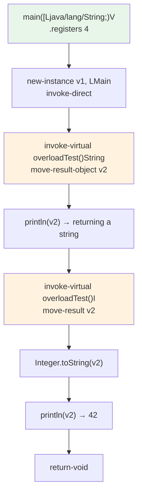

# 🔁 MethodOverloading — 同名方法重载

`examples/MethodOverloading/Main.smali` 演示 Java 方法重载在 smali 层的呈现：两个 `overloadTest` 方法同名，仅靠**原型（参数列表 + 返回类型）**区分。预期输出为 `returning a string` 与 `42`。

Dalvik 字节码中，方法以「类名 + 方法名 + 原型」三元组唯一定位。Java 语言层面禁止「仅返回类型不同」的重载，但 dex 层并不禁止——本示例正是利用这一点，定义两个参数列表相同、返回类型不同的方法。

## 语法要点

| 要点 | 体现 |
|------|------|
| 方法签名唯一性 | `LMain;->overloadTest()Ljava/lang/String;` 与 `LMain;->overloadTest()I` 是两条不同方法 |
| 重载一（返回 String） | `overloadTest()Ljava/lang/String;` 无参返回引用 |
| 重载二（返回 int） | `overloadTest()I` 无参返回 32 位整型 |
| 虚方法调用 | `invoke-virtual {v1}, LMain;->overloadTest()Ljava/lang/String;`（行尾原型决定调用哪个重载） |
| 接收引用返回值 | `move-result-object v2` |
| 接收整型返回值 | `move-result v2`（无 `-object` 后缀，32 位） |
| 装箱输出 | `Integer;->toString(I)Ljava/lang/String;` 把 int 转字符串后再 `println` |
| 重载解析时机 | 静态：由 invoke 指令写死的原型决定，运行期无动态分派开销 |

## 源码摘录

两个重载方法定义（`examples/MethodOverloading/Main.smali:38-50`）：

```smali
.method public overloadTest()Ljava/lang/String;
    .registers 1

    const-string v0, "returning a string"
    return-object v0
.end method

.method public overloadTest()I
    .registers 1

    const v0, 42
    return v0
.end method
```

`main` 中分别调用两个重载版本（`Main.smali:21-32`），注意两次 `invoke-virtual` 行尾的原型不同，这正是重载分派的依据：

```smali
invoke-virtual {v1}, LMain;->overloadTest()Ljava/lang/String;
move-result-object v2
invoke-virtual {v0, v2}, Ljava/io/PrintStream;->println(Ljava/lang/Object;)V

invoke-virtual {v1}, LMain;->overloadTest()I
move-result v2
invoke-static {v2}, Ljava/lang/Integer;->toString(I)Ljava/lang/String;
move-result-object v2
invoke-virtual {v0, v2}, Ljava/io/PrintStream;->println(Ljava/lang/Object;)V
```

## 结构



## Java 等价

> 注意：Java 语法不允许两个 `overloadTest()` 仅凭返回类型区分，下列代码无法通过 javac 编译；这是 dex 层独有的能力。

```java
public class Main {
    public static void main(String[] args) {
        Main m = new Main();
        System.out.println(m.overloadTest()); // returning a string
        System.out.println(m.overloadTest()); // 42
    }

    public String overloadTest() { return "returning a string"; }
    public int overloadTest()    { return 42; }
}
```

## 汇编、反汇编与运行

```bash
# 1. 汇编 smali → dex
java -jar smali/build/libs/smali.jar assemble examples/MethodOverloading/Main.smali -o classes.dex

# 2. 反汇编 dex → smali，验证两个重载方法都被保留
java -jar baksmali/build/libs/baksmali.jar disassemble classes.dex -o out/
#   out/Main.smali 中会同时出现 .method public overloadTest()Ljava/lang/String;
#   与 .method public overloadTest()I; 两条定义

# 3. 打包进 zip 并在设备/模拟器上跑
zip MethodOverloading.zip classes.dex
adb push MethodOverloading.zip /data/local
adb shell dalvikvm -cp /data/local/MethodOverloading.zip Main
# returning a string
# 42
```

## 延伸阅读

- [smali 语法参考](../internals/smali-syntax.md)
- [汇编管线](../reference/smali/assembly-pipeline.md)
- [dex-assemble skill](../skills/dex-assemble.md)
- [示例总览](./)
