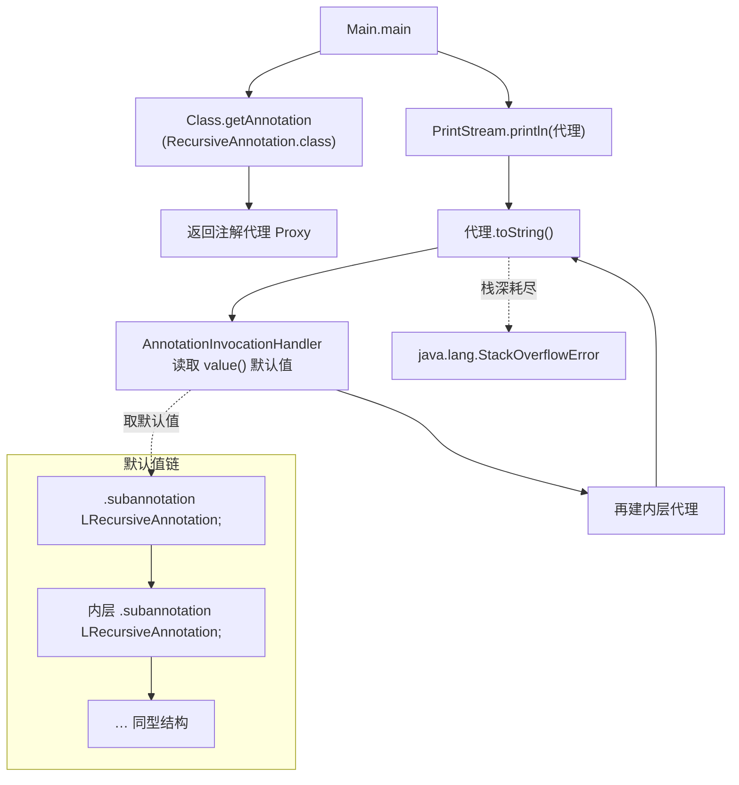
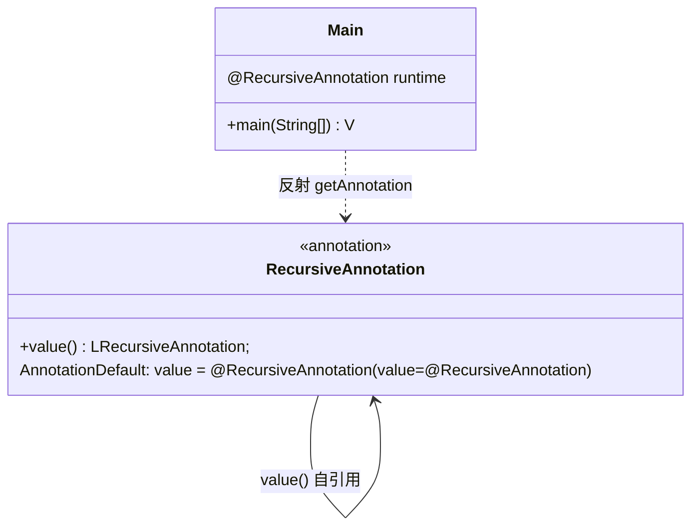

# 🔄 RecursiveAnnotation — 递归注解

本示例展示一种特殊的嵌套注解：注解的某个元素类型就是注解自身。`RecursiveAnnotation` 声明了一个返回 `LRecursiveAnnotation;` 的 `value()` 方法，并在 `AnnotationDefault` 中用 `.subannotation` 把默认值设为又一层的自己。当运行时反射调用注解实例的 `toString()` 时，默认实现会不断展开内层注解的 `toString()`，最终在 Dalvik 默认栈深下抛出 `java.lang.StackOverflowError`。

## 🎯 示例定位

| 文件 | 角色 |
| --- | --- |
| `RecursiveAnnotation.smali` | 注解接口定义，`value()` 返回自身类型，附递归默认值 |
| `Main.smali` | 入口类，标注该运行时注解并通过反射打印 |

> 关键点：注解接口必须以 `.class public abstract interface annotation` 声明，并 `.implements Ljava/lang/annotation/Annotation;`，才能被反射 `getAnnotation` 识别。

## 📋 语法要点

| 要点 | smali 写法 | 说明 |
| --- | --- | --- |
| 注解接口声明 | `.class public abstract interface annotation LRecursiveAnnotation;` | `abstract interface annotation` 四修饰符组合 |
| 实现注解接口 | `.implements Ljava/lang/annotation/Annotation;` | 所有注解均隐式实现 |
| 自引用元素 | `.method public abstract value()LRecursiveAnnotation;` | 返回类型即自身描述符 |
| 默认值块 | `.annotation system Ldalvik/annotation/AnnotationDefault;` | 系统注解，存放各元素默认值 |
| 嵌套子注解 | `value = .subannotation LRecursiveAnnotation; ... .end subannotation` | `.subannotation`/`.end subannotation` 成对 |
| 多层嵌套 | 在 `.subannotation` 内再写 `.subannotation` | 缩进无语法意义，仅可读性 |
| 运行时标注 | `.annotation runtime LRecursiveAnnotation;` | `runtime` 保留策略，可被反射读取 |
| 反射获取 | `invoke-virtual {v1, v2}, Ljava/lang/Class;->getAnnotation(...)Ljava/lang/annotation/Annotation;` | `Class.getAnnotation` |

> `.subannotation` 是 smali 表达「注解元素值是另一注解实例」的唯一写法，对应 dex 中的 `encoded_annotation` 结构；递归只体现在元素类型与默认值层层自包含，与 `.subannotation` 语法本身无关。

## 🔧 smali 源码摘录

注解接口与递归默认值（`examples/RecursiveAnnotation/RecursiveAnnotation.smali:1-17`）：

```smali
# RecursiveAnnotation.smali:1
.class public abstract interface annotation LRecursiveAnnotation;
.super Ljava/lang/Object;
.implements Ljava/lang/annotation/Annotation;

# RecursiveAnnotation.smali:9 —— value() 返回自身类型
.method public abstract value()LRecursiveAnnotation;
.end method

# RecursiveAnnotation.smali:12 —— 默认值自包含
.annotation system Ldalvik/annotation/AnnotationDefault;
    value = .subannotation LRecursiveAnnotation;
                value = .subannotation LRecursiveAnnotation;
                        .end subannotation
            .end subannotation
.end annotation
```

入口类标注运行时注解并反射打印（`examples/RecursiveAnnotation/Main.smali:7-24`）：

```smali
# Main.smali:7
.method public static main([Ljava/lang/String;)V
    .registers 3
    sget-object v0, Ljava/lang/System;->out:Ljava/io/PrintStream;
    const-class v1, LMain;
    const-class v2, LRecursiveAnnotation;
    # Main.smali:15 —— Class.getAnnotation 触发代理创建
    invoke-virtual {v1, v2}, Ljava/lang/Class;->getAnnotation(Ljava/lang/Class;)Ljava/lang/annotation/Annotation;
    move-result-object v1
    invoke-virtual {v0, v1}, Ljava/io/PrintStream;->println(Ljava/lang/Object;)V
    return-void
.end method

# Main.smali:23 —— 运行时保留注解，未显式给 value 故走默认值链
.annotation runtime LRecursiveAnnotation;
.end annotation
```

> `Main` 上的运行时注解未显式给 `value`，故取 `AnnotationDefault` 中的递归默认值；`println` 内部调用注解的 `toString()`，触发无限自展开。

## ☕ Java 等价代码

```java
public @interface RecursiveAnnotation {
    RecursiveAnnotation value() default @RecursiveAnnotation(
        value = @RecursiveAnnotation()
    );
}

@RecursiveAnnotation   // value 走默认，层层自引用
public class Main {
    public static void main(String[] args) {
        // 注解实例的 toString() 会递归展开内层 value()
        // → java.lang.StackOverflowError
        System.out.println(
            Main.class.getAnnotation(RecursiveAnnotation.class)
        );
    }
}
```

> Java 源码层无法直接写出「无限递归」的字面量，默认值只能写有限层；dex 层的 `AnnotationDefault` 同样是有限层（本例两层），但运行时 `AnnotationInvocationHandler.toString` 会顺着默认值链不断向下取 `value()`，每层都新建代理，于是栈不断增长直至溢出。

## 🧩 递归展开与调用流





## 🛠 assemble + disassemble 命令

```bash
# 1) 汇编示例目录为 dex（递归搜索 *.smali，无输出即成功）
java -jar smali.jar assemble -o /tmp/recursive.dex examples/RecursiveAnnotation/
# 产物：/tmp/recursive.dex

# 2) 列出类，确认注解接口与入口类均已入 dex
java -jar baksmali.jar list classes --format text /tmp/recursive.dex
# LMain;
# LRecursiveAnnotation;

# 3) 反汇编回 smali，验证 AnnotationDefault 与 .subannotation 完整保留
java -jar baksmali.jar disassemble -o /tmp/recursive_smali /tmp/recursive.dex
cat /tmp/recursive_smali/RecursiveAnnotation.smali
```

反汇编产物中 `AnnotationDefault` 块与原文件一致，证明 `.subannotation` 双向无损：

```smali
# /tmp/recursive_smali/RecursiveAnnotation.smali（节选）
.annotation system Ldalvik/annotation/AnnotationDefault;
    value = .subannotation LRecursiveAnnotation;
        value = .subannotation LRecursiveAnnotation;
        .end subannotation
    .end subannotation
.end annotation
```

> 在 Android 运行时或用 `d8` 转 jar 后以 `java Main` 运行：控制台抛出 `java.lang.StackOverflowError`（Dalvik 默认栈深下）。加大栈深（`java -Xss2m`）可推迟溢出，但因默认值链有限层、`toString` 每层都新建代理并再请求 `value()`，理论上总能触底。

## 📚 延伸阅读

- 示例目录：返回 [../examples](./) 列表
- 注解元素值全谱：参见 [AnnotationValues](./AnnotationValues.md)
- 注解类型声明与保留策略：参见 [AnnotationTypes](./AnnotationTypes.md)
- 最小可运行反射示例：参见 [HelloWorld](./HelloWorld.md)
- [assemble 命令](../cli/assemble.md) — 汇编选项、API 级别与操作码版本映射
- [disassemble 命令](../cli/disassemble.md) — 反汇编输出选项与调试信息还原
- 反汇编与 dexlib2 内部结构：参见 ../guide/dexlib2
