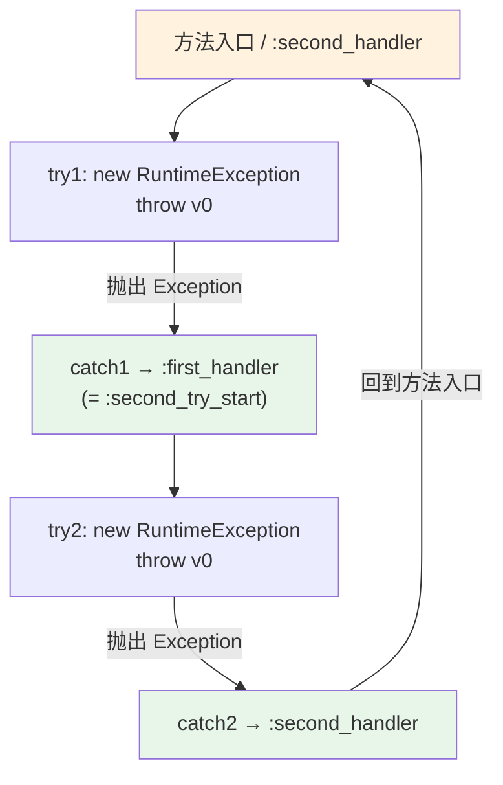

# 🔄 RecursiveExceptionHandler — 嵌套异常处理器

`examples/RecursiveExceptionHandler/Main.smali` 展示 smali 异常处理（`.catch`）的嵌套写法。两个 `try` 块首尾相接：第一个 `try` 抛出后被 `:first_handler` 捕获，而该 handler 恰好落在第二个 `try` 的覆盖范围内——它再次抛出，又被 `:second_handler` 捕获，而 `:second_handler` 与方法入口重合，构成递归式异常处理环路。

## 🎯 示例定位

| 文件 | 行数 | 角色 |
| --- | --- | --- |
| `examples/RecursiveExceptionHandler/Main.smali` | 21 行 | 单文件，仅含 `main`，演示嵌套 `.catch` 与标签交叠 |

> 本示例刻意省略 `return-void`：实际运行会因 `:second_handler` 末尾无可达返回而抛出 `VerifyError` 或再次抛出异常。重点是**语法结构**，而非可运行性。

## 📋 关键语法点

| 语法点 | smali 写法 | 说明 |
| --- | --- | --- |
| try 起止标签 | `:first_try_start` … `:first_try_end` | 自定义标签界定 try 区间 |
| 捕获声明 | `.catch Ljava/lang/Exception; {:start .. :end} :handler` | 在 `..` 范围内抛出指定类型即跳转 |
| 区间语义 | `{:start .. :end}` | 前闭后开（`start` 含、`end` 不含），同 Java 字节码 try 表 |
| 类型签名 | `Ljava/lang/Exception;` | 捕获基类 `Exception`，覆盖其所有子类 |
| 嵌套 catch | handler 标签位于另一 try 内 | `:first_handler` 即 `:second_try_start` |
| 标签复用 | 同一地址多标签并存 | `:second_handler` 与方法入口重合 |
| 抛出 | `throw v0` | 抛出寄存器中的 `Throwable` |
| 实例构造 | `new-instance` + `invoke-direct {v0}, ...-><init>()V` | 两步完成 `new RuntimeException()` |

## 🔧 smali 源码摘录

完整方法体（`examples/RecursiveExceptionHandler/Main.smali:4-21`）：

```smali
.method public static main([Ljava/lang/String;)V
    .registers 3

    :second_handler
    :first_try_start
        new-instance v0, Ljava/lang/RuntimeException;
        invoke-direct {v0}, Ljava/lang/RuntimeException;-><init>()V
        throw v0
    :first_try_end
    .catch Ljava/lang/Exception; {:first_try_start .. :first_try_end} :first_handler
    :first_handler
    :second_try_start
        new-instance v0, Ljava/lang/RuntimeException;
        invoke-direct {v0}, Ljava/lang/RuntimeException;-><init>()V
        throw v0
    :second_try_end
    .catch Ljava/lang/Exception; {:second_try_start .. :second_try_end} :second_handler
.end method
```

关键在 `Main.smali:14-15`：`:first_handler` 与 `:second_try_start` 指向**同一指令地址**——第一个 catch 入口就是第二个 try 的起点，两个 try 区间在此交叠。`:second_handler`（`Main.smali:7`）又与方法入口重合，catch2 的目标指回方法头，形成环路。

## ☕ Java 等价代码

```java
public class Main {
    public static void main(String[] args) {
        try {
            throw new RuntimeException();
        } catch (Exception first) {           // :first_handler
            try {
                throw new RuntimeException();
            } catch (Exception second) {       // :second_handler
                throw new RuntimeException();  // 回到方法入口逻辑
            }
        }
    }
}
```

Java 源码层难以精确表达「catch 入口即下一 try 起点」的交叠结构；smali/dex 的标签模型可自由组合，是反编译/重写 dex 时的常见形态。

## 🧩 异常处理流



两个 try 区间在 `:first_handler`/`:second_try_start` 处交叠，catch2 的目标 `:second_handler` 又指回方法入口，构成递归环路。

## 🛠️ 汇编与往返验证

```bash
# 1) 汇编 smali -> dex（无输出即成功）
java -jar smali.jar assemble -o /tmp/recurse.dex examples/RecursiveExceptionHandler/Main.smali

# 2) 反汇编回 smali，核对 .catch 范围与标签是否保留
java -jar baksmali.jar disassemble -o /tmp/recurse_smali /tmp/recurse.dex

# 3) 列出产物中的类与方法
java -jar baksmali.jar list classes --format text /tmp/recurse.dex
# LMain;
java -jar baksmali.jar list methods /tmp/recurse.dex
# LMain;->main([Ljava/lang/String;)V

# 4) dump 查看异常处理项的 dex 原始结构（code_item 内的 tries + handlers）
java -jar baksmali.jar dump /tmp/recurse.dex
```

反汇编得到的 `/tmp/recurse_smali/Main.smali` 与源文件逻辑等价——寄存器命名、空行等表面细节会被规范化，但 `.catch` 区间与标签序列一致。这正是 smali↔dex 的**无损往返**特性，也是逆向「修改-重打包」工作流的可信基础。

## 📚 延伸阅读

- [示例总览](./) — 从 HelloWorld 走向字段、注解、枚举等更复杂结构
- [smali 语法参考](../internals/smali-syntax.md) — 类型描述符、方法签名、指令格式全景
- [dex-format](../internals/dex-format.md) — `code_item`、`try_item`、`encoded_catch_handler` 的二进制布局
- [assemble 命令](../cli/assemble.md) — 汇编选项与 API 级别/操作码版本映射
- [disassemble 命令](../cli/disassemble.md) — 反汇编输出选项与 `--sequential-labels`
- [反汇编↔汇编往返](../guide/roundtrip.md) — 无损往返的原理与多 dex 处理
- [dex-read skill](../skills/dex-read.md) — 把 dex 结构化读取封装成可复用技能
