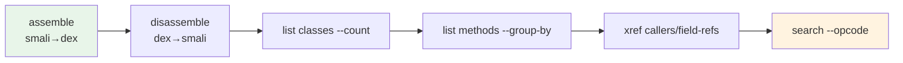

# 📚 示例

`examples/` 目录提供端到端可运行的 smali 源码示例，每个展示一种语法特性。

## e2e 闭环演示

`examples/scripts/e2e_demo.sh` 串联所有 Layer-2 CLI 能力：



```bash
./gradlew build                      # 先构建 fat jar
bash examples/scripts/e2e_demo.sh    # 跑完整闭环
```

## smali 源码示例

每个子目录是独立 smali 源码，可单独汇编：

```bash
java -jar smali/build/libs/smali.jar assemble examples/HelloWorld/HelloWorld.smali -o hello.dex
java -jar baksmali/build/libs/baksmali.jar disassemble hello.dex -o out/
```

| 示例 | 语法点 | 文档 |
|------|--------|------|
| HelloWorld | 最小可运行类 | [→](./HelloWorld.md) |
| AnnotationTypes | 注解类型与目标 | [→](./AnnotationTypes.md) |
| AnnotationValues | 注解元素值 | [→](./AnnotationValues.md) |
| BracketedMemberNames | 带括号的成员名 | [→](./BracketedMemberNames.md) |
| Enums | 枚举类 | [→](./Enums.md) |
| Interface | 接口定义 | [→](./Interface.md) |
| InvokeCustom | invoke-custom 指令 | [→](./InvokeCustom.md) |
| MethodOverloading | 方法重载 | [→](./MethodOverloading.md) |
| RecursiveAnnotation | 嵌套注解 | [→](./RecursiveAnnotation.md) |
| RecursiveExceptionHandler | 递归异常处理 | [→](./RecursiveExceptionHandler.md) |

## 延伸阅读

- [快速上手](../guide/quickstart.md)
- [smali 语法参考](../internals/smali-syntax.md)
- [反汇编 ↔ 汇编往返](../guide/roundtrip.md)
