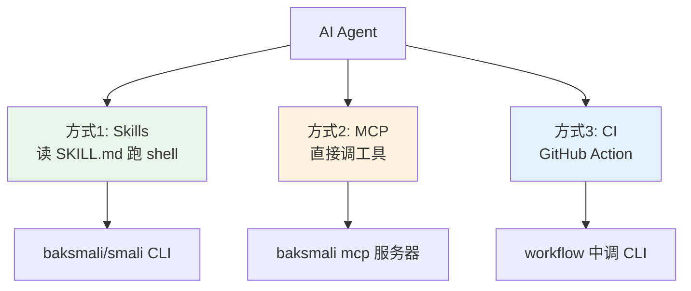
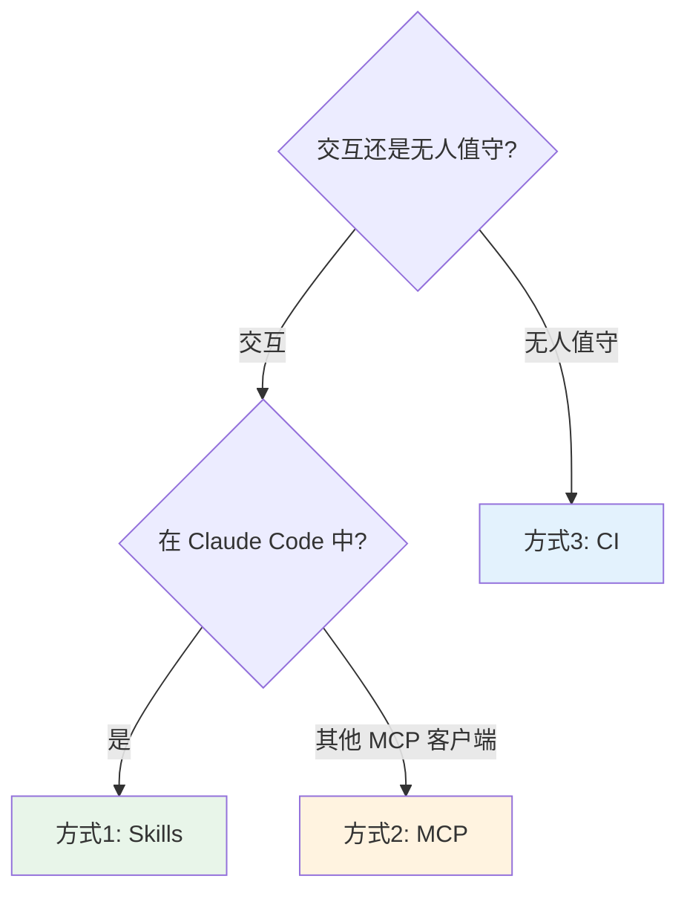

# 🤖 Agent 自动化集成工作流

smali-skills 面向 AI Agent 设计，提供三种集成方式，按场景选择。

## 三种集成方式



## 方式 1：Skills（Claude Code 插件）

最完整的方式。Agent 读 Skill 文档决定何时用哪个命令，自己跑 shell。

```bash
/plugin marketplace add android-security-engineer/smali-skills
/plugin install smali-skills@smali-skills
```

安装后 Agent 可调用：

```
/smali-skills:dex-xref          # 交叉引用
/smali-skills:dex-transform     # 写回变换
/smali-skills:dex-search        # 模式搜索
```

每个 Skill 含三层渐进披露，Agent 按需读取，控制上下文。详见 [插件机制](../internals/plugin.md)。

**适用**：交互式分析、需要 Agent 自主决策的场景。

## 方式 2：MCP 服务器

把只读查询暴露为工具，Agent 直接函数调用，不经过 shell。

```bash
java -jar baksmali.jar mcp    # stdio 模式
```

在 MCP 客户端（Claude Desktop、Cursor 等）注册后，Agent 可直接调用 `list`/`xref`/`search` 等工具，参数与返回均为结构化 JSON。详见 [MCP 集成](../internals/mcp.md)。

**适用**：MCP 客户端环境、希望避免 shell 开销的场景。仅暴露只读工具（不暴露 transform，防误改）。

## 方式 3：CI 流水线

在 GitHub Actions 中调用 CLI 做自动化检查。仓库已有 `examples/scripts/e2e_demo.sh` 串联各能力，CI 中直接调用。

```yaml
- name: Analyze APK
  run: |
    java -jar baksmali/build/libs/baksmali.jar list classes app.apk --count
    java -jar baksmali/build/libs/baksmali.jar xref callers app.apk --target "..." 
```

JSON 输出可 `jq` 处理后作为检查门槛。详见 [CI 文件](https://github.com/android-security-engineer/smali-skills/blob/master/.github/workflows/ci.yml)。

**适用**：批量自动化、门禁检查、回归测试。

## 选择决策



## 组合使用

三者不互斥。典型组合：CI 跑基础检查 + Skills 做深度交互分析 + MCP 给 IDE 客户端用。

## 延伸阅读

- [Claude Code 插件机制](../internals/plugin.md)
- [MCP 协议集成](../internals/mcp.md)
- [GitHub Pages 部署](../internals/deployment.md)
- [Skills 索引](../skills/)
- [安装指南](./install.md)
