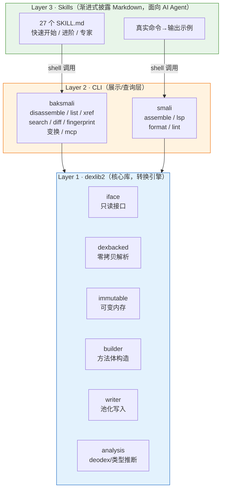
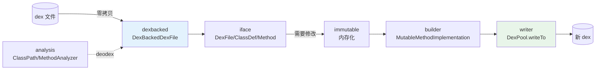
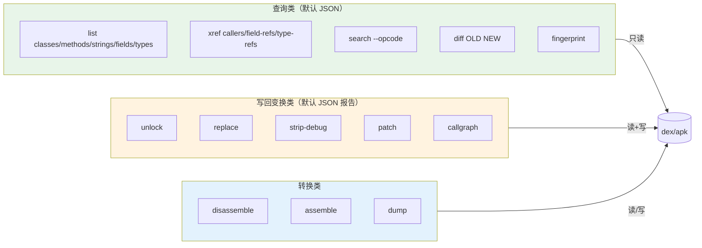

# 三层架构

smali-skills 分为三层，自下而上：核心库 → CLI 工具 → Skills 文档，全部面向 AI Agent 集成设计。

## Layer 1 · dexlib2（核心库）

读写/修改 dex 的核心 Java 库，是整个项目最可复用、最常被改动的部分。无依赖其它模块。

分层表示（`org.jf.dexlib2`）：

| 包 | 职责 |
|----|------|
| `iface/` | 只读接口：`DexFile`/`ClassDef`/`Method`/`Instruction`/引用/encoded 值/调试项。读写之间的通用货币。 |
| `dexbacked/` | 惰性、零拷贝实现，直接读原始 dex 字节缓冲。入口是 `DexFileFactory`，也处理 odex/oat 与 zip 容器。 |
| `immutable/` | 完全实例化的内存实现，用于独立持有/修改 dex。 |
| `builder/` | 可变方法体构造（`MutableMethodImplementation`、builder 指令、标签、try/catch）——smali tree walker 的目标。 |
| `writer/` | 把 iface 对象序列化回 dex；`DexWriter` 编排各 section writer。 |
| `rewriter/` | 通过覆写 `Rewriter` 变换 dex（重命名类型、重映射引用等）。 |
| `analysis/` | deodex 与类型推断（`MethodAnalyzer`/`ClassPath`/寄存器类型格）。 |

`Opcode.java` / `Opcodes.java` 与 `VersionMap.java` 编码每个 dex/API 版本支持哪些 opcode/格式。
本仓库已把版本映射扩展到 **dex 040 / API 30+**（hiddenapi 限制标志）。

## Layer 2 · CLI

原版只有纯文本转换输出，Agent 必须正则解析。本仓库新增 `--format json`（默认）、`xref`、
`search`、`--count`/`--group-by`，让 Agent 直接消费结构化结果。

查询类命令**默认输出 JSON**（机器可读）；变换类命令成功时打印一行结构化 JSON 报告（`command`/`input`/`output` + 各命令特有统计字段）。两者均可用 `--format text` 切回人读文本。

## Layer 3 · Skills

27 个 SKILL.md，按「快速开始 / 进阶 / 专家」三层渐进披露，覆盖每个 CLI 能力与 dexlib2 用法，
含真实命令→输出示例，供 Agent 按需加载。详见 [Skills 索引](../skills/)。
