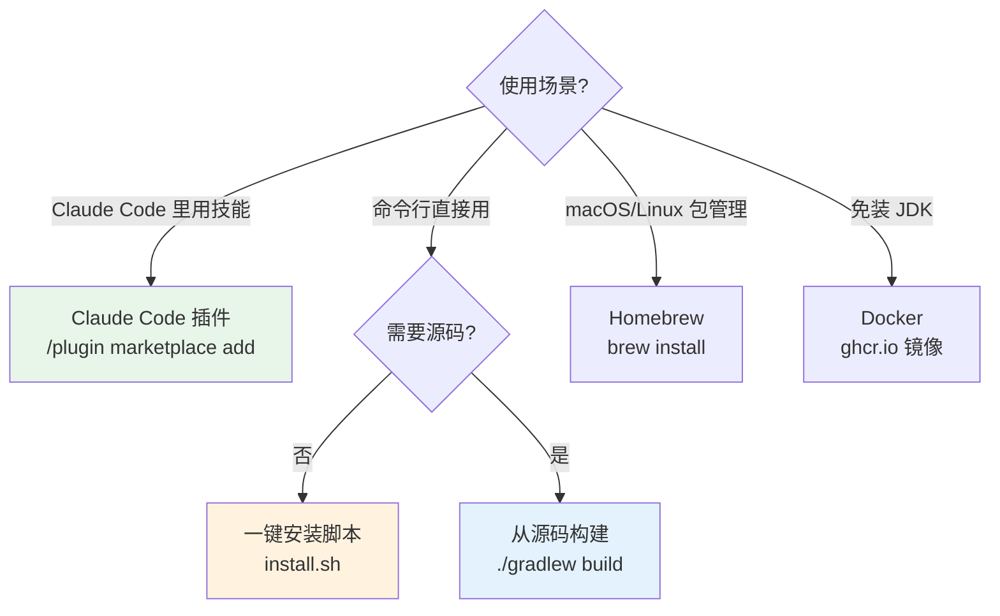

# 安装

smali-skills 提供多种安装方式，按场景选择。

## 方式速查



## Claude Code 插件（marketplace）

本仓库同时是一个 **Claude Code 插件 + marketplace**（`.claude-plugin/marketplace.json` +
`.claude-plugin/plugin.json`），27 个技能会从 `skills/*/SKILL.md` 自动发现。

```
/plugin marketplace add android-security-engineer/smali-skills
/plugin install smali-skills@smali-skills
```

安装后以 `/smali-skills:<skill>` 调用：

```
/smali-skills:dex-xref
/smali-skills:dex-search
/smali-skills:dex-disassemble
```

::: tip 提示
插件仅提供 Skills 文档层；实际执行仍调用构建出的 `baksmali.jar` / `smali.jar`（见下方任一方式安装）。
:::

## 一键安装（推荐）

```bash
# 从 GitHub Release 安装最新版
curl -fsSL https://github.com/android-security-engineer/smali-skills/releases/latest/download/install.sh | bash

# 指定版本
curl -fsSL https://github.com/android-security-engineer/smali-skills/releases/latest/download/install.sh | bash -s 2.5.2

# 自定义安装路径
curl -fsSL https://github.com/android-security-engineer/smali-skills/releases/latest/download/install.sh \
  | bash -s latest ~/.local/share/smali-skills ~/.claude/skills/smali-skills
```

安装后：

- CLI jar → `~/.local/share/smali-skills/smali.jar` 和 `baksmali.jar`
- Skills 文档 → `~/.claude/skills/smali-skills/`

## 从源码构建

```bash
git clone https://github.com/android-security-engineer/smali-skills.git
cd smali-skills
./gradlew build          # 编译、测试、构建 fat jar
```

构建产物（fat jar，含全部依赖）：

| 产物 | 说明 |
|------|------|
| `smali/build/libs/smali.jar` | 汇编器 |
| `baksmali/build/libs/baksmali.jar` | 反汇编器/查询工具 |

便捷包装脚本（`java -jar` 的薄封装）：

```bash
scripts/smali    assemble ...        # 等价于 java -jar smali/build/libs/smali.jar assemble ...
scripts/baksmali disassemble ...     # 等价于 java -jar baksmali/build/libs/baksmali.jar disassemble ...
```

需要 Java 8+（源码目标）与 Java 11（推荐用于构建，CI 使用 Java 11）。

## Homebrew（macOS / Linux）

```bash
brew tap android-security-engineer/tap
brew install smali-skills
# 之后可直接用 smali / baksmali 命令
baksmali list strings app.apk
```

## Docker（免装 JDK）

无需本地安装 JDK/Gradle，直接用容器运行：

```bash
# 拉取预构建镜像
docker pull ghcr.io/android-security-engineer/smali-skills:latest

# 反汇编（把当前目录挂进容器 /work）
docker run --rm -v "$PWD:/work" ghcr.io/android-security-engineer/smali-skills:latest \
  disassemble app.apk -o out/

# 汇编（切到 smali 入口）
docker run --rm -v "$PWD:/work" ghcr.io/android-security-engineer/smali-skills:latest \
  smali assemble out/ -o app.dex

# 查询（xref / search / list）
docker run --rm -v "$PWD:/work" ghcr.io/android-security-engineer/smali-skills:latest \
  xref callers app.apk --target 'Lcom/Example;->foo()V'
```

## 作为依赖引入

dexlib2 可作为 Maven 依赖直接用于 Java/Kotlin 项目：

```xml
<dependency>
  <groupId>org.jf</groupId>
  <artifactId>dexlib2</artifactId>
  <version>2.5.2</version>
</dependency>
```
