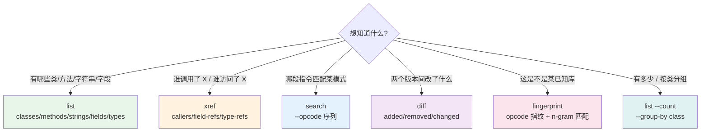
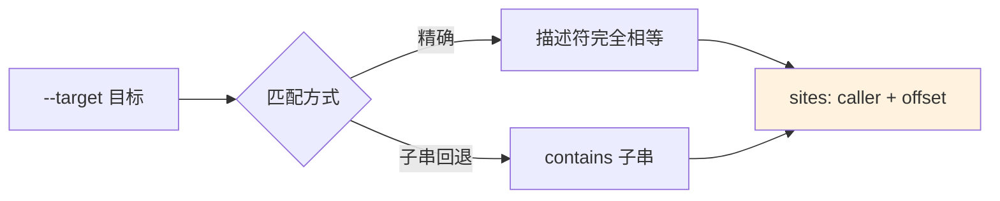
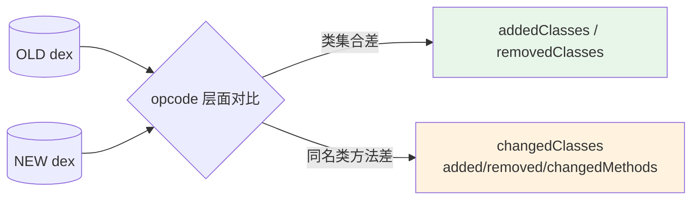
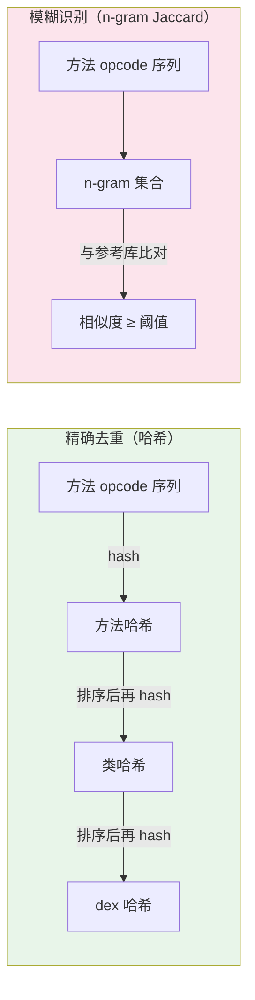

# 查询与交叉引用

只读地探索 dex：列举内容、反向查引用、正向搜指令、统计聚合、对比版本、识别库。所有查询命令
**默认输出 JSON**，面向 Agent / 脚本消费；`--format text` 切回人读文本。

## 查询能力地图



## list：正向列举

列举 dex 中已有的对象，给出结构化视图。

```bash
# 类（默认 JSON：含超类/接口/字段/方法结构）
java -jar baksmali.jar list classes app.apk
java -jar baksmali.jar l c app.apk --format text   # 仅类描述符

# 方法 / 字符串 / 字段 / 类型
java -jar baksmali.jar l m app.apk
java -jar baksmali.jar l s app.apk
java -jar baksmali.jar l f app.apk
java -jar baksmali.jar l t app.apk
```

聚合选项（无需 grep/wc 管道）：

```bash
java -jar baksmali.jar l m --count app.apk              # {"count":N}
java -jar baksmali.jar l m --group-by class app.apk     # [{group,count}]
```

::: tip 适合 grep 的场景
`grep` 管道在文本模式下更直观。要传统文本过滤，先切 `--format text`：

```bash
java -jar baksmali.jar l s app.apk --format text | grep -iE "key|secret|token"
```

JSON 模式用 `jq` 精确取值：

```bash
java -jar baksmali.jar l s app.apk | jq -r '.[].string | select(test("https";"i"))'
```
:::

## xref：反向交叉引用

给定一个方法/字段/类型，找出 dex 中所有引用它的位置——`list` 的反向补充。



```bash
# 谁调用了某方法（默认 JSON）
java -jar baksmali.jar xref callers app.apk --target "Lcom/Example;->foo()V"
# 谁访问了某字段
java -jar baksmali.jar xref field-refs app.apk --target "Lcom/Config;->token:Ljava/lang/String;"
# 谁引用了某类型
java -jar baksmali.jar xref type-refs app.apk --target "Lcom/Sensitive;"
```

| 子命令 | 别名 | 匹配的引用类型 |
|--------|------|----------------|
| `callers` | `caller`, `c` | 方法引用（invoke-*） |
| `field-refs` | `field-ref`, `f` | 字段引用（iget/iput/sget/sput） |
| `type-refs` | `type-ref`, `t` | 类型引用（check-cast/new-instance/instance-of 等） |

`offset` 是引用指令在方法体内的字节偏移（hex），可定位到反汇编输出的具体行。

## search：指令模式搜索

在方法指令流中搜连续 opcode 模式，支持 `*` 通配符与类/方法正则过滤。

```bash
# 单 opcode
java -jar baksmali.jar search app.apk --opcode invoke-virtual
# opcode 序列（逗号分隔，按顺序连续匹配）
java -jar baksmali.jar search app.apk --opcode const-string,invoke-virtual
# 通配符 *：匹配任意单条 opcode
java -jar baksmali.jar search app.apk --opcode "const-string,*,invoke-virtual"
# 类/方法正则过滤
java -jar baksmali.jar search app.apk --class "Lcom/example/.*" --method "onCreate"
```

| 场景 | 命令 |
|------|------|
| 找日志调用点 | `--opcode "const-string,invoke-virtual"` |
| 找字符串拼接 | `--opcode "new-instance,invoke-direct,const-string,invoke-virtual"` |
| 找反射调用 | `--method "invoke" --class "Ljava/lang/reflect/.*"` |

`search` 按模式正向搜（找「什么样的指令」），`xref` 按引用目标反向查（找「谁调用了这个方法」）。

## diff：语义差异



在**opcode 层面**比较两个 dex/apk，刻意忽略寄存器分配、调试信息、指令偏移——同源重编译产生的噪声不会被误报。

```bash
java -jar baksmali.jar diff old.apk new.apk          # 默认 JSON
java -jar baksmali.jar diff old.apk new.apk --format text
```

退出码：`0` = 语义一致，`1` = 存在差异。可用于脚本门控：

```bash
baksmali diff orig.dex patched.dex && echo "未改动" || echo "有差异，请复核"
```

## fingerprint：opcode 指纹

基于**方法体 opcode 序列**（不含名字/引用）计算指纹，对重命名不敏感——混淆器改名、换寄存器号，
只要逻辑不变指纹就相同。用于识别「被改名的已知库」「被重打包/抄袭的代码」。



```bash
# 列举指纹（默认 JSON）
java -jar baksmali.jar fingerprint app.apk                    # 每个类
java -jar baksmali.jar fingerprint app.apk --level method     # 细到方法
java -jar baksmali.jar fingerprint app.apk --level dex        # 整个 dex 一个哈希

# 匹配参考库（识别 app 里是否含某已知库）
java -jar baksmali.jar fingerprint app.apk --match okhttp.dex --min-similarity 0.9
```

- 哈希用于**精确去重**（两份 dex 类哈希取交集 = 结构相同的类）。
- n-gram Jaccard 相似度用于**模糊识别**（库被插桩/加几条指令也能认出）。

## 真实示例

用仓库自带 fixture 实跑的真实输出，见对应 [CLI 文档](../cli/) 与 [Skills](../skills/)。
