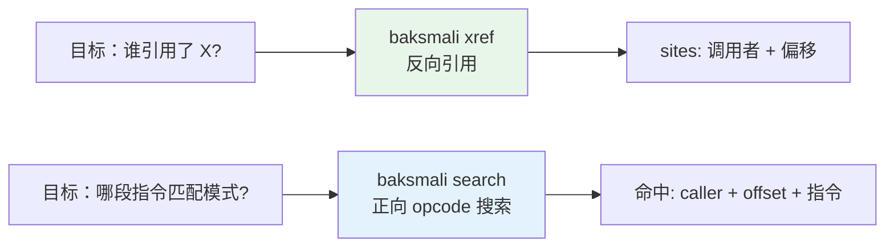
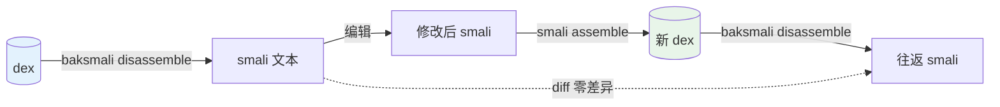

# 快速上手

五分钟跑通：反汇编一个 dex → 列举内容 → 查交叉引用 → 改一处 → 重汇编验证。

## 准备

确认 `baksmali.jar` 与 `smali.jar` 可用（见 [安装](./install)）。本文用仓库自带的 fixture：

```bash
# 仓库根目录
DEX=dexlib2/src/test/resources/accessorTest.dex
LT=baksmali/src/test/resources/LocalTest/classes.dex
```

## 1. 浏览 dex 内容（默认 JSON）

```bash
# 列出所有类（默认 JSON，含超类/接口/字段/方法结构）
java -jar baksmali.jar list classes $LT
```

```json
[{"type":"LLocalTest;","superclass":"Ljava/lang/Object;","accessFlags":1,"interfaces":[],"fields":[],"methods":[{"name":"method1","parameters":[],"returnType":"V","accessFlags":9},{"name":"method2","parameters":["I","J","Ljava/lang/String;"],"returnType":"V","accessFlags":9}]}]
```

要人读文本，加 `--format text`：

```bash
java -jar baksmali.jar list classes $LT --format text
# LLocalTest;
```

其它列举子命令同构：`list methods` / `list strings` / `list fields` / `list types`。

## 2. 反汇编为 smali 文本

```bash
java -jar baksmali.jar disassemble -o /tmp/lt_smali $LT
cat /tmp/lt_smali/LocalTest.smali
```

```smali
.class public LLocalTest;
.super Ljava/lang/Object;

# direct methods
.method public static method1()V
    .registers 10
    .local v0, "blah!...":I
    ...
    return-void
.end method
```

## 3. 查交叉引用与搜索指令



```bash
# 谁调用了某桥接方法（默认 JSON）
java -jar baksmali.jar xref callers $DEX \
  --target "Lorg/jf/dexlib2/AccessorTypes;->access\$072(Lorg/jf/dexlib2/AccessorTypes;I)Z"
```

```json
[{"target":"Lorg/jf/dexlib2/AccessorTypes;->access$072(Lorg/jf/dexlib2/AccessorTypes;I)Z","sites":[{"caller":"Lorg/jf/dexlib2/AccessorTypes$Accessors;->boolean_and(Z)V","offset":"0x2"}]}]
```

```bash
# 搜索 invoke-static 指令模式
java -jar baksmali.jar search --opcode invoke-static $DEX
```

## 4. 写回变换（patch）

```bash
# 强制 boolean_and 方法立即返回（默认打印 JSON 报告）
java -jar baksmali.jar patch $DEX \
  --class 'Lorg/jf/.*' --method 'boolean_and' --return void -o /tmp/patched.dex
```

```json
{"command":"patch","input":"dexlib2/src/test/resources/accessorTest.dex","output":"/tmp/patched.dex","matched":1,"return":"void","classFilter":"Lorg/jf/.*","methodFilter":"boolean_and"}
```

`matched` 是被改写的方法数。

## 5. 验证改动（diff）

```bash
java -jar baksmali.jar diff $DEX /tmp/patched.dex
```

输出会显示 `changedClasses` 中 `boolean_and` 方法体的 opcode 序列变化。

## 6. 反汇编 ↔ 汇编往返



```bash
# 汇编 examples/HelloWorld 为 dex
java -jar smali.jar assemble -o /tmp/hello.dex examples/HelloWorld/

# 反汇编回来，指令序列与源完全一致（寄存器命名等价规范化）
java -jar baksmali.jar disassemble -o /tmp/hello_rt /tmp/hello.dex
```

smali ⇄ dex 是**无损往返**：除寄存器命名等同义写法外，字节码层面零差异。

## 下一步

- [查询与交叉引用](./query) 的完整能力
- [写回变换](./transform) 的四个命令
- [CLI 概览](../cli/) 的全部子命令
