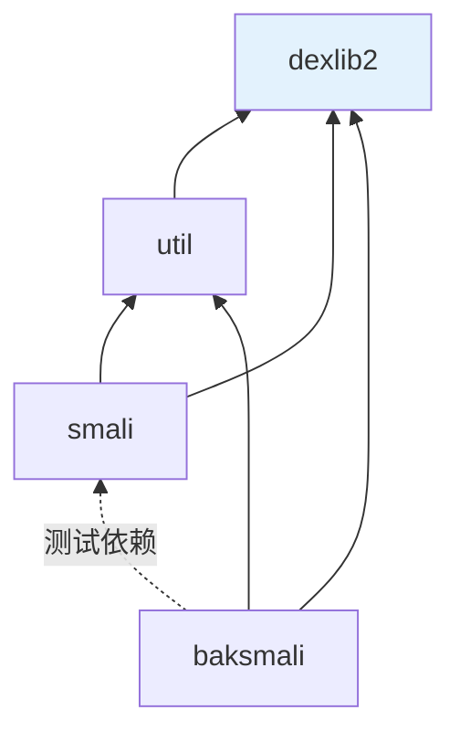

# 📖 如何阅读源码

smali-skills 是一个 Gradle 多模块 Java 项目。这份指南帮你快速定位到想看的代码。

## 模块依赖方向



`dexlib2` 是核心，无依赖其它模块。所有改动最终都落在它或其上层。

## 按目的定位

### 我想理解 dex 怎么被读

1. 入口 `dexlib2/.../dexbacked/DexFileFactory.java` — 识别文件类型
2. `DexBackedDexFile.java` — 持字节缓冲，惰性迭代各池
3. `DexBackedClassDef` / `DexBackedMethod` — 单条解码
4. 底层 `DexBuffer` / `DexReader` — 字节读取（uleb128）

详见 [零拷贝解析](../internals/zero-copy.md)。

### 我想理解 dex 怎么被写

1. `writer/pool/DexPool.java` — 编排入口
2. 各 `*Pool` — intern 与排序
3. `writer/DexWriter.java` — section 写盘与偏移回填

详见 [池化写入](../internals/pool-writing.md)。

### 我想加一个 baksmali 命令

1. 参考 `baksmali/.../ListClassesCommand.java` 的结构
2. 继承 `DexInputCommand`，加 `@Parameter` 参数
3. 在 `Main.java` 注册命令
4. 若需 JSON 输出，用 `output/JsonOutput`

详见 [baksmali Main](../reference/baksmali/main.md)。

### 我想理解汇编管线

1. `smali/src/main/jflex/smaliLexer.jflex` — 词法
2. `smali/src/main/antlr/smaliParser.g` — 语法→AST
3. `smali/src/main/antlr/smaliTreeWalker.g` — AST→dexlib2 builder
4. 改完跑 `./gradlew generateGrammarSource`

详见 [汇编管线](../reference/smali/assembly-pipeline.md)。

### 我想理解类型推断/deodex

1. `dexlib2/.../analysis/MethodAnalyzer.java` — 分析核心
2. `ClassPath.java` — 类型层次
3. `RegisterType` — 类型格

详见 [类型推断](../internals/type-inference.md)。

## 构建与测试

```bash
./gradlew build                       # 全量
./gradlew :dexlib2:test               # 单模块测试
./gradlew :baksmali:test --tests '*DisassemblyTest'   # 单测试类
```

测试多为**往返测试**：`.smali`/`.dex` fixture 汇编↔反汇编比对。fixture 在 `src/test/resources/<TestName>/`。

## 生成代码（勿手改）

| 生成物 | 输入 | 何时重新生成 |
|--------|------|-------------|
| smali lexer/parser | jflex/antlr 文件 | `build` 自动 |
| `SyntheticAccessorFSM.java` | `*.rl` ragel | 改后手动 `./gradlew ragel` |
| accessor 测试 dex | `accessorTest.dex` | 手动 `generateAccessorTestDex` |

详见 [CLAUDE.md](https://github.com/android-security-engineer/smali-skills/blob/master/CLAUDE.md)。

## 关键枚举

- `Opcode.java` / `Opcodes.java` — opcode 定义与版本集合
- `VersionMap.java` — dex↔API 版本映射
- `AccessFlags.java` — 访问标志位
- `ItemType.java` — dex section tag

改字节码或版本支持时，这些加 `iface/instruction/formats` 是入口。

## 延伸阅读

- [三层架构](./architecture.md)
- [内部原理](../internals/)
- [代码参考](../reference/)
- [CLAUDE.md](https://github.com/android-security-engineer/smali-skills/blob/master/CLAUDE.md)
