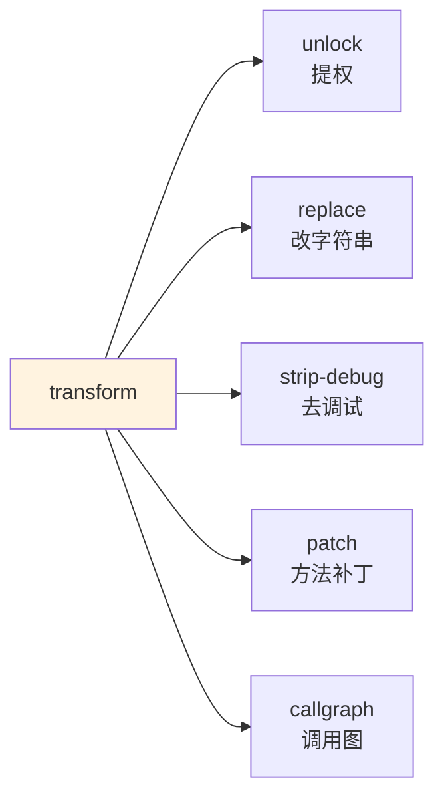

# 🔧 逆向工程工作流

需要修改 dex 的常见场景：提权（绕过私有/ final 限制）、改字符串（替换 API 端点）、去调试信息（反检测）。`baksmali transform` 把这些命令化。

## 变换族



每条变换输出结构化 JSON 报告：`command`/`input`/`output` + 命中与变更统计。

## 1. 提权（unlock）

把 `private`/`final`/`protected` 字段与方法改为 `public`，便于外部访问。

```bash
java -jar baksmali.jar transform unlock app.apk -o unlocked.apk
```

报告示例：

```json
{"command":"unlock","input":"app.apk","output":"unlocked.apk","classesScanned":N,"fieldsUnlocked":M,"methodsUnlocked":K}
```

实现：`baksmali/src/main/java/org/jf/baksmali/transform/AccessFlagTransform.java` 清除对应 `ACC_*` 位。

## 2. 字符串替换（replace）

替换 dex 字符串池中的字符串（如改 API 域名、去广告 SDK 标识）。

```bash
java -jar baksmali.jar transform replace app.apk \
  --old "https://old.api.com" --new "https://new.api.com" -o out.apk
```

支持正则。实现：`transform/StringReplaceTransform.java`。

## 3. 去调试信息（strip-debug）

移除 `LineNumber`/`StartLocal` 等 debug 项，减小体积、反基于调试信息的检测。

```bash
java -jar baksmali.jar transform strip-debug app.apk -o out.apk
```

实现：`transform/StripDebugTransform.java`。

## 4. 方法补丁（patch）

对指定方法施加变换（如强制返回常量）。

```bash
java -jar baksmali.jar transform patch app.apk --method "Lcom/App;->check()Z" \
  --return-const 0x1 -o out.apk
```

实现：`transform/ForceReturnTransform.java`。

## 5. 调用图（callgraph）

```bash
java -jar baksmali.jar callgraph app.apk --method "Lcom/App;->main([Ljava/lang/String;)V" -o cg.json
```

输出方法调用关系图，JSON 格式，可可视化分析。实现：`baksmali/graph/CallGraph.java`。

## 往返验证

改完后用往返测试确保字节码有效：

```bash
java -jar baksmali.jar disassemble out.apk -o check/
java -jar smali.jar assemble check/ -o roundtrip.dex
# 比对 out.apk 与 roundtrip.dex
```

详见 [反汇编 ↔ 汇编往返](./roundtrip.md)。

## 注意事项

- transform 直接改 dex，**务必备份原文件**。
- 改 access flag 可能影响 ART 的方法内联与校验。
- 字符串替换若改变长度，dexlib2 自动重新分配 string_data，无需手动对齐。

## 延伸阅读

- [写回变换](./transform.md)
- [反汇编 ↔ 汇编往返](./roundtrip.md)
- [baksmali transform 命令](../cli/transform.md)
- [dex-transform skill](../skills/dex-transform.md)
