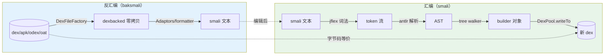

# 反汇编 ↔ 汇编往返

dex 与 smali 文本之间是无损双向转换。这是 smali-skills 最基础也是最核心的工作流。

## 往返模型



汇编管线（`smali` 模块）：lexer（JFlex）→ parser（ANTLR3）→ tree walker（ANTLR3）→ dexlib2 writer。

## 完整流程

### 步骤 1：反汇编

```bash
# 反汇编 APK（自动识别 zip 中的 classes.dex）
java -jar baksmali.jar d -o smali_out app.apk

# 反汇编 dex 文件
java -jar baksmali.jar d -o smali_out classes.dex

# 省略调试信息（更干净的输出，方便编辑）
java -jar baksmali.jar d -o smali_out --debug-info=false app.apk

# 使用顺序标签（方便引用和编辑）
java -jar baksmali.jar d -o smali_out --sequential-labels app.apk
```

### 步骤 2：编辑 smali

```bash
find smali_out -name "Main.smali"
vim smali_out/com/example/Main.smali
```

常见修改模式：

```smali
# 修改字符串常量
const-string v1, "new_url"      # 改自 "old_url"

# 跳过方法调用（直接返回 true）
const/4 v0, 0x1
return v0
```

### 步骤 3：重新汇编

```bash
java -jar smali.jar a -o modified.dex smali_out/
# 指定 API 级别（如果使用了高版本指令）
java -jar smali.jar a -o modified.dex -a 28 smali_out/
```

### 步骤 4：替换回 APK

```bash
mkdir apk_contents && unzip app.apk -d apk_contents
cp modified.dex apk_contents/classes.dex
rm -rf apk_contents/META-INF                 # 删旧签名
cd apk_contents && zip -r ../modified.apk . && cd ..
zipalign -f 4 modified.apk aligned.apk
apksigner sign --ks my-key.jks --out signed.apk aligned.apk
```

## 验证往返完整性

```bash
# 方法1：重新反汇编并对比
java -jar baksmali.jar d -o verified modified.dex
diff -r smali_out/ verified/

# 方法2：用语义 diff（忽略重编译噪声）
java -jar baksmali.jar diff original.dex modified.dex
```

::: warning 注意
纯文本 `diff` 会把寄存器命名（`v1` vs `p0`）当作差异，但二者是同义写法、字节码等价。
用 `baksmali diff`（opcode 层面）可消除这类重编译噪声，只报真正的语义变化。
:::

## 处理 odex

odex/oat 文件需先 deodex 才能重汇编：

```bash
java -jar baksmali.jar deodex -o smali_out \
  --boot-class-path /system/framework/framework.jar app.odex
# 编辑后正常汇编
java -jar smali.jar a -o modified.dex smali_out/
```

## 多 dex APK

```bash
# 查看包含哪些 dex
java -jar baksmali.jar l d app.apk
# 反汇编特定 dex
java -jar baksmali.jar d -o smali_out2 "app.apk/classes2.dex"
# 重汇编后替换对应条目
java -jar smali.jar a -o classes2.dex smali_out2/
cp classes2.dex apk_contents/classes2.dex
```
