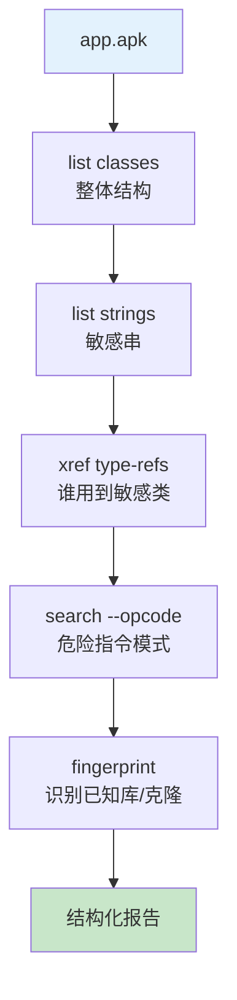

# 🛡️ 安全分析工作流

以审计一个 APK 为例，串起 list/xref/search/fingerprint 等查询能力。所有命令默认输出 JSON，适合脚本化。

## 整体流程



## 1. 整体结构

```bash
java -jar baksmali.jar list classes app.apk --count          # {"count":N}
java -jar baksmali.jar list methods app.apk --group-by class  # 每类方法数
```

先掌握规模与热点类（方法数最多的类往往是业务核心）。

## 2. 敏感字符串提取

```bash
java -jar baksmali.jar list strings app.apk | \
  jq -r '.[].string | select(test("http|key|secret|token|password";"i"))'
```

定位硬编码 URL、密钥、token，这是常见的信息泄露点。

## 3. 反向交叉引用

发现敏感类后，查谁引用它：

```bash
# 谁用了 Lcom/suspicious/Tracker;
java -jar baksmali.jar xref type-refs app.apk --target "Lcom/suspicious/Tracker;"
# 谁调用了它的 send() 方法
java -jar baksmali.jar xref callers app.apk --target "Lcom/suspicious/Tracker;->send(Ljava/lang/String;)V"
```

JSON 输出每个引用点的调用方法与偏移，可直接定位到反汇编代码。

## 4. 危险指令模式搜索

```bash
# 反射调用模式
java -jar baksmali.jar search --opcode const-string,invoke-virtual app.apk | \
  jq '.[] | select(.matchedOpcodes | index("const-string"))'
# 动态加载 dex
java -jar baksmali.jar search --opcode invoke-virtual,move-result-object,invoke-virtual app.apk \
  --filter "loadClass|DexClassLoader"
```

`--opcode` 接受逗号分隔助记符序列，`*` 通配任意指令；`--filter` 正则过滤引用文本。

## 5. 库与克隆识别

```bash
java -jar baksmali.jar fingerprint app.apk --method "Lcom/foo;->bar()V"
java -jar baksmali.jar fingerprint app.apk > fp.json    # 全量指纹
```

opcode 序列指纹忽略寄存器/引用，用于识别已知库版本或检测代码克隆。

## 6. 反汇编细看

定位到目标方法后反汇编细看：

```bash
java -jar baksmali.jar disassemble app.apk -o out/    # 全量
# 或配合 grep 定位单个方法
```

## 报告聚合

所有命令 JSON 输出可 `jq` 聚合，或交给 Agent 自动综合。典型产出：

- 敏感字符串清单 + 引用位置
- 危险指令模式命中清单
- 已知库识别结果
- 可疑方法列表

## 延伸阅读

- [查询与交叉引用](./query.md)
- [baksmali list 命令](../cli/list.md)
- [baksmali xref 命令](../cli/xref.md)
- [baksmali search 命令](../cli/search.md)
- [baksmali fingerprint 命令](../cli/fingerprint.md)
- [dex-xref skill](../skills/dex-xref.md)
- [dex-search skill](../skills/dex-search.md)
