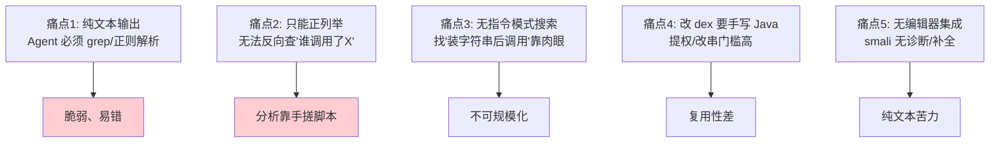
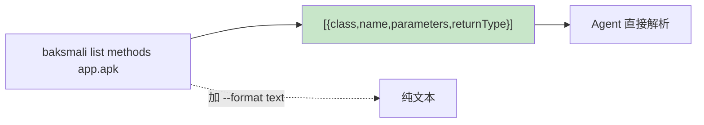
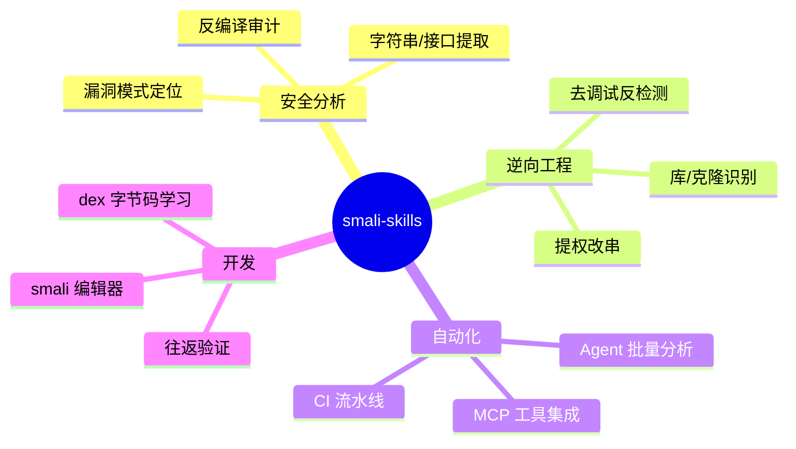

# 🎯 这个工具解决了什么问题

smali-skills 是原版 smali/baksmali 的增强发行版。原版是优秀的 dex ⇄ smali 转换器，但在 AI Agent 与自动化安全分析场景下有明显短板。smali-skills 针对这些短板做了系统性增强。

## 原版的痛点



## smali-skills 如何解决

### ① JSON 默认输出

查询类命令（`list`/`xref`/`search`/`diff`/`fingerprint`）默认输出 JSON，Agent 与脚本直接消费；`--format text` 切回人读文本。



解决痛点 1：结构化输出，解析零成本、零脆弱。

### ② 反向交叉引用（xref）

```bash
# 谁调用了这个方法
java -jar baksmali.jar xref callers app.apk --target "Lcom/Ex;->foo()V"
```

返回每个引用点的调用方法与字节偏移，JSON 输出。解决痛点 2：反向查询内建，无需手搓。

### ③ 指令模式搜索（search）

```bash
# 找"装字符串后调用某方法"的模式（支持通配符）
java -jar baksmali.jar search --opcode const-string,*,invoke-virtual app.apk
```

按 opcode 序列匹配，支持通配符 `*` 与正则过滤。解决痛点 3：指令模式检索可规模化。

### ④ 写回变换（transform）

```bash
# 一行提权：私有/ final → public
java -jar baksmali.jar transform unlock app.apk -o unlocked.apk
# 改字符串
java -jar baksmali.jar transform replace app.apk --old old.api --new new.api -o out.apk
# 去调试信息
java -jar baksmali.jar transform strip-debug app.apk -o out.apk
```

每条变换输出结构化 JSON 报告（命中数、变更数）。解决痛点 4：常见改 dex 操作命令化，无需写 Java。

### ⑤ LSP + MCP 集成

- `smali lsp`：诊断、大纲、悬浮、格式化——Neovim/VS Code 即开即用。
- `baksmali mcp`：把只读查询暴露为 MCP 工具，Agent 直接调用。

解决痛点 5：编辑器与 Agent 集成一等公民。

### ⑥ Skills 渐进披露

27 个 `SKILL.md` 按「快速开始/进阶/专家」三层组织，含真实命令→输出示例，Agent 按需加载——既给足知识又不爆上下文。

## 价值矩阵

| 能力 | 原版 | smali-skills |
|------|------|--------------|
| 输出格式 | 纯文本 | JSON 默认 + text |
| 反向引用 | 无 | `xref` 命令 |
| 指令搜索 | 无 | `search --opcode` |
| 一行变换 | 无 | `transform unlock/replace/...` |
| 编辑器集成 | 无 | LSP |
| Agent 工具协议 | 无 | MCP |
| AI 知识层 | 无 | 27 Skills |
| 指纹/克隆识别 | 无 | `fingerprint` |
| 语义 diff | 无 | `diff` |

## 适用场景



## 延伸阅读

- [三层架构](./architecture.md)
- [快速上手](./quickstart.md)
- [Skills 索引](../skills/)
- [CLI 概览](../cli/)
