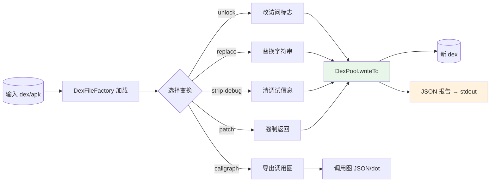
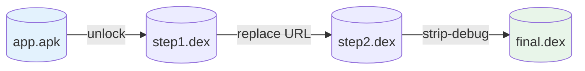

# 写回变换

读入 dex → 应用变换 → 写出新 dex，**原文件不被修改**。成功时默认打印一行 **JSON 报告**
（`command`/`input`/`output` + 各命令特有统计字段），`--format text` 切回人读文本。

## 变换流水线



所有变换底层都是 dexlib2 `rewriter` 框架的成品封装：覆写 `getAccessFlags()` / 自定义
`InstructionRewriter` / 令 `getDebugItems()` 返回空 / 覆写 `getImplementation()`。

## 命令速查

| 命令 | 作用 | 典型场景 |
|------|------|---------|
| `unlock` | 批量改访问标志：publicize / definalize | 打开隐藏 API、让类可被继承 |
| `replace` | 批量替换字符串常量 | 改 URL/日志 tag、脱敏 key |
| `strip-debug` | 清除全部调试信息 | 瘦身、增加逆向难度 |
| `patch` | 强制目标方法立即返回定值 | 绕过 root/授权/SSL 校验 |
| `callgraph` | 导出方法级调用图 | 静态分析、可视化 |

## unlock — 批量修改访问标志

```bash
baksmali unlock app.apk -o unlocked.dex            # 两者都做（默认）
baksmali unlock app.apk --public   -o public.dex   # 仅 publicize（清 private/protected）
baksmali unlock app.apk --no-final -o open.dex     # 仅 definalize（去 final）
```

JSON 报告示例：

```json
{"command":"unlock","input":"app.apk","output":"unlocked.dex","publicized":true,"definalized":true}
```

## replace — 批量替换字符串常量

同时替换 `const-string`/`const-string/jumbo` 指令与字符串型 encoded value（如 `static final String` 初值）。

```bash
# 字面替换（--from 与 --to 按出现顺序配对）
baksmali replace app.apk --from http://old.example --to http://new.example -o patched.dex
# 多条规则，按顺序依次施加
baksmali replace app.apk --from DEBUG --to RELEASE --from v1 --to v2 -o patched.dex
# 正则替换，--to 可用 $1 引用捕获组
baksmali replace app.apk --regex "key_[0-9]+" --to REDACTED -o patched.dex
```

规则按命令行顺序依次作用于每个字符串（后一条看到前一条的输出）。

## strip-debug — 清除调试信息

移除每个方法的全部 debug item（行号 `.line`、局部变量 `.local`、参数名），保留可执行字节码不变。

```bash
baksmali strip-debug app.apk -o stripped.dex
```

## patch — 强制方法返回定值

把匹配 `--class`/`--method`（正则）的方法体整体替换为「立即返回」。返回值必须与方法返回类型兼容：

| `--return` 值 | 适用返回类型 |
|---------------|-------------|
| `void` | `V` |
| `true` / `false` / `0` / `1` | 布尔/数值 |
| `null` | 对象/数组 |

```bash
# 让授权检查恒为 true
baksmali patch app.apk --method 'isPremium' --return true -o patched.dex
# 让某包下所有 check() 变成空操作
baksmali patch app.apk --class 'Lcom/drm/.*' --method 'check' --return void -o patched.dex
```

JSON 报告示例：

```json
{"command":"patch","input":"app.apk","output":"patched.dex","matched":1,"return":"true","methodFilter":"isPremium"}
```

`matched` = 被改写的方法数；`classFilter`/`methodFilter` 仅在显式给出时才出现。必须至少给出
`--class` 或 `--method` 之一，避免误伤全部方法。类型不兼容（如对 `I` 返回请求 `null`）会报错并中止。

## callgraph — 导出调用图

遍历每个方法体，把每次 invoke 记为一条 `调用者 -> 被调用者` 有向边。

```bash
baksmali callgraph app.apk                              # JSON（默认）
baksmali callgraph app.apk --graph-format dot > cg.dot  # Graphviz
baksmali callgraph app.apk --graph-format mermaid       # Mermaid 流程图
baksmali callgraph app.apk --class 'Lcom/example/.*'    # 只看某子系统
```

JSON 结构：`{"nodes":[...],"edges":[{"from":"...","to":"..."}]}`，节点用规范 smali 描述符。

## 组合工作流

去混淆式「解锁 + 脱敏 + 瘦身」流水线：



```bash
baksmali unlock      app.apk        -o step1.dex
baksmali replace     step1.dex --from https://telemetry.example --to https://127.0.0.1 -o step2.dex
baksmali strip-debug step2.dex      -o final.dex
```

绕过校验后验证：

```bash
baksmali patch app.apk --class 'Lcom/app/License;' --method verify --return true -o patched.dex
baksmali diff  app.apk patched.dex        # 应只显示 verify 一处 ~
```
