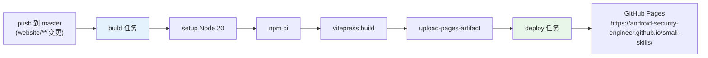

# 🚀 GitHub Pages 部署

本网站基于 VitePress 构建，通过 GitHub Actions 自动部署到 GitHub Pages。

## CI/CD 流程



## workflow 文件

部署定义在 `.github/workflows/deploy-website.yml`，触发条件：

- push 到 master 且改动 `website/**` 或 workflow 本身
- 手动 `workflow_dispatch`

两个 job：

| job | 职责 |
|-----|------|
| `build` | 安装依赖、`vitepress build`、上传产物 |
| `deploy` | 用 `actions/deploy-pages` 部署到 Pages |

`concurrency` 组 `pages` 配 `cancel-in-progress: true`，避免并发部署。

## 一次性配置

仓库需在 GitHub 设置中：

1. **Settings → Pages → Source**：选 "GitHub Actions"（不是 branch）。
2. 部署 workflow 已声明 `permissions: pages: write, id-token: write`。

## base 路径

项目站点部署在子路径 `/smali-skills/`，故 `website/.vitepress/config.ts` 设：

```ts
base: '/smali-skills/'
```

所有静态资源与链接会自动加此前缀。若改用自定义域名或 user 站点（`<user>.github.io`），需移除 `base`。

## 本地预览

```bash
cd website
npm install
npm run docs:dev       # 开发服务器
npm run docs:build     # 构建到 .vitepress/dist
npm run docs:preview   # 预览构建产物
```

## 延伸阅读

- [VitePress 配置](https://vitepress.dev/reference/site-config)
- [GitHub Pages 文档](https://docs.github.com/en/pages)
- [三层架构](../guide/architecture.md)
