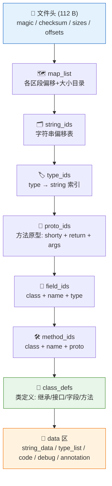
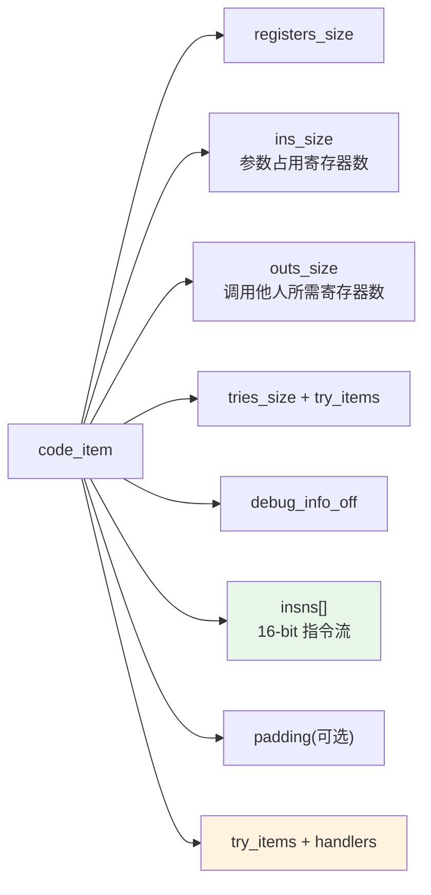

# 📦 DEX 文件格式

smali-skills 处理的对象。DEX（Dalvik Executable）是 Android 运行时消费的字节码容器，
`baksmali`/`smali` 负责它与可读 smali 文本之间的双向转换，`dexlib2` 负责其底层读写。

## 整体布局

DEX 是**池化设计**：字符串、类型、原型、字段、方法都是独立的 id 池，类定义与方法体通过索引引用池中条目。`dexlib2` 的 `writer/pool/` 正是镜像这一结构。

## 文件头（Header）

固定 112 字节，位于文件起始。

| 字段 | 偏移 | 大小 | 含义 |
|------|------|------|------|
| magic | 0 | 8 | `dex\n035\0`（或 `036`/`037`/`038`/`039`/`040`） |
| checksum | 8 | 4 | adler32 校验（覆盖除 magic 与自身外全部） |
| signature | 12 | 20 | SHA-1 签名（同上覆盖范围） |
| file_size | 32 | 4 | 整文件大小 |
| header_size | 36 | 4 | 固定 0x70 |
| endian_tag | 40 | 4 | `0x12345678`（小端） |
| link_size / link_off | 44/48 | 4/4 | 运行时链接区（静态文件恒为 0） |
| map_off | 52 | 4 | map_list 偏移 |
| string_ids_size / off | 56/60 | 4/4 | 字符串 id 表 |
| type_ids_size / off | 64/68 | 4/4 | 类型 id 表 |
| proto_ids_size / off | 72/76 | 4/4 | 原型 id 表 |
| field_ids_size / off | 80/84 | 4/4 | 字段 id 表 |
| method_ids_size / off | 88/92 | 4/4 | 方法 id 表 |
| class_defs_size / off | 96/100 | 4/4 | 类定义表 |
| data_size / off | 104/108 | 4/4 | 数据区 |

源码：`dexlib2/src/main/java/org/jf/dexlib2/dexbacked/raw/HeaderItem.java`。

## 区段与 map_list

`map_list` 是文件末尾的目录，列出每个区段（section）的类型 tag、大小、偏移。
`baksmali dump` 可打印带注释的十六进制转储，`baksmali list` 各子命令直接消费对应池。

| Section tag | 含义 |
|-------------|------|
| `TYPE_HEADER` | 文件头 |
| `TYPE_STRING_ID_ITEM` | 字符串 id 表 |
| `TYPE_TYPE_ID_ITEM` | 类型 id 表 |
| `TYPE_PROTO_ID_ITEM` | 原型 id 表 |
| `TYPE_FIELD_ID_ITEM` | 字段 id 表 |
| `TYPE_METHOD_ID_ITEM` | 方法 id 表 |
| `TYPE_CLASS_DEF_ITEM` | 类定义 |
| `TYPE_CALL_SITE_ID_ITEM` | call site（dex 038+） |
| `TYPE_METHOD_HANDLE_ITEM` | method handle（dex 038+） |
| `TYPE_CODE_ITEM` | 方法代码体 |
| `TYPE_STRING_DATA_ITEM` | 字符串数据（MUTF-8） |
| `TYPE_DEBUG_INFO_ITEM` | 调试信息 |
| `TYPE_ANNOTATION_ITEM` / `ANNOTATION_SET_*` | 注解 |
| `TYPE_TYPE_LIST` / `TYPE_LIST` | 类型列表 |

源码：`dexlib2/src/main/java/org/jf/dexlib2/ItemType.java`。

## 字符串编码（MUTF-8）

DEX 用 Modified UTF-8：`\0` 编码为双字节 `0xC0 0x80`，补码字符用 3 字节。
`string_data_item` 结构为 `utf16_size`（uleb128）+ 变长字节 + `\0`。

`baksmali list strings` 直接枚举该池；`dexlib2` 通过 `DexBackedStringReference` 零拷贝读取。

## code_item —— 方法代码体

`insns[]` 是 16-bit 单元的指令流（部分指令带 32-bit payload，如 `const-string`、switch payload）。
`dexlib2` 的 `DexBackedMethodImplementation` 惰性遍历该流，按 `Opcode` 的 format 解码每条指令。

## 访问标志（access flags）

类/字段/方法共享一组位标志（`ACC_*`），源码 `dexlib2/src/main/java/org/jf/dexlib2/AccessFlags.java`。

常见：`PUBLIC=0x1` `PRIVATE=0x2` `PROTECTED=0x4` `STATIC=0x8` `FINAL=0x10` `SYNCHRONIZED=0x20`
`VOLATILE=0x40` `BRIDGE=0x40` `TRANSIENT=0x80` `VARARGS=0x80` `NATIVE=0x100` `INTERFACE=0x200`
`ABSTRACT=0x400` `STRICT=0x800` `SYNTHETIC=0x1000` `ANNOTATION=0x2000` `ENUM=0x4000`
`CONSTRUCTOR=0x10000` `DECLARED_SYNCHRONIZED=0x20000`。

`baksmali transform unlock` 正是清除 `PRIVATE`/`FINAL` 等位来提权。

## 多 dex 容器

APK 内可含多个 `classes*.dex`；CDex（压缩 dex，dex 039+）在头部加 `compact_dex_payload` 前缀。
`dexlib2` 通过 `MultiDexContainer` / `ZipDexContainer` / `CDexBackedDexFile` 统一处理，入口 `DexFileFactory.loadDexContainer`。

## 延伸阅读

- [dexlib2 dexbacked 层](../reference/dexlib2/dexbacked.md) — 零拷贝解析
- [dexlib2 writer 层](../reference/dexlib2/writer.md) — 序列化写入
- [Opcode 参考](./opcodes.md)
- [版本映射](./version-map.md)
- [baksmali dump 命令](../cli/) — 十六进制转储
