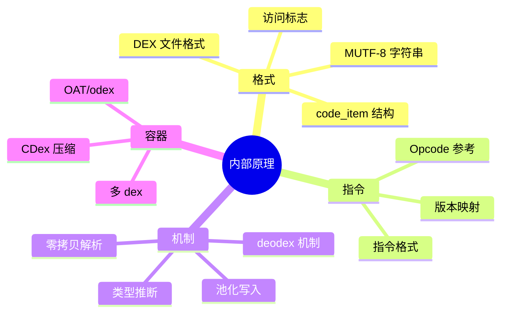

# 🧬 内部原理

理解 smali-skills 背后的机制。这些文档面向想深入理解 dex 格式与工具实现的使用者。

## 📐 格式与编码

| 文档 | 内容 |
|------|------|
| [DEX 文件格式](./dex-format.md) | 文件头、区段、map_list、code_item |
| [smali 语法参考](./smali-syntax.md) | 类型描述符、寄存器、方法体、注解 |
| [Opcode 参考](./opcodes.md) | 完整 Dalvik opcode 表与格式 |
| [版本映射](./version-map.md) | dex 版本 ↔ API ↔ opcode 集合 |

## ⚙️ 核心机制

| 文档 | 内容 |
|------|------|
| [零拷贝解析](./zero-copy.md) | dexbacked 如何惰性读取字节缓冲 |
| [池化写入](./pool-writing.md) | writer/pool 如何镜像 dex 池结构 |
| [类型推断](./type-inference.md) | analysis 如何推断寄存器类型 |
| [deodex 机制](./deodex.md) | 如何把 odex 指令还原为具体 invoke/field |

## 🚀 集成与部署

| 文档 | 内容 |
|------|------|
| [Claude Code 插件机制](./plugin.md) | marketplace.json 与 skill 自动发现 |
| [MCP 协议集成](./mcp.md) | baksmali mcp 暴露的工具 |
| [GitHub Pages 部署](./deployment.md) | CI/CD 流程 |
| [测试体系](./testing.md) | 往返测试、单元测试、e2e 冒烟 |

## 学习路径

建议按上述顺序学习，配合 [快速上手](../guide/quickstart.md) 与 [三层架构](../guide/architecture.md)。
