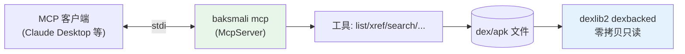

# 🔌 MCP 协议集成

`baksmali mcp` 启动一个 MCP（Model Context Protocol）服务器，把只读 dex 查询能力暴露为 Agent 工具，可集成进任意 MCP 客户端（Claude Desktop、Cursor 等）。

## 架构



服务器通过 stdio 与客户端通信，按 MCP 协议响应 `tools/list`、`tools/call`。每个工具对应一个 baksmali 查询能力，参数与返回都是结构化 JSON。

## 工具集

MCP 服务器暴露只读工具（不暴露写回变换，避免 Agent 误改 dex）：

| 工具 | 对应 CLI | 作用 |
|------|----------|------|
| list classes/methods/strings/fields/types | `baksmali list *` | 枚举各池 |
| xref callers/field-refs/type-refs | `baksmali xref *` | 反向引用 |
| search | `baksmali search` | opcode 模式搜索 |
| fingerprint | `baksmali fingerprint` | 方法指纹 |
| disassemble | `baksmali disassemble` | 反汇编为 smali 文本 |

## 与 Skills 的区别

- **Skills**（Layer 3）：Markdown 文档，教 Agent **何时**用哪个命令，Agent 自己跑 shell。
- **MCP**（Layer 2 扩展）：把能力暴露为**工具调用**，Agent 直接调函数，无需 shell。

二者互补：MCP 客户端里 Agent 直接调工具；纯 CLI 场景里 Agent 读 Skill 跑 shell。

## 启动

```bash
java -jar baksmali.jar mcp                # stdio 模式
java -jar baksmali.jar mcp --help         # 查看选项
```

在 MCP 客户端配置中注册（以 Claude Desktop 为例，概念性）：

```json
{
  "mcpServers": {
    "baksmali": {
      "command": "java",
      "args": ["-jar", "/path/to/baksmali.jar", "mcp"]
    }
  }
}
```

## 延伸阅读

- [baksmali mcp 命令](../cli/mcp.md)
- [baksmali mcp 子包](../reference/baksmali/commands/mcp.md)
- [smali-mcp skill](../skills/smali-mcp.md)
- [Claude Code 插件机制](./plugin.md)
