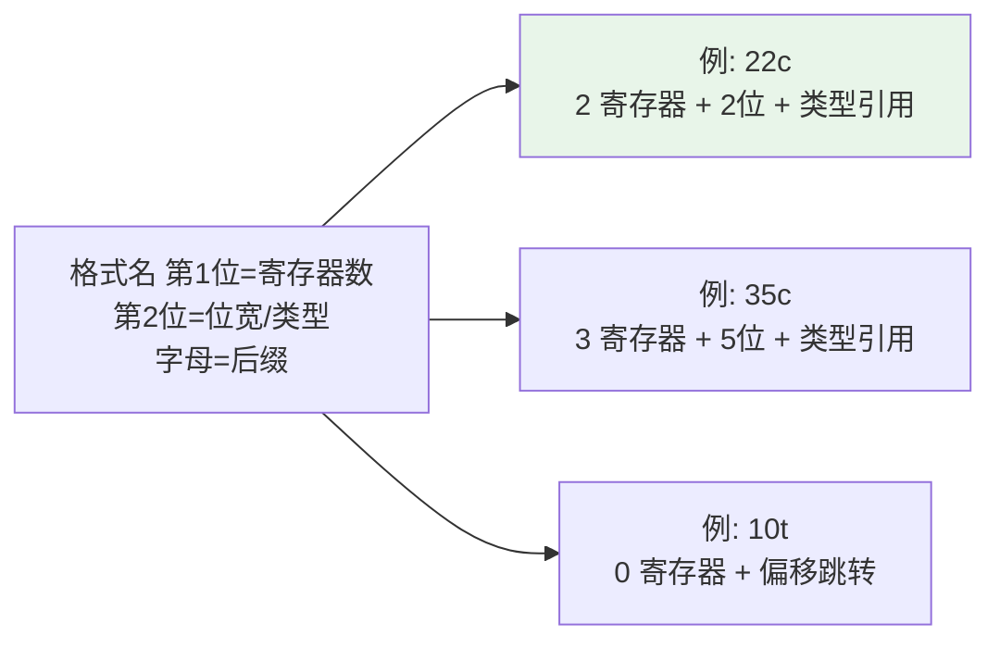
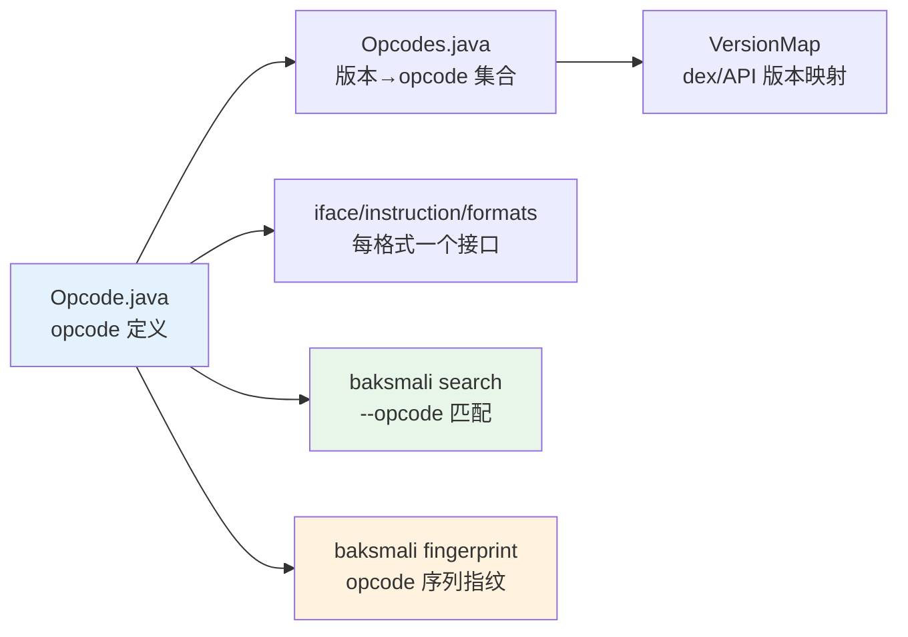

# 🛠️ Opcode 参考

Dalvik 字节码的完整 opcode 表。源码定义在 `dexlib2/src/main/java/org/jf/dexlib2/Opcode.java`，
每条形如 `NAME(0xNN, "mnemonic", ReferenceType, Format, flags)`。

## 字段含义

| 字段 | 含义 |
|------|------|
| 操作码 | 16-bit 指令首单元的低 8 位 |
| 助记符 | smali 文本形式（带 `/` 后缀变体） |
| ReferenceType | 该指令引用的池类型：`NONE`/`STRING`/`TYPE`/`FIELD`/`METHOD`/`METHOD_PROTO`/`METHOD_HANDLE`/`CALL_SITE` |
| Format | 操作数布局（见 [指令格式](#指令格式)） |
| flags | `CAN_CONTINUE`/`CAN_THROW`/`SETS_REGISTER`/`SETS_WIDE_REGISTER`/`SETS_RESULT` |

## 指令格式

格式名编码操作数宽度与个数，如 `35c` = 3 个寄存器操作数 + 5 bit 寄存器位宽 + `c` 类引用。

后缀字母：`t`=分支偏移、`c`=常量/引用、`n`=立即数、`x`=寄存器、`s`=短立即数、
`ih`=高 16 位立即数、`lh`=长高 16 位、`l`=64 位立即数、`m`=method/inline、`mi/ms`=method handle/polymorphic。

## opcode 速查表

### 移动（0x00–0x0d）

| 码 | 助记符 | 格式 | 说明 |
|----|--------|------|------|
| 0x00 | `nop` | 10x | 空操作 |
| 0x01–0x03 | `move` `/from16` `/16` | 12x/22x/32x | 寄存器间移动 |
| 0x04–0x06 | `move-wide` `/from16` `/16` | 12x/22x/32x | 宽（64 位）移动 |
| 0x07–0x09 | `move-object` `/from16` `/16` | 12x/22x/32x | 对象移动 |
| 0x0a–0x0c | `move-result` `-wide` `-object` | 11x | 取上一 invoke 返回值 |
| 0x0d | `move-exception` | 11x | 取异常处理器捕获的异常 |

### 返回（0x0e–0x11）

| 码 | 助记符 | 格式 |
|----|--------|------|
| 0x0e | `return-void` | 10x |
| 0x0f–0x11 | `return` `-wide` `-object` | 11x |

### 常量装载（0x12–0x1c）

| 码 | 助记符 | 格式 | 引用 |
|----|--------|------|------|
| 0x12 | `const/4` | 11n | — |
| 0x13/0x14/0x15 | `const/16` `const` `const/high16` | 21s/31i/21ih | — |
| 0x16–0x19 | `const-wide/16` `/32` `` `/high16` | 21s/31i/51l/21lh | — |
| 0x1a/0x1b | `const-string` `/jumbo` | 21c/31c | STRING |
| 0x1c | `const-class` | 21c | TYPE |

### 监视/类型/数组（0x1d–0x27）

| 码 | 助记符 | 格式 | 引用 |
|----|--------|------|------|
| 0x1d/0x1e | `monitor-enter` `-exit` | 11x | — |
| 0x1f | `check-cast` | 21c | TYPE |
| 0x20 | `instance-of` | 22c | TYPE |
| 0x21 | `array-length` | 12x | — |
| 0x22 | `new-instance` | 21c | TYPE |
| 0x23 | `new-array` | 22c | TYPE |
| 0x24/0x25 | `filled-new-array` `/range` | 35c/3rc | TYPE |
| 0x26 | `fill-array-data` | 31t | — |
| 0x27 | `throw` | 11x | — |

### 跳转/分支（0x28–0x3d）

| 码 | 助记符 | 格式 |
|----|--------|------|
| 0x28–0x2a | `goto` `/16` `/32` | 10t/20t/30t |
| 0x2b/0x2c | `packed-switch` `sparse-switch` | 31t |
| 0x2d–0x31 | `cmpl-float` `cmpg-float` `cmpl-double` `cmpg-double` `cmp-long` | 23x |
| 0x32–0x37 | `if-eq/ne/lt/ge/gt/le` | 22t |
| 0x38–0x3d | `if-eqz/nez/ltz/gez/gtz/lez` | 21t |

### 算术（0x3e+）

`add-int` `sub-int` `mul-int` `div-int` `rem-int` `and-int` `or-int` `xor-int` `shl-int` `shr-int` `ushr-int` 各有 `/2addr` 变体；
类型前缀 `int`/`long`/`float`/`double`。源码 `Opcode.java` 全量定义。

### 字段访问

`iget`/`iput`（实例）与 `sget`/`sput`（静态），类型后缀 `-wide` `-object` `-boolean` `-byte` `-char` `-short`，引用 FIELD。

### 方法调用

| 助记符 | 格式 | 说明 |
|--------|------|------|
| `invoke-direct` | 35c/3rc | 构造器/private |
| `invoke-virtual` | 35c/3rc | 实例方法 |
| `invoke-super` | 35c/3rc | 父类方法 |
| `invoke-static` | 35c/3rc | 静态方法 |
| `invoke-interface` | 35c/3rc | 接口方法 |
| `invoke-custom` | 35c/3rc | invoke-custom（CALL_SITE） |
| `invoke-polymorphic` | 45cc/4rcc | 多态（METHOD_HANDLE） |

## 与工具的关系

- `baksmali search --opcode const-string,invoke-virtual` 按助记符序列匹配指令模式。
- `baksmali fingerprint` 用 opcode 序列（忽略寄存器/引用）生成方法指纹，用于库/克隆识别。
- `dexlib2` 解码指令时按 `Opcode.format` 选择对应的 `Instruction` 实现类。

## 版本支持

不同 dex 版本引入的 opcode：

| dex 版本 | 新增 |
|----------|------|
| 035 | 基础指令集 |
| 037 | `invoke-custom` / `invoke-polymorphic` / method handle |
| 038 | call site id、method handle item |
| 039 | CDex（压缩 dex） |
| 040 | hidden API 限制标志扩展 |

详见 [版本映射](./version-map.md) 与源码 `VersionMap.java`、`Opcodes.java`。

## 延伸阅读

- [版本映射](./version-map.md)
- [DEX 文件格式](./dex-format.md)
- [smali 语法参考](./smali-syntax.md)
- [dexlib2 Opcode 类](../reference/dexlib2/opcode.md)
- [baksmali search 命令](../cli/search.md)
- [baksmali fingerprint 命令](../cli/fingerprint.md)
