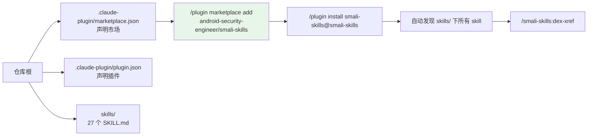

# 🧩 Claude Code 插件机制

smali-skills 仓库本身就是一个 Claude Code 插件市场（marketplace）。用户用一条命令安装后，27 个 skill 自动被发现，以 `/smali-skills:<skill>` 调用。

## 仓库即市场



## marketplace.json

位于 `.claude-plugin/marketplace.json`，声明市场元数据与所含插件。

```json
{
  "name": "smali-skills",
  "owner": { "name": "Android Security Engineer", "url": "..." },
  "plugins": [{ "name": "smali-skills", "source": "./", "description": "..." }]
}
```

`source` 用相对路径指向同一仓库内的插件目录（自托管市场）。

## plugin.json

位于 `.claude-plugin/plugin.json`，声明插件本身。`skills/` 子目录下的 skill 会被**自动发现**——无需在 plugin.json 逐条列举。

## skill 自动发现规则

Claude Code 扫描 `skills/*/SKILL.md`，每个 `SKILL.md` 的 frontmatter 提供：

```yaml
---
name: dex-xref
description: "Use when the user asks to: ..."
---
```

`description` 是触发条件——Agent 据此判断何时加载该 skill。三层渐进披露（快速开始/进阶/专家）让 Agent 按需读取，控制上下文消耗。

## 安装与使用

```bash
# 在 Claude Code 中
/plugin marketplace add android-security-engineer/smali-skills
/plugin install smali-skills@smali-skills
```

安装后：

```
/smali-skills:dex-xref          # 交叉引用
/smali-skills:dex-transform     # 写回变换
/smali-skills:smali-format      # 格式化
```

## 为何这样设计

- **零配置**：skill 自动发现，新增 skill 只需加目录。
- **渐进披露**：避免一次性把所有知识塞进上下文。
- **版本随仓库**：marketplace 跟随 git，更新即升级。

## 延伸阅读

- [Skills 索引](../skills/)
- [三层架构](../guide/architecture.md)
- [安装指南](../guide/install.md)
