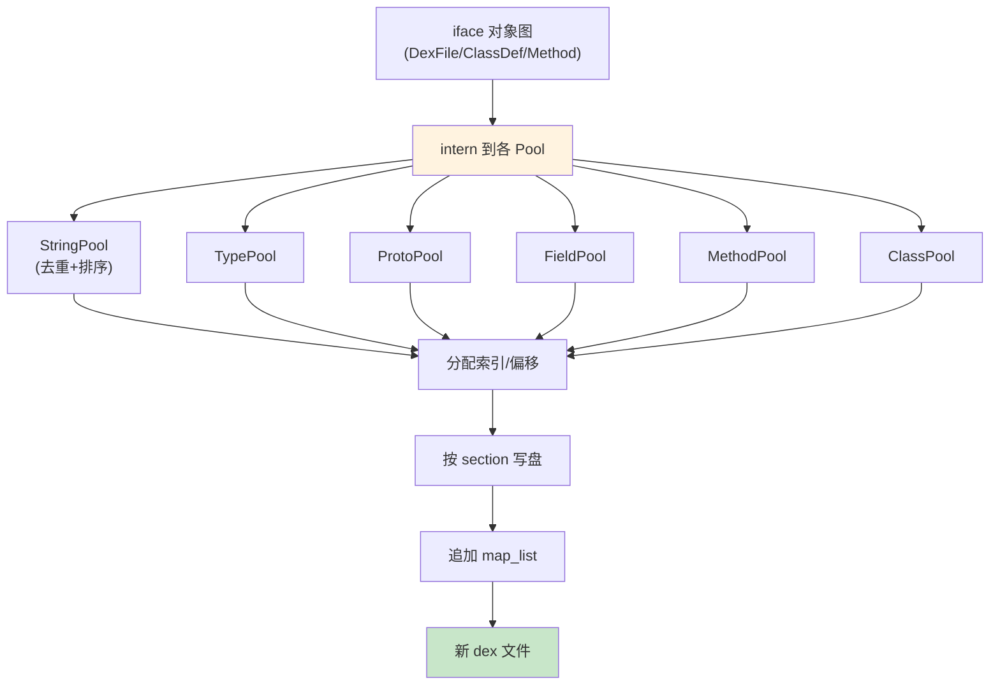

# 📤 池化写入

`dexlib2` 写 dex 时必须把所有 string/type/proto/field/method 条目 intern 到池、排序、分配索引，再写盘。`writer/pool/` 镜像 dex 的池结构完成这一流程。

## 写入流程



## DexPool —— 编排者

`DexPool`（`writer/pool/DexPool.java`）是入口。流程：

1. `internClass` 把每个 `ClassDef` 的字段/方法/引用递归加入对应池。
2. 各 `BasePool` 子类去重（interning）并按 dex 规范排序（string 按 MUTF-8 字节序，type 按 string 索引序……）。
3. 排序后分配连续索引。
4. `writeTo` 按 header → ids → data → map 顺序写各 section。

## 池类层次

| 池 | 内含 | 排序键 |
|----|------|--------|
| `StringPool` | string_data | MUTF-8 字节序 |
| `TypePool` | type → string 索引 | 按 string 索引 |
| `ProtoPool` | shorty + return + arg types | shorty → return → args |
| `FieldPool` | class + name + type | class → name → type |
| `MethodPool` | class + name + proto | class → name → proto |
| `ClassPool` | class_def | 类描述符 |
| `CallSitePool` / `MethodHandlePool` | call site / method handle | — |

## 去重的意义

同一字符串/类型/方法在整个 dex 中只有一个 id。`baksmali` 反汇编时引用的是索引；`smali` 汇编时，tree walker 产生的每个 `StringReference` 都会被 `StringPool` intern——重复的字符串自动合并为一个 id。

## 偏移的两阶段

code_item、annotation、type_list 等 data 区条目需先写盘才知道偏移，而 class_def/proto 等又引用这些偏移。`DexWriter` 用 `OffsetSection`/`NullableOffsetSection` 先预留、后回填的两次扫描解决循环依赖。

## 实战

```bash
# 汇编——内部走 DexPool
java -jar smali.jar assemble input.smali -o out.dex

# 写回变换——修改后重新池化写盘
java -jar baksmali.jar transform unlock app.apk -o unlocked.apk
```

## 延伸阅读

- [dexlib2 writer 层](../reference/dexlib2/writer.md)
- [dexlib2 writer/pool](../reference/dexlib2/writer-pool.md)
- [DexPool 详解](../reference/dexlib2/dex-pool.md)
- [DexWriter 详解](../reference/dexlib2/dex-writer.md)
- [零拷贝解析](./zero-copy.md)
