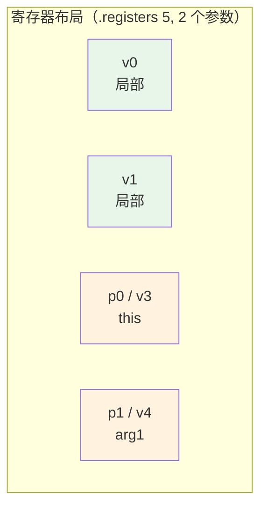

# 📝 smali 语法参考

smali 是 Jasmin/dedexer 风格的 dex 汇编语言。`smali` 命令把它汇编成 dex，`baksmali` 把 dex 反汇编成它。

## 类型描述符

| Java 类型 | smali 描述符 |
|-----------|-------------|
| `int` | `I` |
| `long` | `J` |
| `float` | `F` |
| `double` | `D` |
| `boolean` | `Z` |
| `byte` | `B` |
| `char` | `C` |
| `short` | `S` |
| `void` | `V` |
| `String` | `Ljava/lang/String;` |
| `int[]` | `[I` |
| `String[][]` | `[[Ljava/lang/String;` |

类描述符以 `L` 开头、`;` 结尾，包名用 `/` 分隔。数组每加一维前置一个 `[`。

## 方法签名

`class->name(params)return`

```
Lcom/example/App;->onCreate(Landroid/os/Bundle;)V
Lcom/example/App;->foo(IIJLjava/lang/String;)V
```

参数类型紧挨、无分隔；返回类型在末尾。`xref` 的 `--target` 即用此格式。

## 寄存器

Dalvik 是寄存器机，方法声明 `.registers N`（含参数）或 `.locals N`（不含参数）。



`vN` 是全寄存器编号；`pN`（parameter）从参数区开始，等价于 `v(registers - params + N)`。非静态方法 `p0` 即 `this`。

## 方法体结构

```smali
.method public foo(I)V
    .registers 2               # 总寄存器数
    .param p1, "arg"           # 参数名（调试）

    # 指令区
    const/4 v0, 0x1
    add-int v0, v0, p1
    return v0

    # try/catch
    .catch Ljava/lang/Exception; {:try_start .. :try_end} :catch
    :try_start
    invoke-virtual {p0, p1}, Lcom/example/App;->bar(I)I
    :try_end
    move-result v0
    return v0
    :catch
    const/4 v0, -0x1
    return v0
.end method
```

`:label` 是跳转/异常目标；`.catch` 声明异常处理器；`move-result` 取上一条 `invoke` 的返回值。

## 字段与类

```smali
.class public Lcom/example/App;
.super Ljava/lang/Object;
.implements Lcom/example/Iface;
.source "App.java"

.field public static final TAG:Ljava/lang/String; = "App"

.field private count:I        # 实例字段
```

`.field ... = <value>` 携带静态初始值；实例字段无初始值（构造函数里赋值）。

## 注解

```smali
.annotation runtime Lcom/example/MyAnno;
    value = "hello"
    count = 0x5
    cls = Lcom/example/Foo;
.subannotation Lcom/example/Nested;
    x = 0x1
.end subannotation
.end annotation
```

注解有 `runtime`（运行时可见）、`system`（系统可见， Dalvik 内置）、`build`（仅编译期）三种可见性。`.subannotation` 表达嵌套注解元素。

## 常见指令速查

| 类别 | 指令示例 | 说明 |
|------|----------|------|
| 常量装载 | `const/4` `const/16` `const` `const-wide` `const-string` | 装载立即数/字符串 |
| 移动 | `move` `move-wide` `move-object` `move-result*` | 寄存器间/取返回值 |
| 返回 | `return-void` `return` `return-wide` `return-object` | 方法返回 |
| 算术 | `add-int` `mul-int` `div-double` | 二元算术 |
| 比较 | `if-eq` `if-ne` `if-lt` `if-gez` | 条件跳转 |
| 跳转 | `goto` `if-eqz` `packed-switch` `sparse-switch` | 控制流 |
| 字段 | `iget` `iput` `sget` `sput` | 字段读写 |
| 调用 | `invoke-virtual` `invoke-static` `invoke-super` `invoke-interface` `invoke-direct` | 方法调用 |
| 类型 | `new-instance` `check-cast` `instance-of` | 类型操作 |
| 数组 | `new-array` `aget` `aput` `array-length` | 数组操作 |

完整 opcode 列表见 [Opcode 参考](./opcodes.md)。

## 延伸阅读

- [Opcode 参考](./opcodes.md)
- [DEX 文件格式](./dex-format.md)
- [汇编管线](../reference/smali/assembly-pipeline.md)
- [smali-format skill](../skills/smali-format.md)
- [smali-syntax skill](../skills/smali-syntax.md)
