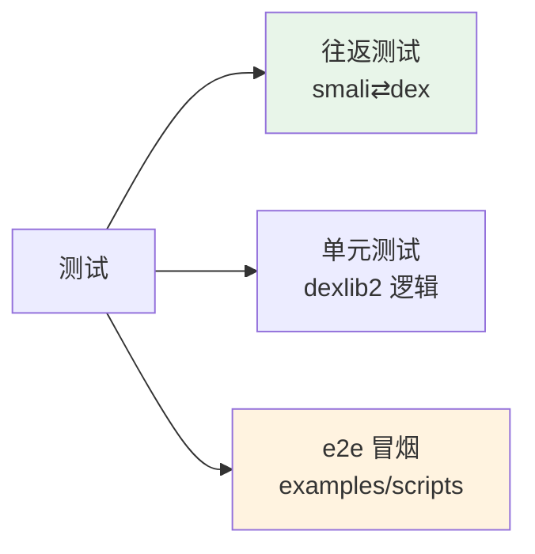
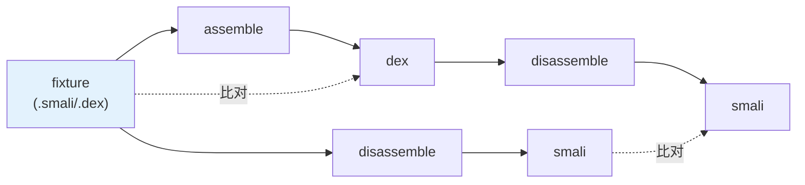

# 🧪 测试体系

smali-skills 用 JUnit 4（dexlib2 还用 Mockito）组织测试，核心是**往返测试**——保证 smali ⇄ dex 100% 无损。

## 测试类型



## 往返测试

baksmali/smali 多数测试是往返：一个 `.smali` 或 `.dex` fixture 汇编↔反汇编后比对。



fixture 位于 `src/test/resources/<TestName>/` 或 `src/test/smali/`。每个测试类 `*Test.java` 指向对应 fixture 目录。

### 模式

| 模式 | 验证 |
|------|------|
| smali → dex → smali | 汇编再反汇编，smali 文本一致 |
| dex → smali → dex | 反汇编再汇编，dex 字节一致 |
| dex → smali → dex → smali | 双向幂等 |

## 运行测试

```bash
./gradlew build                                  # 全量（编译+测试+jar）
./gradlew :dexlib2:test                          # 单模块
./gradlew :baksmali:test --tests '*DisassemblyTest'   # 单测试类（Gradle 过滤）
./gradlew :baksmali:fb                           # baksmali fast build（跳过测试+javadoc）
```

## e2e 冒烟

`examples/scripts/e2e_demo.sh` 串联所有 CLI 能力（assemble→disassemble→list→xref→search），CI 的 `skills` job 调用它做端到端冒烟。

```bash
./gradlew :smali:fatJar :baksmali:fatJar   # 先构建
bash examples/scripts/e2e_demo.sh
```

## CI 中的测试

`.github/workflows/ci.yml` 三个 job：

| job | 内容 |
|-----|------|
| `test` | 矩阵 Java 11/17，`./gradlew build -x javadoc` + `test` |
| `lint` | 代码风格检查 |
| `skills` | `validate_skills.py` 校验 Skills 层 + 构建 jar + e2e 冒烟 |

## dexlib2 预置 fixture

dexlib2 在 `src/test/resources/` 预置多个 `.dex`/`.odex` 二进制 fixture（含 `accessorTest.dex`，由 `accessorTestGenerator` 子项目生成）。这些是往返测试的输入。

## 生成代码的测试

| 生成物 | 测试 |
|--------|------|
| `SyntheticAccessorFSM`（ragel） | `SyntheticAccessorTest` |
| accessor 测试 dex | `AccessorTypes` 相关测试 |
| smali 语法 | 各 `*Test` 往返 |

改 ragel 后必须 `./gradlew ragel` 重生成再测试。

## 延伸阅读

- [如何阅读源码](../guide/reading-source.md)
- [CLAUDE.md](https://github.com/android-security-engineer/smali-skills/blob/master/CLAUDE.md)
- [CI 文件](https://github.com/android-security-engineer/smali-skills/blob/master/.github/workflows/ci.yml)
- [反汇编 ↔ 汇编往返](../guide/roundtrip.md)
