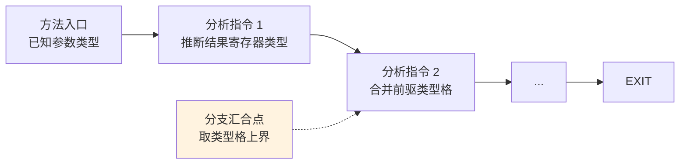
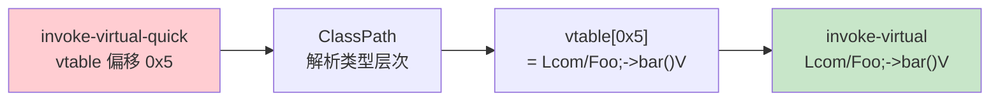

# 🔬 类型推断与 deodex

`dexlib2/analysis` 层负责两类工作：寄存器类型推断（用于 `dump` 注释、`vtable` 解析）与 odex 指令还原（deodex）。

## 寄存器类型推断

Dalvik 是寄存器机，但 dex 不记录每个寄存器在每条指令处的类型。`MethodAnalyzer` 做前向数据流分析，推断每个寄存器在每个程序点的精确类型。



类型格（lattice）：`Top`（未知）→ 具体类型 → `Bottom`（冲突）。分支汇合取上界。这使得 `baksmali dump` 能标注 `v0 = Ljava/lang/String;` 这类信息。

## 关键类

| 类 | 职责 |
|----|------|
| `MethodAnalyzer` | 单方法前向分析，产出 `AnalyzedInstruction` 序列 |
| `ClassPath` | 已知类型的层次（含框架类），用于解析父类/接口 |
| `ClassProto` / `TypeProto` / `PrimitiveProto` | 类型原型，提供字段/方法/vtable 查询 |
| `RegisterType` | 寄存器在某点的类型 |
| `DexClassProvider` | 从 dex 提供类定义给 ClassPath |

## deodex —— odex 指令还原

odex（optimized dex）把部分 `invoke-virtual`/`iget` 替换为带 vtable/field 偏移的优化形式（`invoke-virtual-quick`、`iget-quick`）。这些指令引用的是**偏移**而非方法/字段 id，脱离原设备无法解读。



`MethodAnalyzer` 结合 `ClassPath`（需 `--boot-class-path` 提供框架类）把 quick 指令还原为引用具体方法/字段的普通指令。`baksmali disassemble --deodex` 即调用此机制。

## ClassPath 与类提供者

`ClassPath` 由若干 `ClassProvider` 组成：`DexClassProvider`（从目标 dex）、外部 jar/apk（框架类）。解析 vtable/字段偏移时需完整类型层次，故 deodex 常需指定 `--boot-class-path /system/framework/framework.jar`。

## 实战

```bash
# 带类型注释的十六进制转储（触发类型推断）
java -jar baksmali.jar dump app.apk

# deodex（需框架类路径）
java -jar baksmali.jar disassemble app.odex --deodex -b framework.jar -o out/

# vtable / fieldoffsets（依赖类型层次）
java -jar baksmali.jar l v -b framework.jar app.apk
```

## 延伸阅读

- [dexlib2 analysis 层](../reference/dexlib2/analysis.md)
- [ClassPath 详解](../reference/dexlib2/classpath.md)
- [MethodAnalyzer 详解](../reference/dexlib2/method-analyzer.md)
- [dex-classpath skill](../skills/dex-classpath.md)
- [dex-deodex skill](../skills/dex-deodex.md)
