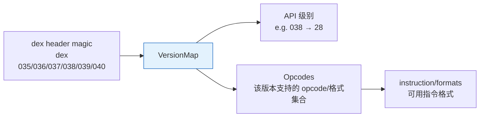

# 🗺️ 版本映射 (VersionMap)

DEX 格式随 Android 演进。`dexlib2` 用 `VersionMap` 把 dex header 里的版本号（如 `038`）映射到 API 级别与
`Opcodes` 集合，决定哪些 opcode/格式可用。源码：`dexlib2/src/main/java/org/jf/dexlib2/VersionMap.java`。

## 三层映射



## 版本对照表

| dex 版本 | magic | API 级别 | 关键变化 |
|----------|-------|----------|----------|
| 035 | `dex\n035\0` | ≤ 13 | 基础指令集 |
| 036 | `dex\n036\0` | 14–19 | 默认 dex 版本 |
| 037 | `dex\n037\0` | 20+ | `invoke-custom` / `invoke-polymorphic` / method handle |
| 038 | `dex\n038\0` | 27+ | call site id、method handle item 区段 |
| 039 | `dex\n039\0` | 28+ | CDex 压缩 dex payload |
| 040 | `dex\n040\0` | 30+ | hidden API 限制标志扩展 |

## Opcodes 与版本

`Opcodes`（源码 `dexlib2/src/main/java/org/jf/dexlib2/Opcodes.java`）为每个版本维护一个 opcode 表。
读写时 `DexWriter` 用 `VersionMap` 选定目标版本的 opcode 集合，确保不写入目标版本不支持的指令。

```java
// 概念性示意
public static Opcodes forDexVersion(int version) {
    int api = VersionMap.mapDexVersionToApi(version);
    return forApi(api);
}
```

## hidden API 限制标志

dex 040 起字段/方法 id 项可携带 hidden API 限制标志（`whitelist`/`greylist`/`blacklist`/`core-platform-api`），
反映 Android 对非 SDK 接口的访问限制。`baksmali` 反汇编时在对应条目标注限制级别。

## 对工具的影响

- **`smali assemble`**：默认产出 dex 036；如源码含 `invoke-custom` 需升版。
- **`baksmali`**：按 dex 实际版本选 opcode 集解码，避免误判未知指令为 `opcode 0x?`。
- **`analysis` deodex**：odex/oat 文件含版本信息，`ClassPath` 据此加载对应框架类。

## 延伸阅读

- [DEX 文件格式](./dex-format.md)
- [Opcode 参考](./opcodes.md)
- [dexlib2 VersionMap 类](../reference/dexlib2/version-map.md)
- [dexlib2 Opcodes 类](../reference/dexlib2/opcodes.md)
