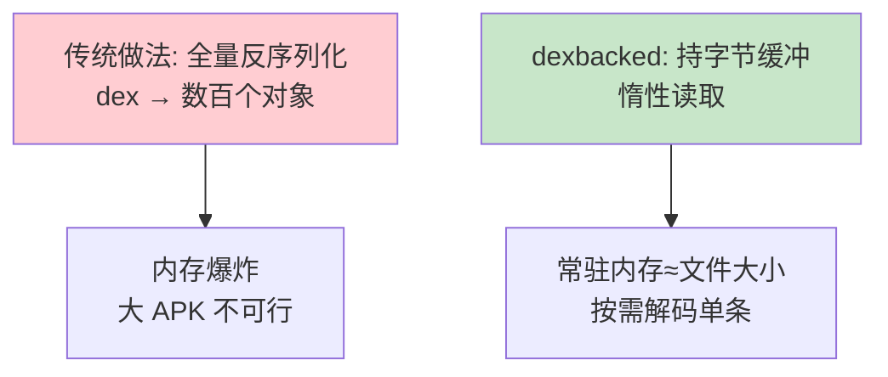
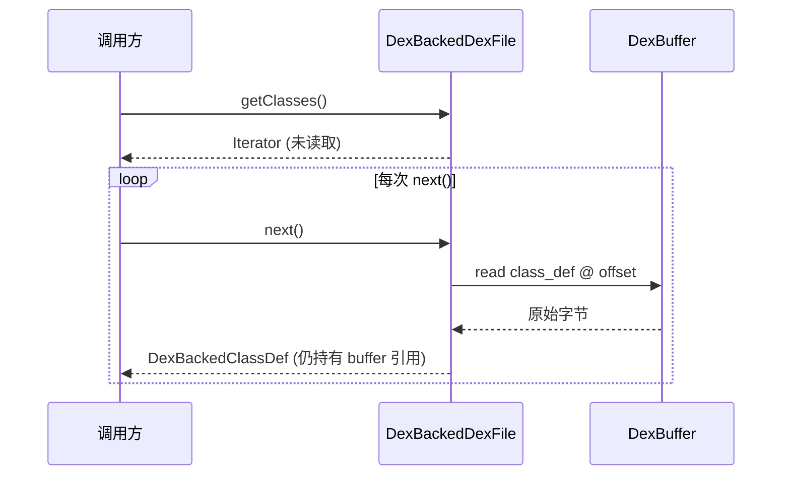
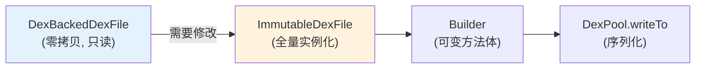

# ⚡ 零拷贝解析

`dexlib2` 的 `dexbacked` 层不把 dex 反序列化成对象图，而是持有一份字节缓冲，按需读取——解析一个大 dex 几乎不占额外内存。

## 动机



Android APK 的 dex 可达数十 MB，方法数百万级。全量实例化会内存溢出。`dexbacked` 只持有原始 `ByteBuffer`，访问某个类/方法/指令时才从对应偏移解码。

## 关键类

| 类 | 职责 |
|----|------|
| `DexFileFactory` | 入口，识别 dex/odex/oat/zip，返回 `DexBackedDexFile` |
| `DexBackedDexFile` | 持 `DexBuffer`，提供各池的惰性迭代器 |
| `DexBackedClassDef` | 读 `class_def_item`，字段/方法按偏移惰性列出 |
| `DexBackedMethod` / `DexBackedMethodImplementation` | 方法元信息与 code_item 惰性解码 |
| `DexBackedField` | 字段条目 |
| `DexBuffer` / `DexReader` | 底层字节读取（uleb128/固定宽度） |

## 惰性迭代



迭代器每次 `next()` 才读一条 `class_def_item`。访问该类的方法时，`DexBackedClassDef.getMethods()` 又返回一个惰性迭代器，从 `methods_off` 开始读 `method_id` + `code_item`。

## uleb128 与紧凑编码

dex 大量使用 uleb128（变长整数）节省空间——多数索引值小，1–2 字节即可。`DexReader.readUleb128()` 按需解码，是零拷贝能保持低开销的关键。

## 与 immutable 的衔接

零拷贝适合**只读**；若要**修改**，需转成 `immutable`（全量实例化）。`baksmali` 反汇编时只读，故全程零拷贝；`smali` 汇编与 `transform` 写回则需要 `immutable`/`builder`。



## 实战

```bash
# 列举类——零拷贝，大 APK 秒开
java -jar baksmali.jar list classes app.apk

# 反汇编——逐类惰性读，内存稳定
java -jar baksmali.jar disassemble app.apk -o out/
```

## 延伸阅读

- [dexlib2 dexbacked 层](../reference/dexlib2/dexbacked.md)
- [DexBackedDexFile 详解](../reference/dexlib2/dexbacked-dexfile.md)
- [池化写入](./pool-writing.md)
- [DEX 文件格式](./dex-format.md)
