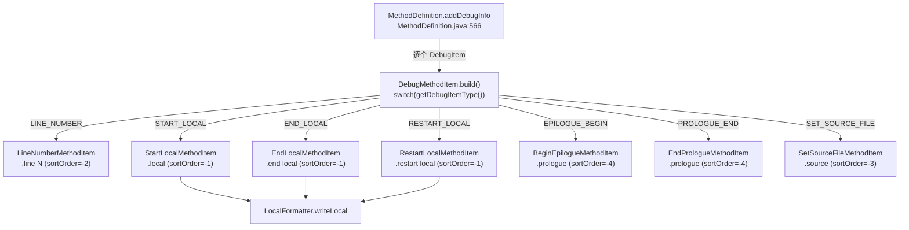

# 🛠️ Adaptors/Debug — 调试项适配器

`org.jf.baksmali.Adaptors.Debug` 包负责把 dexlib2 `iface.debug.DebugItem`（行号、局部变量活区间、prologue/epilogue 标记、源文件覆盖）翻译回 smali 文本里的调试指令（`.line`、`.local`、`.end local`、`.restart local`、`.prologue`、`.source`）。这些指令不改变字节码语义，仅服务于调试器与可读性，是反汇编输出"像源码"的关键一环。

## 📊 包定位

- **上游**：`MethodDefinition.addDebugInfo()` 遍历 `methodImpl.getDebugItems()`，逐个调用 `DebugMethodItem.build()`（`baksmali/src/main/java/org/jf/baksmali/Adaptors/MethodDefinition.java:566`）。
- **下游**：产出的 `MethodItem` 与指令、标签、try/catch 项混合排序后，由 `MethodDefinition.writeTo()` 顺序写出到 `BaksmaliWriter`。
- **基类**：所有调试项继承 `DebugMethodItem`，后者继承 `org.jf.baksmali.Adaptors.MethodItem`（实现 `Comparable`，按 `codeAddress` + `getSortOrder()` 排序，`MethodItem.java:35`）。

## 🧬 类清单

| 类名 | 对应 `DebugItemType` | 输出 smali | 职责 |
|---|---|---|---|
| `DebugMethodItem` | — | — | 抽象基类 + 工厂 `build()`，按类型分发并赋予 `sortOrder` |
| `LineNumberMethodItem` | `LINE_NUMBER (0x0a)` | `.line N` | 写出源码行号 |
| `StartLocalMethodItem` | `START_LOCAL (0x03)` | `.local vN, "name":type, "sig"` | 标记局部变量进入活区间 |
| `EndLocalMethodItem` | `END_LOCAL (0x05)` | `.end local vN    # ...` | 标记局部变量离开活区间 |
| `RestartLocalMethodItem` | `RESTART_LOCAL (0x06)` | `.restart local vN    # ...` | 标记同一寄存器复用为同名局部 |
| `BeginEpilogueMethodItem` | `EPILOGUE_BEGIN (0x08)` | `.prologue` | 方法尾段起始标记（输出文本仍是 `.prologue`） |
| `EndPrologueMethodItem` | `PROLOGUE_END (0x07)` | `.prologue` | 方法序言结束标记 |
| `SetSourceFileMethodItem` | `SET_SOURCE_FILE (0x09)` | `.source "Foo.java"` | 覆盖类级 `.source` |
| `LocalFormatter` | — | `"name":Type, "sig"` | 把 name/type/signature 三元组格式化为 smali 局部变量描述 |

## 🗺️ 类间关系



## ⚡ 排序与协作流程

`sortOrder` 决定同一 `codeAddress` 上多项 `MethodItem` 的输出先后（`DebugMethodItem.java:49` 通过覆写 `getSortOrder()` 返回构造时传入值）：

| sortOrder | 项 | 含义 |
|---|---|---|
| `-4` | prologue / epilogue 标记 | 最先，划分方法段落 |
| `-3` | `.source` | 紧随其后，覆盖源文件 |
| `-2` | `.line N` | 行号注释 |
| `-1` | `.local` / `.end local` / `.restart local` | 寄存器活区间，紧贴真实指令之前 |

典型协作流程：

1. `MethodDefinition` 构建时，先添加指令项、label、try/catch，再调用 `addDebugInfo()` 追加调试项（`MethodDefinition.java:565`）。
2. `DebugMethodItem.build()` 读取 `debugItem.getCodeAddress()` 与 `getDebugItemType()`，按 switch 分发到具体子类，传入预设 `sortOrder`（`DebugMethodItem.java:51-74`）。
3. 全部 `MethodItem` 经 `Collections.sort` 排序（`codeAddress` 升序，同地址按 `sortOrder` 升序）。
4. `writeTo()` 阶段，局部变量项委托 `LocalFormatter.writeLocal()` 拼出 `"name":Type, "sig"` 三段（`LocalFormatter.java:55`）；`name` 为 null 写 `null` 编码值，`type` 为 null 写 `V`。

## 🔎 源码要点

- 工厂分发：`DebugMethodItem.build()` switch 覆盖全部 7 种非控制流 `DebugItemType`，未知类型抛 `ExceptionWithContext`（`DebugMethodItem.java:71-72`）。控制流项 `END_SEQUENCE`/`ADVANCE_PC`/`ADVANCE_LINE`/`START_LOCAL_EXTENDED` 不在此处还原——它们只调整状态机，不直接产出文本。
- `BeginEpilogueMethodItem` 与 `EndPrologueMethodItem` 的 `writeTo()` **都**输出 `.prologue`（`BeginEpilogueMethodItem.java:45`、`EndPrologueMethodItem.java:45`），靠 `sortOrder=-4` 与位置区分语义，而非文本。
- `SetSourceFileMethodItem` 在 `sourceFile == null` 时只写裸 `.source`（`SetSourceFileMethodItem.java:50-57`），用于显式清除类级源文件。
- `StartLocalMethodItem` 仅当 name/type/signature 至少一个非空才写第二段（`StartLocalMethodItem.java:64`），否则输出裸 `.local vN`——对应无名称的寄存器活区间。
- `EndLocal`/`RestartLocal` 的 name/type/signature 段以 `    # ` 注释形式追加（`EndLocalMethodItem.java:61`），因为它们仅起提示作用，不影响活区间状态。

## 📤 真实命令 → 输出示例

```bash
# 反汇编含调试信息的 dex，保留 .line / .local
baksmali d classes.dex -o out/
```

产出 `out/com/example/LocalTest.smali`（节选自 skills/dex-disassemble 真实样例）：

```smali
.class public LLocalTest;
.super Ljava/lang/Object;

.method public static method1()V
    .registers 10

    .local v0, "blah! This local name has some spaces, a colon, even a \nnewline!":I, "some sig info:\nblah."
    .local v1, "blah! This local name has some spaces, a colon, even a \nnewline!":V, "some sig info:\nblah."
    .local v8
    .local v9
    return-void
.end method
```

关闭调试信息后上述 `.local` / `.line` 全部消失：

```bash
baksmali d classes.dex -o out/ --debug-info=false
```

## 延伸阅读

- ../main.md — baksmali 入口与子命令总览
- ../output.md — 输出目录布局与 smali 文件组织
- [../../skills/dex-disassemble.md](../../skills/dex-disassemble.md) — 反汇编技能与 `--debug-info` 等选项
- [../../skills/smali-format.md](../../skills/smali-format.md) — smali 文本格式与 `.local` 的缩进/层级规则
