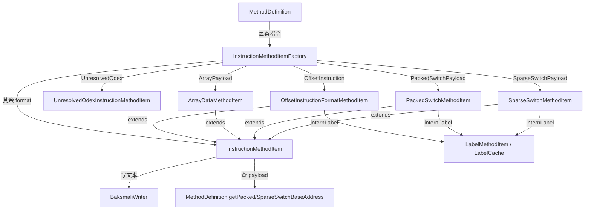

# 🛠️ Adaptors/Format — 指令格式适配器

`org.jf.baksmali.Adaptors.Format` 是 `Adaptors` 包内**单条指令的序列化层**。`MethodDefinition` 把方法体里每条 `dexlib2.iface.Instruction` 交给本包的工厂，工厂按 `Opcode.format`（以及 `OffsetInstruction`/`UnresolvedOdexInstruction` 特例）选一个 `InstructionMethodItem` 子类，由它驱动 `BaksmaliWriter` 写出 `const`/`invoke-*`/`packed-switch` 等具体行。本包只关心「一条指令如何变成文本」，标签去重、payload 重定位、try/catch、debug 项都在 `MethodDefinition`/`LabelCache` 中完成。

## 📊 类清单

| 类名 | 职责 |
| --- | --- |
| `InstructionMethodItemFactory` | 静态工厂入口：先按运行时类型（`OffsetInstruction`/`UnresolvedOdexInstruction`）特判，再按 `Opcode.format` 的 payload 分支选具体 `MethodItem`，其余落到通用 `InstructionMethodItem` |
| `InstructionMethodItem<T>` | 通用指令基类，`getSortOrder()=100`；`writeTo` 用一个大 `switch(opcode.format)` 分发到 `writeFirstRegister`/`writeLiteral`/`writeInvokeRegisters`/`writeReference` 等保护方法；处理 odex 放行、引用失效注释、31t payload 校验、浮点/资源 ID 注释 |
| `OffsetInstructionFormatMethodItem` | 跳转/分支（`goto`/`if-*`/`fill-array-data`/`packed/sparse-switch`）：把数值偏移换成 `:label` 引用，构造期 `internLabel` 一个 `LabelMethodItem`，按格式决定前缀 `goto_`/`cond_`/`array_`/`pswitch_data_`/`sswitch_data_` |
| `ArrayDataMethodItem` | `.array-data`/`.end array-data` 块：按 `elementWidth` 给元素加 `t`/`s` 后缀，宽元素附 `# Double`/`# Float`/`# 资源 ID` 注释 |
| `PackedSwitchMethodItem` | `.packed-switch firstKey`/`.end packed-switch`：能解出 base 地址则用 `:pswitch_N` 标签，否则降级为 `+offset` 裸偏移并整块注释 |
| `SparseSwitchMethodItem` | `.sparse-switch`/`.end sparse-switch`：键->目标，标签优先，base 缺失时降级为 `key -> +offset` 裸偏移并整块注释 |
| `UnresolvedOdexInstructionMethodItem` | deodex 失败兜底：输出 `#Replaced unresolvable odex instruction...` 注释加 `throw vN`，替代原 odex 指令 |

## 🗺️ 类间关系



## ⚡ 典型协作流程

`MethodDefinition.getMethodItems` 在普通模式下逐条调用 `InstructionMethodItemFactory.makeInstructionFormatMethodItem`（`InstructionMethodItemFactory.java:43`，调用点 `MethodDefinition.java:396`）。分发顺序很关键：

1. **偏移指令优先**（`:46`）——任何实现 `OffsetInstruction` 的指令（`goto`/`if-*`/`fill-array-data`/`packed-switch`/`sparse-switch`）走 `OffsetInstructionFormatMethodItem`，构造期（`OffsetInstructionFormatMethodItem.java:48`）用 `codeAddress + getCodeOffset()` 算出目标地址，`internLabel` 进 `LabelCache`，`getLabelPrefix()`（`:61`）按 `format`/`opcode` 选前缀。`writeTargetLabel`（`:53`）只写标签，不写裸偏移。
2. **未解析 odex**（`InstructionMethodItemFactory.java:51`）——deodex 阶段无法还原的 odex 指令落 `UnresolvedOdexInstructionMethodItem`，`writeTo` 输出 `throw vObjReg`（`UnresolvedOdexInstructionMethodItem.java:49`）。
3. **payload 表**（`:57-62`）——`ArrayPayload`/`PackedSwitchPayload`/`SparseSwitchPayload` 三个格式分别建对应 `MethodItem`，构造期向 `MethodDefinition` 反查 base 地址。
4. **通用兜底**（`:63`）——其余格式（`10t`..`4rcc`）落 `InstructionMethodItem`。

通用 `InstructionMethodItem.writeTo`（`InstructionMethodItem.java:83`）分三段：先用一组 `instanceof` 做前置处理（`Instruction20bc` 验证错误名 `:91`、`ReferenceInstruction` 引用校验失效则注释 `:102`、`DualReferenceInstruction` 第二引用 `:117`、`Instruction31t` payload 有效性 `:134`、odex 放行 `:170`），再进入 `switch(opcode.format)`（`:181`）按格式拼操作码+寄存器+字面量/引用，最后若被注释则补一行 `nop`（`:383`）。`isAllowedOdex`（`:65`）规则：`allowOdex` 开则放行，API≥14 拒绝，否则仅放行 `isVolatileFieldAccessor()` 与 `THROW_VERIFICATION_ERROR`。

字面量注释由 `writeCommentIfLikelyFloat`（`:481`）/`writeCommentIfLikelyDouble`（`:508`）/`writeCommentIfResourceId`（`:533`）产出，分别识别浮点/双精度/`BaksmaliOptions.resourceIds` 表中的资源 ID。寄存器经 `methodDef.registerFormatter`（`:401`）写 `vN`/`pN`。

switch payload 的降级逻辑：`PackedSwitchMethodItem`（`PackedSwitchMethodItem.java:49`）调 `getPackedSwitchBaseAddress`，得 -1 则 `commentedOut=true`，目标改用 `PackedSwitchOffsetTarget` 裸偏移（`:76`），`writeTo` 用 `getCommentingWriter` 包一层（`:84`）。`SparseSwitchMethodItem`（`SparseSwitchMethodItem.java:48`）同构。

## 📤 真实命令→输出示例

```bash
baksmali disassemble classes.dex -o out/
```

`out/.../Foo.smali` 中由本包产出的片段（节选自 [Adaptors 总览](./adaptors.md)）：

```smali
.method public foo(I)V
    .registers 2
    packed-switch p0, :pswitch_data     ; OffsetInstructionFormatMethodItem 写标签
    return-void

    :pswitch_data                       ; internLabel 产出
    .packed-switch 0x0                  ; PackedSwitchMethodItem, firstKey
        :pswitch_0                      ; PackedSwitchLabelTarget
        :pswitch_1
    .end packed-switch
.end method
```

`.array-data` 块（`ArrayDataMethodItem.java:43`，elementWidth=4 时附资源/浮点注释）：

```smali
new-array v0, v0, [I
fill-array-data v0, :array_0           ; 31t, OffsetInstructionFormatMethodItem, array_ 前缀
:array_0
.array-data 4
    1t
    2t
    0x7f03000a    # com.example:string/app_name   ; writeCommentIfResourceId
.end array-data
```

deodex 失败兜底（`UnresolvedOdexInstructionMethodItem.java:50`）：

```smali
#Replaced unresolvable odex instruction with a throw
throw v0
```

## 延伸阅读

- [Adaptors 反汇编适配器总览](./adaptors.md)
- [Formatter 文本格式化器](./formatter.md)
- [dexlib2 指令格式 iface](../dexlib2/iface-formats.md)
- [dexlib2 指令工厂](../dexlib2/instruction-factory.md)
- [smali 语法速览](../../internals/smali-syntax.md)
