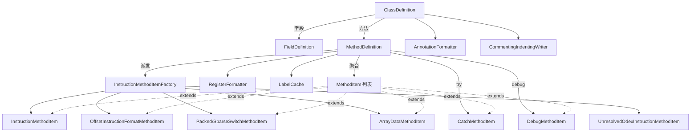

# 🛠️ Adaptors — 反汇编适配器

`org.jf.baksmali.Adaptors` 是 baksmali 的**文本生成层**。它消费 `dexlib2.iface` 只读模型（`ClassDef`/`Method`/`Field`/`Instruction`），按 smali 语法规则驱动 `BaksmaliWriter`，逐行写出 `.class`/`.field`/`.method`/`.registers`/`packed-switch` 等指令。上游 `org.jf.baksmali.dump` 负责多线程调度，本包只关心「一个类如何变成文本」。

## 📊 类清单

| 类名 | 职责 |
| --- | --- |
| `ClassDefinition` | 类级入口：写 `.class`/`.super`/`.source`/`.implements`/注解，遍历静态字段、实例字段、direct/virtual 方法；检测重复字段/方法并降级为注释输出 |
| `FieldDefinition` | 单个 `.field` 行：访问标志、`HiddenApiRestriction`、初始值、注解；处理 `static final` 在 `<clinit>` 中赋值时省略默认初值 |
| `MethodDefinition` | 方法级入口：`.method`/`.locals`/`.registers`/`.param`，构建 `MethodItem` 列表、switch payload 重定位、try/catch、debug 项、分析模式 |
| `MethodItem` | 方法体内一切可排序输出项的抽象基类，按 `(codeAddress, getSortOrder())` 排序 |
| `RegisterFormatter` | 寄存器 `vN`/`pN` 命名与格式化策略 |
| `AnnotationFormatter` | 注解块（类/字段/方法/参数）统一序列化 |
| `LabelMethodItem` / `EndTryLabelMethodItem` | 跳转/异常标签，`LabelCache` 去重 |
| `CatchMethodItem` | `.catch`/`:try_start`/`:try_end`/`:catch_*` 异常处理器 |
| `CommentMethodItem` / `CommentedOutMethodItem` / `CommentingIndentingWriter` | 注释/把整条指令注释掉（如未解析 odex 指令） |
| `BlankMethodItem` | 指令间空行（`sortOrder = Integer.MAX_VALUE`） |
| `SyntheticAccessCommentMethodItem` | 合成访问器调用旁的 `# access$Xxx` 注释 |
| `PreInstructionRegisterInfoMethodItem` / `PostInstructionRegisterInfoMethodItem` | 指令前后寄存器类型注释（`--register-info`） |
| `Format/InstructionMethodItemFactory` | 按 `Opcode.format`/`OffsetInstruction`/`UnresolvedOdexInstruction` 派发具体 `MethodItem` |
| `Format/InstructionMethodItem` | 通用指令行，`getSortOrder()=100` |
| `Format/OffsetInstructionFormatMethodItem` | 跳转/分支：把偏移换成 `:label` 引用 |
| `Format/PackedSwitchMethodItem` / `SparseSwitchMethodItem` / `ArrayDataMethodItem` | payload 数据表，目标用标签或裸偏移 |
| `Format/UnresolvedOdexInstructionMethodItem` | deodex 失败时输出原 odex 指令并附原指令注释 |
| `Debug/DebugMethodItem` 及子类 | `LineNumber`/`StartLocal`/`EndLocal`/`RestartLocal`/`SetSourceFile`/`BeginEpilogue`/`EndPrologue` 等 `.line`/`.local`/`.epilogue` 项 |
| `Debug/LocalFormatter` | `.local` 名字/签名格式化 |

## 🗺️ 类间关系



## ⚡ 典型协作流程

`dump` 线程对每个 `ClassDef` 构造一个 `ClassDefinition`（`ClassDefinition.java:57`），其构造期先扫描 `<clinit>` 收集被 `sput*` 赋值的静态字段（`:69`），用于后续 `FieldDefinition` 决定是否省略初值（`FieldDefinition.java:49`）。

`writeTo`（`ClassDefinition.java:106`）依次输出 class 头、super、source、interfaces、注解，再分四块写字段/方法。对 `DexBackedClassDef` 用 `getStaticFields(false)` 等惰性重载避免验证（`:180`）。重复字段/方法用 `getCommentingWriter`（`:330`）包一层 `CommentingIndentingWriter`，把整块内容以 `#` 前缀输出。

方法体由 `MethodDefinition`（`:61`）接管。构造期（`:83`）建立 `InstructionOffsetMap`、`packedSwitchMap`/`sparseSwitchMap`，并对引用了已存在 payload 的 switch 做**重定位**：把 payload 物理搬迁到方法尾并改写偏移（`:116`、`:139`），保证后续 `:label` 引用稳定。

`getMethodItems`（`:353`）按 `options` 选择两条路径：

- **普通模式** `addInstructionMethodItems`（`:390`）：经 `InstructionMethodItemFactory.makeInstructionFormatMethodItem`（`InstructionMethodItemFactory.java:43`）按格式分发，逐条追加 `MethodItem`、`BlankMethodItem`，可选追加 `#@` 偏移注释与 `SyntheticAccessCommentMethodItem`（`:437`）。
- **分析模式** `addAnalyzedInstructionMethodItems`（`:451`）：当 `registerInfo!=0`、`normalizeVirtualMethods` 或 deodex 需要时，用 `MethodAnalyzer` 做类型推断，输出 `PreInstructionRegisterInfoMethodItem`（`sortOrder=99.9`）与 `PostInstructionRegisterInfoMethodItem`（`100.1`），未解析 odex 指令追加 `CommentedOutMethodItem`（`:476`）。

随后 `addTries`（`:516`）把 `TryBlock` 转成 `CatchMethodItem`（`sortOrder=102`），`addDebugInfo`（`:564`）经 `DebugMethodItem.build` 产出 `.line`/`.local` 项。所有项与 `labelCache.getLabels()` 合并后 `Collections.sort`（`:376`），`MethodItem.compareTo` 以 `(codeAddress, sortOrder)` 定序（`MethodItem.java:49`）。最后逐项 `writeTo`（`MethodDefinition.java:225`）。

### 关键 sortOrder 表

| sortOrder | 项 | 来源 |
| --- | --- | --- |
| -1000 | `#@` 偏移注释 | `MethodDefinition.java:409` |
| 0 | 标签 | `LabelMethodItem.java:49` |
| 99.8 | 合成访问器注释 | `SyntheticAccessCommentMethodItem.java:50` |
| 99.9 | 指令前寄存器信息 | `PreInstructionRegisterInfoMethodItem.java:62` |
| 100 | 指令本体 | `InstructionMethodItem.java:62` |
| 100.1 | 指令后寄存器信息 | `PostInstructionRegisterInfoMethodItem.java:54` |
| 101 | `:try_end` 标签 | `EndTryLabelMethodItem.java:45` |
| 102 | `.catch` | `CatchMethodItem.java:78` |
| MAX_VALUE | 空行 | `BlankMethodItem.java:40` |

## 📤 真实命令→输出示例

```bash
baksmali disassemble classes.dex -o out/
```

生成 `out/Lcom/example/Foo.smali`，节选自 [disassemble 文档](../../cli/disassemble.md)：

```smali
.class public LLocalTest;
.super Ljava/lang/Object;

# direct methods
.method public static method1()V
    .registers 10
    .local v0, "blah! This local name has some spaces, a colon, even a \nnewline!":I, "some sig info:\nblah."
    return-void
.end method
```

带异常与 switch 的方法体（语法见 [smali-syntax](../../internals/smali-syntax.md)）：

```smali
.method public foo(I)V
    .registers 2
    :try_start
    packed-switch p0, :pswitch_data
    :try_end
    .catch Ljava/lang/Exception; {:try_start .. :try_end} :catch
    :catch
    return-void

    :pswitch_data
    .packed-switch 0x0
        :pswitch_0
        :pswitch_1
    .end packed-switch
.end method
```

`packed-switch` payload 由 `MethodDefinition` 重定位到方法尾，`:pswitch_data` 标签经 `LabelCache` 去重后由 `PackedSwitchMethodItem` 输出。

## 延伸阅读

- [baksmali disassemble 命令](../../cli/disassemble.md)
- [smali 语法速览](../../internals/smali-syntax.md)
- BaksmaliOptions
- [Formatter — 文本格式化器](./formatter.md)
- [dump — 多线程调度](./main.md)
