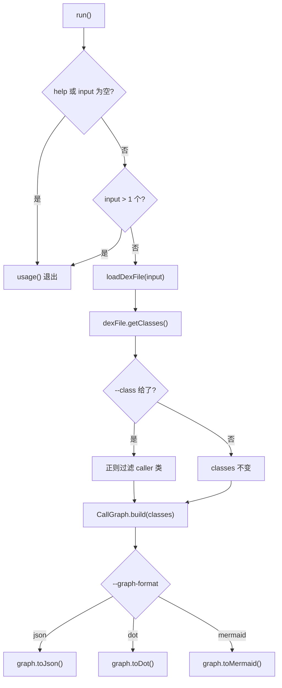
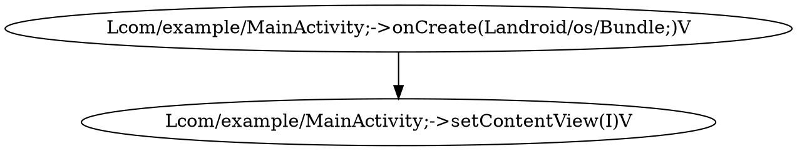
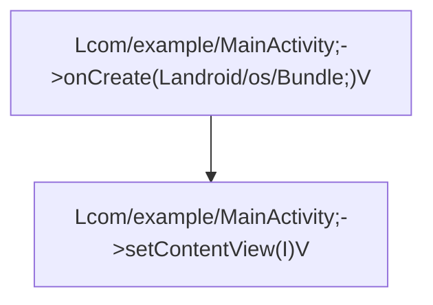

# 🗺️ baksmali callgraph

`baksmali callgraph` 将整个 dex 的方法级调用结构抽成有向图：节点是方法描述符，有向边 `A -> B` 表示方法 `A` 的方法体中含有一条对方法 `B` 的 invoke。它不反汇编、不写回 dex，只输出图，常用于静态分析、依赖可视化与 AI Agent 摘要。

## 命令定位

- 命令名：`callgraph`（`@ExtendedParameters(commandName)`，`CallGraphCommand.java:66-68`）
- 描述（`@Parameters(commandDescription)`）：`Export the method-level call graph as JSON, Graphviz DOT, or Mermaid.`（`CallGraphCommand.java:65`）
- 继承链：`CallGraphCommand` → `DexInputCommand` → `Command`（无 `ListCommand`/`XrefCommand` 血统）
- 纯模型层：`org.jf.baksmali.graph.CallGraph`（`build`/`toJson`/`toDot`/`toMermaid`），命令类只做加载与打印编排
- 描述符形态：规范 smali `Lpkg/Cls;->name(参数)返回类型`（`CallGraph.java:114-125`）

源码：`baksmali/src/main/java/org/jf/baksmali/CallGraphCommand.java:65-127`

## 🛠️ 参数

### 自有参数

| 参数 | 说明 | 默认 | 必填 | arity |
| --- | --- | --- | --- | --- |
| `--graph-format` | 输出格式：`json` / `dot` / `mermaid` | `json` | 否 | 1 |
| `--class` | 正则，限定**调用方所属类**的类型描述符匹配的子图 | 无（全部） | 否 | 1 |
| `-h` `-?` `--help` | 显示用法 | `false` | 否 | 0 |

`--class` 只过滤 caller 一侧；被调用方（callee）即使不属于该类仍会作为节点出现，从而保留子系统对外的调用关系（`CallGraphCommand.java:101-110`）。

### 继承自 DexInputCommand 的通用参数

| 参数 | 说明 | 默认 | 必填 |
| --- | --- | --- | --- |
| 位置参数 `file` | dex/apk/oat/odex 文件；多 dex 容器可用 `app.apk/classes2.dex` 指定条目 | — | 是 |
| `-a` `--api` | 目标文件的数字 API 级别 | `-1`（自动） | 否 |

输入解析、多 dex 容器选择、引号包裹条目名匹配均在 `DexInputCommand.loadDexFile` 中实现（`DexInputCommand.java:111-173`）。callgraph 仅接受单个输入文件，多给会报 `Too many files specified`（`CallGraphCommand.java:92-96`）。

## ⚡ 主流程



`CallGraph.build` 遍历 `ClassDef → Method → MethodImplementation → Instruction`，对每条 `ReferenceInstruction` 携带的 `MethodReference` 加一条 `caller -> callee` 边；只把真正出现的 caller/callee 收为节点，故图规模与可达调用结构成正比，而非与方法表总量成正比（`CallGraph.java:79-103`）。

## 🔎 真实命令与输出示例

```bash
# 默认 JSON，适合管道给 jq 或 AI Agent
baksmali callgraph app.apk
# Graphviz DOT，重定向到文件后用 dot 渲染
baksmali callgraph app.apk --graph-format dot > cg.dot
# Mermaid 流程图，可直接粘进 Markdown
baksmali callgraph app.apk --graph-format mermaid
# 只导出某子系统的调用图
baksmali callgraph app.apk --class 'Lcom/example/.*'
```

JSON 结构为 `{"nodes":[...],"edges":[{"from":"...","to":"..."}]}`，节点用规范 smali 描述符。示例（节选）：

```json
{
  "nodes": [
    "Lcom/example/MainActivity;->onCreate(Landroid/os/Bundle;)V",
    "Lcom/example/MainActivity;->setContentView(I)V",
    "Lcom/example/Net;->fetch(Ljava/lang/String;)Ljava/lang/String;"
  ],
  "edges": [
    {"from":"Lcom/example/MainActivity;->onCreate(Landroid/os/Bundle;)V","to":"Lcom/example/MainActivity;->setContentView(I)V"},
    {"from":"Lcom/example/Net;->fetch(Ljava/lang/String;)Ljava/lang/String;","to":"Lcom/example/Net;->parse(Ljava/lang/String;)V"}
  ]
}
```

DOT 输出形态（`CallGraph.java:180-191`）：



Mermaid 输出用 `n<hex>` 作稳定节点 id、完整描述符作标签（`CallGraph.java:197-221`）：



## 📤 源码要点

- `graphFormat` 为 `String`，`switch` 前先 `toLowerCase()`，故 `JSON`/`Dot` 等大小写不敏感（`CallGraphCommand.java:114-125`）
- JSON 经 `GsonBuilder().disableHtmlEscaping()` 序列化，避免 `<`/`>` 被转义（`CallGraph.java:173`）
- `--class` 用 `Pattern.matcher(...).find()` 部分匹配，`Lcom/example/.*` 即可命中（`CallGraphCommand.java:102-105`）
- 边集为 `LinkedHashMap<String, LinkedHashSet<String>>`，节点/边均保持**首次出现顺序**，输出可复现（`CallGraph.java:72-73`）

## 延伸阅读

- [CLI 总览：transform 与 callgraph](../../../cli/transform.md)
- [dex-transform 技能（含 callgraph 用法）](../../../skills/dex-transform)
- [baksmali xref：反向引用查询](./xref.md)
- [baksmali search：方法/字符串检索](./search.md)
