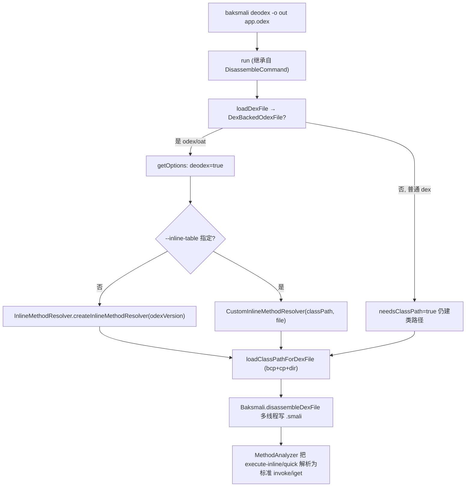

# 🧬 baksmali deodex

`baksmali deodex` 把 odex/oat 文件里的**优化指令**（`execute-inline`、`iget-quick`、`invoke-virtual-quick` 等）通过类路径分析解析为标准的 `invoke-virtual`、`iget` 等，使输出能被 `smali assemble` 重新汇编回可用的 dex。它是 `disassemble` 的「可重汇编」变体——继承后者全部输出控制选项，再叠加 `options.deodex = true` 与内联方法解析器（`DeodexCommand.java:70-96`）。

类注解声明命令名 `deodex`、别名 `de`/`x`、描述 `Deodexes an odex/oat file`（`DeodexCommand.java:50-53`）。与普通 `disassemble` 的关键差异是三个被覆盖的模板方法：`needsClassPath()` 恒为 `true`（必须构建类路径）、`showDeodexWarning()` 恒为 `false`（正在去 odex，无需再警告）、`shouldCheckPackagePrivateAccess()` 由 `--check-package-private-access` 决定（`DeodexCommand.java:98-108`）。

## 📊 参数

`DeodexCommand` 自身只声明 `--inline-table`；其余参数继承自 `DisassembleCommand`（输出/调试/寄存器等）、`AnalysisArguments`（类路径）、`CheckPackagePrivateArgument` 与 `DexInputCommand`（输入/`--api`）。

| 参数 | 说明 | 默认 | 必填 |
|------|------|------|------|
| `file`（位置参数） | dex/apk/oat/odex 文件，apk/oat 可用 `/classes2.dex` 指定条目（`DexInputCommand.java:61-65`） | — | 是 |
| `-o, --output <dir>` | 输出目录（`DisassembleCommand.java:108-111`） | `out` | 否 |
| `--inline-table, --inline, --it <file>` | 自定义内联方法表文件，替代内置表的 odex 版本默认表（`DeodexCommand.java:59-64`） | `null` | 否 |
| `-b, --bootclasspath, --bcp <list>` | 冒号分隔的引导类路径文件列表，可传 `""` 表示空 bcp（`AnalysisArguments.java:54-62`） | `null`（自动） | 否 |
| `-c, --classpath, --cp <list>` | 冒号分隔的额外类路径（`AnalysisArguments.java:64-69`） | `[]` | 否 |
| `-d, --classpath-dir, --cpd, --dir <dir>` | 类路径搜索目录，可多次指定（`AnalysisArguments.java:71-75`） | 输入文件父目录 | 否 |
| `--check-package-private-access, --pp` | 计算 vtable 时做包私有访问检查；oat 自动启用，odex 仅 4.2.0 需要（`AnalysisArguments.java:78-83`） | `false` | 否 |
| `-a, --api <api>` | 输入文件 API level，选择 opcode 集（`DexInputCommand.java:56-59`） | `-1`（自动） | 否 |
| `-j, --jobs <n>` | 并行反汇编线程数（`DisassembleCommand.java:86-90`） | CPU 核数 | 否 |
| `--classes <list>` | 只反汇编逗号分隔的指定类（`DisassembleCommand.java:140-143`） | `null` | 否 |
| `--debug-info=false` | 省略 `.local`/`.param`/`.line` 调试信息（`DisassembleCommand.java:67-71`） | `true` | 否 |
| `--sequential-labels, --sl` | 标签用顺序编号而非字节码地址（`DisassembleCommand.java:126-129`） | `false` | 否 |
| `--register-info, -r <spec>` | 注释寄存器类型（ALL/ARGS/DEST/MERGE/FULLMERGE…，`DisassembleCommand.java:119-124`） | `[]` | 否 |
| `-h, -?, --help` | 显示用法（`DisassembleCommand.java:60-62`） | `false` | 否 |

继承自 `disassemble` 的其余输出控制（`--code-offsets`、`--use-locals`、`--accessor-comments`、`--normalize-virtual-methods`、`--parameter-registers`、`--implicit-references`、`--resolve-resources`、`--allow-odex-opcodes`）同样可用，见 [disassemble](./disassemble.md)。

## 🧬 命令主流程



`getOptions()` 的内联解析器构造是 deodex 独有逻辑（`DeodexCommand.java:75-93`）：仅当 `dexFile instanceof DexBackedOdexFile` 时才挂解析器；普通 dex 虽强制建类路径但不会触发内联解析。自定义表文件不存在或读取失败会打印 stderr 后 `System.exit(-1)`（`DeodexCommand.java:81-91`）。

## 📤 真实命令与输出示例

对 dalvik odex 去 odex（摘自 `dex-deodex` skill 的工作流）：

```bash
java -jar baksmali.jar deodex -o smali_out \
  --boot-class-path /system/framework/framework.jar \
  app.odex
```

解析前后对照（优化指令 → 标准指令）：

```smali
# deodex 前（disassemble 直接输出，不可重汇编）
.method public foo()V
    .registers 2
    execute-inline {v1}, inline #1   # 丢失了被调方法签名
    iget-quick v0, v1, #obj          # 丢失了字段类型
    return-void
.end method

# deodex 后（解析为标准指令，可被 smali assemble 重新汇编）
.method public foo()V
    .registers 2
    invoke-virtual {v1}, Lcom/example/Foo;->bar()V   # execute-inline 解析回真实方法
    iget v0, v1, Lcom/example/Foo;->value:I          # iget-quick 解析回真实字段
    return-void
.end method
```

验证可重汇编（闭环）：

```bash
# 1. 去 odex
java -jar baksmali.jar deodex -o smali_out --boot-class-path framework.jar app.odex
# 2. 重新汇编
java -jar smali.jar a -o rebuilt.dex smali_out/
# 3. 对比重建
java -jar baksmali.jar d -o verified rebuilt.dex
```

自定义内联表（非标准 dalvik 设备）：

```bash
# 设备端导出内联表
adb shell /data/local/deodexerant > inline_methods.txt
# 用导出的表去 odex
java -jar baksmali.jar deodex -o out --inline-table inline_methods.txt app.odex
```

## ⚡ disassemble vs deodex

| | disassemble | deodex |
|---|---|---|
| 速度 | 快 | 较慢（需类路径分析） |
| odex 指令 | 保留优化指令 | 解析为标准指令 |
| 可重汇编 | 否 | 是 |
| 需要类路径 | 仅 `register-info`/`--normalize-virtual-methods` 时 | 必须 |
| 适用 | 快速查看 | 修改/重打包 |

## 🗺️ 源码要点

- 命令注册：`@Parameters(commandDescription="Deodexes an odex/oat file")` + `@ExtendedParameters(commandName="deodex", commandAliases={"de","x"})`（`DeodexCommand.java:50-53`）。
- `getOptions()` 设 `deodex=true` 并按需挂 `InlineMethodResolver`/`CustomInlineMethodResolver`（`DeodexCommand.java:70-96`）。
- 模板方法覆盖：`needsClassPath()`→`true`（`DeodexCommand.java:102-104`）、`showDeodexWarning()`→`false`（`106-108`）、`shouldCheckPackagePrivateAccess()`→`--pp`（`98-100`）。
- 主流程 `run()` 与输出目录创建在父类 `DisassembleCommand.java:149-186`；类路径加载在 `AnalysisArguments.loadClassPathForDexFile`（`AnalysisArguments.java:86-147`），oat 自动启用包私有检查并推断 oat 版本。
- 未解析的优化指令会抛 `UnresolvedOdexInstruction`——通常因类路径缺失依赖。

## 延伸阅读

- [baksmali disassemble（deodex 继承其全部输出选项）](./disassemble.md)
- dex-deodex skill（去 odex 工作流与闭环验证）
- dex-classpath skill（类路径解析原理）
- dex-disassemble skill（反汇编总览）
- [disassemble CLI 文档](../../../cli/disassemble.md)
